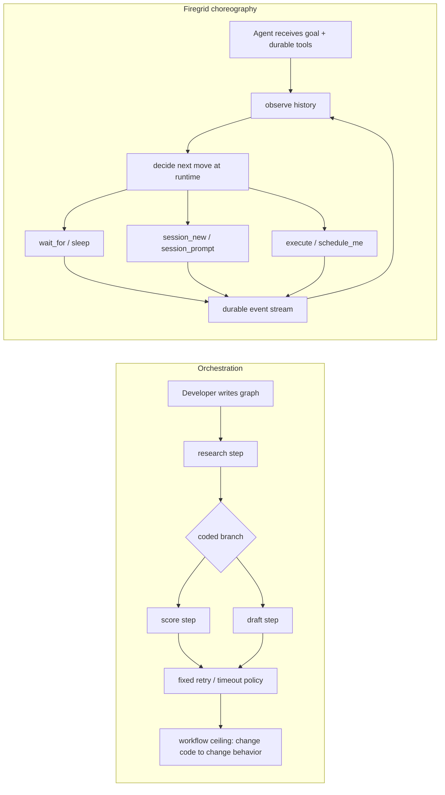

# Firegrid

Firegrid lets you build local AI agents that survive crashes, restarts, long
waits, and external events without losing their place.

It is not a graph builder where you hard-code the agent workflow up front.
Firegrid gives agents a small set of durable primitives - wait, sleep,
delegate, schedule, execute, observe - and lets the model decide what to do
next at runtime. Firegrid handles the durable execution underneath: workflow
state, event streams, runtime contexts, retries, host restarts, and typed
protocol boundaries.

**Status:** private beta. The runtime is usable for local experiments and
internal agent workflows, but public APIs may still change.

## Choreography, Not Orchestration

Most agent frameworks ask you to author the control flow: define a graph, write
steps, wire branches, set timeouts, and decide when one agent should call the
next. Firegrid's bet is different. The durable substrate should make agent
decisions safe and observable, but the sequence of work should be chosen by the
agent in response to what it actually sees.



The agent-facing surface is intentionally small:

- `wait_for` - pause durably until a matching fact appears
- `session_new`, `session_prompt` - create and continue delegated participants
- `schedule_me` - ask your future self to resume with a prompt
- `execute` - call a bounded, advertised capability and record the result
- `sleep` - pause for a duration

That means the primary "program" can be a prompt plus durable tools, not a
TypeScript DAG:

```text
Goal: fix the failing checkout test and open a PR.

Available durable tools:
- wait_for(channel, match, timeout)
- session_new(prompt)
- session_prompt(session, prompt)
- schedule_me(when, prompt)
- execute(capability, input)
- sleep(duration)

Agent:
1. Start an investigation session for the failing test.
2. Wait for its summary.
3. If the fix is small, implement it directly; otherwise start a second
   session for review.
4. Execute the test command.
5. Wait for CI or schedule myself to re-check.
6. Open the PR when the evidence is good enough.
```

The model owns the sequence, branching, delegation, and recovery policy. The
durability comes from the primitives, and the legibility comes from the
observation stream every primitive writes to.

## One Substrate, Several Projections

Firegrid does have client APIs, host composition APIs, CLI entry points, and MCP
tools. Those are projections of the same substrate, not separate ways to define
a central agent graph.

- **Agent tool projection:** the agent sees `wait_for`, `session_new`,
  `schedule_me`, `execute`, and related durable tools.
- **Channel projection:** application events such as webhooks, approvals,
  runtime observations, and domain facts become semantic channels the agent can
  wait on or emit to.
- **Client SDK projection:** apps can create sessions, read observations, and
  render live state without importing runtime internals.
- **Host Layer projection:** host authors compose runtime services, channel
  bindings, MCP exposure, and adapters with Effect `Layer`s.
- **CLI projection:** local development can start a host or run one context
  without writing a host app.
- **Transport projections:** future REST, gRPC, or JSON-RPC adapters can bind
  the same protocol contracts without becoming a new orchestration layer.

Application code talks to these projections. It does not receive workflow
engines, stream URLs, table names, execution ids, or subscription handles.

## Who It Is For

Firegrid is for developers building agents that need to do real work over time:
local coding agents, automation workers, private assistants, webhook-driven
agents, and internal tools that need durable waits without becoming a full
hosted workflow platform.

It sits near systems such as Temporal, Restate, Inngest, LangGraph, Mastra, and
CrewAI, but the center of gravity is different. Firegrid is an Effect-native
local agent runtime for choreography: durable primitives, typed channels, and
observable history under an agent-facing surface. It is not a general workflow
SaaS, and it is not primarily a graph authoring framework.

## Quick Start

Install dependencies:

```sh
pnpm install
```

Run the full local verification gate:

```sh
pnpm run verify
```

Start a local Firegrid host with a route-scoped MCP endpoint:

```sh
pnpm firegrid -- start
```

Run one local-process context synchronously:

```sh
pnpm firegrid -- run \
  --cwd "$PWD" \
  --prompt "hello from Firegrid" \
  -- \
  node agent.mjs
```

Run deterministic tiny-firegrid simulations:

```sh
pnpm --filter @firegrid/tiny-firegrid simulate:list
pnpm --filter @firegrid/tiny-firegrid simulate:perf
```

## What Firegrid Provides

- **Durable local agent contexts.** Agent work can span sleeps, waits, restarts,
  and host bounces without depending on one in-memory process staying alive.
- **Agent tools with durable semantics.** Operations like `sleep`, `wait_for`,
  session control, scheduling, and execution are exposed as a small tool
  surface.
- **Typed channels.** Agents wait on or emit semantic events such as webhooks,
  approvals, lifecycle events, and domain facts without knowing the transport
  underneath.
- **Effect-native runtime composition.** Host applications compose Firegrid
  services with `Layer`s, so tests and local hosts can swap concrete bindings
  cleanly.
- **Protocol-owned contracts.** Host, client, CLI, runtime, and tests share
  schemas through `@firegrid/protocol` instead of inventing local contracts.
- **Simulation-first validation.** `@firegrid/tiny-firegrid` provides fast,
  deterministic traces and perf harnesses for runtime behavior that should not
  require live provider calls.

## How It Is Organized

```text
@firegrid/protocol
  shared schemas, operation contracts, row/projection schemas

bindings
  @firegrid/host-sdk
    host composition, channel Layers, MCP / Effect AI tool binding
  @firegrid/client-sdk
    browser/app-safe client surface over protocol schemas
  @firegrid/cli
    local command-line binding

@firegrid/runtime
  workflow engine integration, runtime workflows, event pipeline,
  verified webhook ingest, provider adapters, common execution services
```

| Package | Role |
| --- | --- |
| [`@firegrid/protocol`](packages/protocol/README.md) | Browser-safe shared schemas, operation contracts, launch/control rows, runtime ingress rows, observations, projection schemas, verified-webhook schemas. |
| [`@firegrid/runtime`](packages/runtime/README.md) | Durable execution substrate: workflow engine, workflow definitions, runtime event pipeline, provider adapters, verified webhook ingest, runtime operation execution. |
| [`@firegrid/host-sdk`](packages/host-sdk/README.md) | Host-author composition: `FiregridRuntimeHostLive`, channel Layers, MCP server exposure, Effect AI toolkit binding, local host topology. |
| [`@firegrid/client-sdk`](packages/client-sdk/README.md) | App/browser-safe client binding over protocol schemas and normalized observations. |
| [`@firegrid/cli`](packages/cli/package.json) | Local CLI entry points for starting hosts and running contexts. |
| [`@firegrid/tiny-firegrid`](packages/tiny-firegrid/README.md) | Deterministic simulations, trace capture, perf harnesses, and factory-vision smokes. |
| [`effect-durable-operators`](packages/effect-durable-operators/README.md) | Effect-native durable table/operator layer over Durable Streams State. |
| [`effect-durable-streams`](packages/effect-durable-streams/README.md) | Low-level Effect client for the Durable Streams protocol. |

## Architecture Docs

The compact source-of-truth reading set starts at
[`docs/cannon/README.md`](docs/cannon/README.md). Older docs elsewhere under
`docs/` are historical unless they are promoted there.

Useful entry points:

- [`docs/cannon/architecture/host-sdk-runtime-boundary.md`](docs/cannon/architecture/host-sdk-runtime-boundary.md)
- [`docs/cannon/architecture/current-convergence-assessment-2026-05-20.md`](docs/cannon/architecture/current-convergence-assessment-2026-05-20.md)
- [`docs/cannon/sdds/SDD_FIREGRID_AGENT_BODY_PLAN.md`](docs/cannon/sdds/SDD_FIREGRID_AGENT_BODY_PLAN.md)
- [`docs/cannon/sdds/SDD_FIREGRID_ONE_SUBSTRATE_WORKFLOW_ENGINE.md`](docs/cannon/sdds/SDD_FIREGRID_ONE_SUBSTRATE_WORKFLOW_ENGINE.md)
- [`docs/cannon/vision/factory-vision.md`](docs/cannon/vision/factory-vision.md)

## For Contributors

Run docs-only checks when editing documentation:

```sh
pnpm run check:docs
pnpm run check:specs
```

Run the full gate before code review:

```sh
pnpm run verify
```

Lane work happens in sibling worktrees under `../firegrid-worktrees/`, not in
the primary checkout:

```sh
bash scripts/task-enter.sh <bead-id> <slug>
# work in ../firegrid-worktrees/<bead-id>-<slug>
bash scripts/task-exit.sh <bead-id>
```

Architecture discipline for contributors:

- Channels are the application and agent surface.
- Runtime owns workflow execution and durable substrate integration.
- Host SDK owns binding and host composition.
- Protocol owns shared contracts consumed by more than one binding.
- Product code imports from normal package dependencies, never from
  `repos/**`; vendored upstream sources are read-only references.

The current convergence scoreboard is the `currentHostSdkSubstrateDebt` list in
[`.dependency-cruiser.cjs`](.dependency-cruiser.cjs).

## License

This repository does not currently include a license file.
