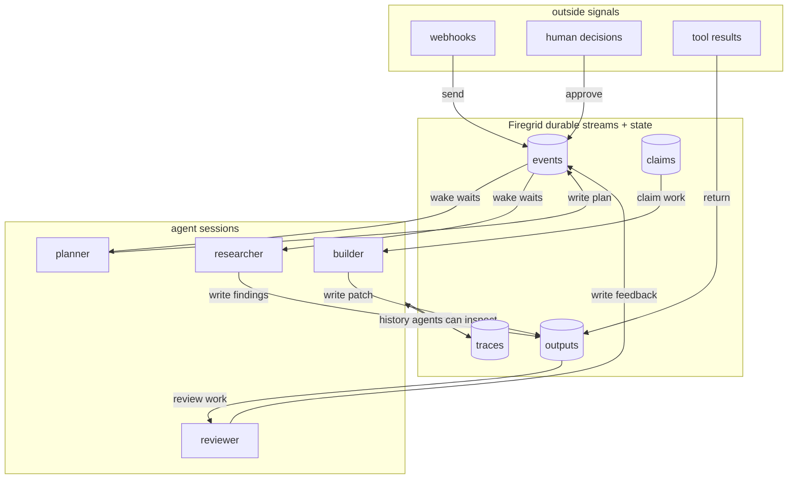

# Firegrid

Firegrid is durable coordination infrastructure for AI agents.

Agents use it to wait for events, record progress, call tools, ask for approval,
and survive long-running work without a central workflow graph.

Most agent frameworks ask you to define the flow up front: step A, then step B,
then route to step C. Firegrid gives agents a shared durable workspace instead.
Your agents decide what to do next; Firegrid keeps the shared state and history
alive across crashes, restarts, and long waits.

**Status:** private beta. Local and internal use are active; public APIs may
still change.

---

## The Short Version

Firegrid gives agents a place to leave and find work.

Agents can:

- wait for something to happen;
- write down what happened;
- call a tool and get a typed result;
- ask a human for approval;
- start or prompt another session;
- resume after a process crash or a long wait.

The important bit is durability. If an agent waits for a webhook, a CI result,
a user approval, or another session's output, that wait should not depend on one
process staying alive.

---

## Why

Real agent work does not happen in one clean function call.

A useful agent may need to:

- wait for a webhook;
- pause for human approval;
- restart after a host dies;
- inspect what a previous attempt already did;
- start or prompt another agent session;
- continue after CI, GitHub, Linear, or Slack changes state.

Firegrid stores those events and decisions in a durable shared workspace. Agents
can observe the workspace and act when the state they care about appears.

---

## The Model

Firegrid is not the manager of your agents. It is the durable coordination layer
they use.



The participants do not need to know about each other directly. They coordinate
through shared state.

That does not mean Firegrid gives you magic agent-to-agent chat. It means agents
can communicate through durable events and tool results when you expose the
right channels.

---

## Choreography, Not A Central Graph

In an orchestration framework, the application usually owns the plan: call the
researcher, route to the coder, wait for review, then move to the next step.

Firegrid keeps that logic out of the center by default. Agents can publish
facts, wait for facts, claim work, call tools, and react to approvals through
shared durable state. The plan can emerge from the participants instead of
being frozen into one central graph.

You can still build orchestration on top. Firegrid is lower level: events,
waits, calls, sessions, and recovery.

---

## Agent Surface

The agent-facing surface is intentionally small.

```ts
wait_for(channel, { match, timeoutMs }) // wait for a matching event
send(channel, payload)                  // record an event
call(channel, request)                  // request a typed result
sleep(duration)                         // pause durably
session_new(prompt)                     // start another agent session
session_prompt(session, prompt)         // send work to a session
```

These are coordination primitives, not a workflow DSL. There is no
`graph.addNode()`, router function, or required central planner.

---

## Low-Level Primitive Example

You do not have to model your whole system this way. This is the raw channel
surface for cases where you want maximum control, or when you are building a
small adapter on top of Firegrid.

One participant can leave a durable fact:

```ts
yield* send("plan.ready", {
  issueId: "ENG-123",
  summary: "Update the OAuth callback flow",
})
```

Another participant can react when that fact appears:

```ts
const plan = yield* wait_for("plan.ready", {
  match: { issueId: "ENG-123" },
})

const approval = yield* call("human.approval", {
  issueId: plan.issueId,
  summary: plan.summary,
})

if (approval.approved) {
  yield* call("github.create_pr", {
    issueId: plan.issueId,
    title: "Fix OAuth callback flow",
  })
}
```

This is intentionally just the lower level building block. The point is not to
turn your app into hand-written routing code. The point is that when agents,
tools, webhooks, and humans do coordinate, the waits, events, calls, approvals,
and results are durable.

---

## How It Compares

| If you want... | Look at... |
| --- | --- |
| A graph of LLM steps authored up front | LangGraph, CrewAI, AutoGen-style orchestration |
| Durable workflows for service code | Temporal, Restate, Inngest |
| A durable coordination layer agents can use through tools/channels | Firegrid |

Firegrid is closer to durable workflow infrastructure than to an agent SDK, but
the surface is designed for agents: wait, send, call, sleep, and session tools.

---

## What Firegrid Provides

- **Durable waits:** an agent can wait without keeping a process alive.
- **Durable events:** facts, outputs, approvals, and tool results survive
  restarts.
- **Typed channels:** integrations expose typed inputs and outputs instead of
  loose strings.
- **Session identity:** long-running agent sessions can be resumed and observed.
- **Tool and approval paths:** tools, humans, and services can participate in the
  same shared workspace.
- **Traceable execution:** runs produce observable traces and durable history.

---

## Current Repo Layout

| Package | Purpose |
| --- | --- |
| `@firegrid/protocol` | Shared schemas and channel contracts |
| `@firegrid/runtime` | Durable runtime internals and workflow engine integration |
| `@firegrid/host-sdk` | Host composition and channel bindings |
| `@firegrid/client-sdk` | App/client surface over Firegrid sessions and channels |
| `@firegrid/cli` | Local CLI entry points |
| `@firegrid/tiny-firegrid` | Local simulations and trace artifacts |

Most users should start with the client/session surface. Most contributors
should read the architecture docs before changing package boundaries.

---

## Development

This repository uses pnpm workspaces.

```bash
pnpm install
pnpm preflight
```

Useful local scripts:

```bash
pnpm typecheck
pnpm test
pnpm lint
```

Simulation examples live in `packages/tiny-firegrid`. They are the best way to
inspect real traces while the public API is still settling.

---

## Docs

- [Factory vision](docs/vision/factory-vision.md)
- [Canon docs](docs/cannon/README.md)
- [tiny-firegrid guide](packages/tiny-firegrid/README.md)
- [Client SDK README](packages/client-sdk/README.md)

---

## License

This project is not yet published as a stable public package. License and public
distribution terms will be clarified before a broader release.
