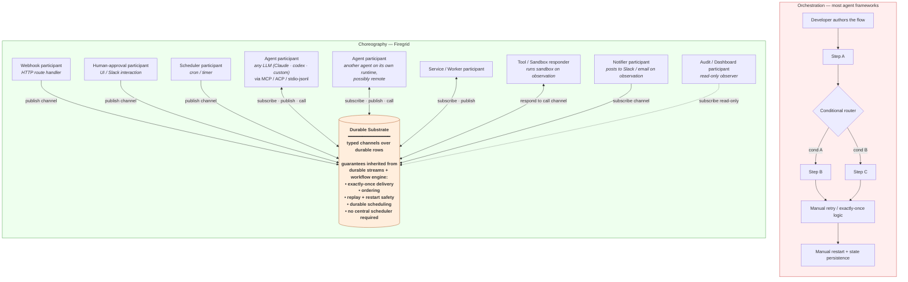
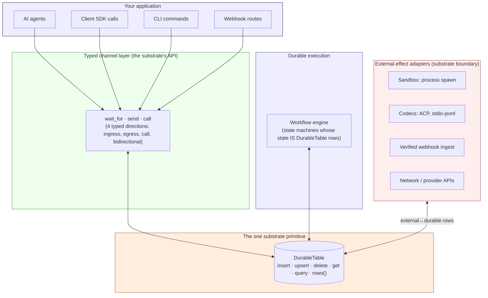

# Firegrid

**A durable choreography substrate for AI agent systems.**
No orchestrator. No graph. No central plan.

Agents, humans, webhooks, and services coordinate by reading and writing
typed events to a shared durable environment. Firegrid runs that
environment durably — across crashes, restarts, long waits, and external
events you don't control. The substrate is the contract; the
participants choose what to do next at runtime.

> **If you're choosing between LangGraph, AutoGen, and CrewAI to define
> your agent's flow upfront, Firegrid is a different category** — closer
> to Restate or Temporal than to LangChain, but with an agent-facing
> coordination model rather than a state-machine DSL.

**Status:** private beta. Local + internal use ready; public APIs may
still change.

---

## Two Categories. Pick One.



**Orchestration**: the developer authors a directed graph upfront. The
framework routes work between nodes according to that graph. The
specific roles (planner / router / executor / critic) are
illustrative — every orchestrator imposes SOME authored shape.
Predictable. Hard to extend. Brittle under external events. Retry,
exactly-once, restart-safety are your code to write.

**Choreography**: participants are peers reading and writing typed
events to a shared durable substrate. No one routes; no one
orchestrates. Coordination emerges from each participant acting on
what it observes.

**Every external integration is a channel participant — the substrate
doesn't differentiate.** A webhook receiver runs an HTTP route and
publishes to a channel. A Slack notifier subscribes to a channel and
posts to Slack when it observes a matching event. A sandbox tool
responds to a call channel and runs a process. Each one is a peer on
the substrate; the substrate doesn't push to any of them.

What this means concretely:

- **The substrate doesn't "drive" Slack.** A notifier participant
  subscribes to a channel; when it observes a `notify` event, it
  decides to call the Slack API. The Slack integration lives entirely
  inside the participant.
- **The substrate doesn't "execute" tools.** A tool responder
  subscribes to a call channel; when it observes a tool-call request,
  it runs the sandbox and writes the result back to the channel.
- **The substrate doesn't "schedule" jobs.** A scheduler participant
  watches its own cron / timer; when its alarm fires, it publishes a
  fact. Other participants observe the fact and act.

Ingress (webhooks, humans, schedulers) and egress (tools,
notifications, side effects) **look identical from the substrate's
perspective** — they're all channel participants. The asymmetry is in
the participant's relationship with the external world, not in the
substrate. Adding a new integration is registering a channel binding;
removing one is unregistering.

The participants don't know each other exists. They share the
environment.

### What you'd build yourself vs. what the substrate provides

| In an orchestration framework, you'd build | Firegrid's substrate provides |
| --- | --- |
| Central scheduler / job runner | Workflow engine over durable streams |
| Exactly-once delivery logic | `DurableTable.insertOrGet` primary-key fencing |
| Retry + restart logic | Workflow replay over durable rows |
| Event ordering coordination | Stream ordering guarantees |
| State persistence after crash | All state IS durable rows |
| Late-event reconciliation | Substrate keeps all events; participants observe when ready |
| Scheduled / delayed work | `DurableClock` primitives |
| Cross-process / cross-host state | DurableTable rows survive any single process |

These guarantees are **inherited by every participant** — agents,
services, webhooks, schedulers — by writing to typed channels. You don't
implement them. You don't configure a scheduler. You don't stand up a
separate retry framework. The substrate gives them to you by being the
substrate.

---

## You Run The Agent. Firegrid Runs The Substrate.

**Firegrid is not an agent SDK.** It does not ask you to use its LLM
client, its inference loop, or its tool-calling convention. You bring
whatever agent you already run — and Firegrid presents a small set of
**durable tools** the agent can call.

From the agent's perspective, Firegrid is a tool server it talks to
over MCP (or equivalent transport). From your perspective, those tool
calls land as durable substrate operations: `wait_for` survives a host
restart, `send` pins a fact for any participant to observe,
`schedule_me` persists across crashes.

| Agent | Where it runs | How it talks to Firegrid |
| --- | --- | --- |
| `claude-agent-acp` | local subprocess | ACP over stdio |
| Codex CLI | local subprocess | stdio-jsonl codec |
| Your custom tool-using LLM | local process | MCP over HTTP/stdio |
| Hosted Claude on Anthropic's API | remote | MCP / your client wrapper |
| Effect AI agent | in-process | direct Effect composition |
| Any agent that speaks MCP | wherever it runs | MCP server endpoint |

**The same agent program can run on different hosts at different times.**
Firegrid's durability lives at the substrate layer; agent processes
come and go. An agent that started on host A this morning can resume
on host B tonight against the same substrate state — because the
state isn't in the agent's memory, it's in the typed durable rows.

Bring your own agent. Bring more than one. They don't need to know
about each other; they coordinate through the substrate.

---

## The Substrate, Concretely

Think of the substrate as a **typed, durable bulletin board**:

- Anyone can pin a typed fact ("plan ready", "PR opened", "human approved")
- Anyone can wait on facts matching a pattern
- The board survives restarts; late readers see what was pinned before
  they arrived
- There's no postmaster routing pins to readers — the board IS the routing

The agent's contract with the substrate is a small fixed verb set
(channels are the typed transport):

```ts
wait_for(channel, { match, timeoutMs })   // observe — wait until something pins a matching fact
send(channel, payload)                     // emit — pin a typed fact for others to find
call(channel, request)                     // request/response — pin a question, wait for the typed answer
sleep(duration) / schedule_me(when, prompt) // time-based waits
session_new(prompt) / session_prompt(session, prompt) // delegate to a child participant
execute(capability, input)                 // call a bounded host capability and record the result
```

That's the whole agent surface. **There is no `graph.addNode()`. There
is no `state.transition()`. There is no router function.**

---

## Hello Choreography

A LangGraph hello-world authors the flow:

```ts
// orchestration: edges + conditional routing all encoded upfront
const graph = new StateGraph(MyState)
  .addNode("planner", plannerFn)
  .addNode("executor", executorFn)
  .addEdge("planner", "executor")
  .addConditionalEdge("executor", routerFn, { retry: "planner", done: END })
```

A Firegrid hello-world doesn't:

```ts
// participant A — does work, pins a fact
yield* send(PlanReadyChannel, { plan: "..." })

// participant B — somewhere else, possibly running on a different host,
// possibly waiting for hours, possibly restarted three times since A ran.
// observes the substrate, reacts. No import of A. No knowledge of A.
const event = yield* wait_for(PlanReadyChannel, { match: {...} })
yield* execute(approve_pr_tool, event.plan)
```

Nobody authors the relationship. The participants coordinate through
the substrate, not through code that references each other.

---

## Things Choreography Enables That Orchestrators Can't (Without Becoming Substrate Themselves)

These aren't theoretical — they're the use cases that pushed us out of
orchestration in the first place.

### 1. Late-arriving external events

A Linear webhook arrives 3 hours after the agent started its first turn.
The agent that was waiting observes it. Nobody updated a state graph to
say "the webhook is coming." The webhook is just a participant emitting
a fact into the substrate; the agent is just a participant observing.

### 2. Capabilities that grow without rewiring

Add a GitHub integration next week. Register a `GitHubPullRequestOpened`
channel binding. The existing agent gains the ability to wait on it —
without touching the agent's code, without redeploying a central
orchestrator, without updating a state graph.

### 3. Multi-agent coordination without a coordinator

Agent A finishes planning and emits `event("plan.ready")`. Agent B was
already waiting on that channel. Neither agent knew the other existed.
No router decided "now hand off to B." A scaled-up version: 50
specialist agents subscribing to overlapping subsets of channels, each
acting on what they see.

### 4. Cross-restart resumption with new state

Agent is mid-task when the host crashes. New process starts. Agent
resumes — and finds three human approvals that arrived during the
downtime, already in the substrate. It picks up the right one.
Orchestrators model this as "we'd need a separate event queue and a way
to inject it into the graph." Choreography models it as "events are
substrate facts; the substrate persists; the agent observes."

### 5. Adding observers for free

Want to log every permission request to S3? Subscribe a new participant
to the permission channel. The agent doesn't change. The orchestrator
doesn't change. There IS no orchestrator. The participant is a peer
reading the substrate, just like everyone else.

### 6. Backpressure without coordination

If 100 webhooks arrive at once, they're 100 facts pinned to the
substrate. Workers consume at their own pace. No queue depth to
configure, no orchestrator to instrument, no "handle burst load" code
to write. The substrate is the queue; subscribers consume at their
rate.

---

## The Agent's Eye View

A Firegrid program is a goal + the substrate + a small toolbox:

```text
Goal: triage the failing checkout test and ship a fix.

Substrate channels available to me (this is the entire universe I can perceive):
- ci.test.failure                  (ingress; I observe failed CI runs)
- linear.issue.created              (ingress; I observe new tickets)
- agent_output.from(child)          (ingress; I observe what my children emit)
- session_prompt(child)             (egress; I can give a child a new instruction)
- approval(human)                   (call; I can ask a human to decide)
- github.pr.create                  (call; I can open a PR)
- session.log                       (egress; I leave breadcrumbs)

What I do:
1. session_new("read the failing test and find the root cause")
2. wait_for(agent_output.from(child), {match: {final: true}})
3. If fix is small → execute(github.pr.create, ...)
   else → call(approval(human), "fix is risky; OK to proceed?")
4. wait_for(ci.test.passing) OR schedule_me(in: 10min, "check CI again")
5. session.log("shipped fix; closed loop")
```

The agent picks the sequence. The substrate makes the sequence durable.
No one wrote a graph; no one decided the branch conditions in advance.

---

## The Engineer's Eye View



Three concentric layers:

1. **One substrate primitive**: `DurableTable` — typed rows + reads +
   subscriptions. Everything persistent is rows in some table.
2. **One semantic transport layer**: protocol-owned typed channels with
   4 directions. Channels carry typed payloads over DurableTable
   primitives without exposing table names, stream URLs, or workflow
   handles to callers.
3. **N projection surfaces**: client SDK methods, agent verbs, CLI
   commands, MCP tools, future REST/gRPC bindings — all project the
   same protocol channel contracts in surface-specific shapes.

A small fixed set of external-effect adapters (sandbox, codecs, webhook
ingest, network) bridges between the outside world and DurableTable
rows. Once an effect lands as a row, the substrate is uniform.

For example, a product-owned Linear route verifies a signed request,
runtime ingest writes a source-neutral verified webhook fact, the generic
`firegrid.verifiedWebhooks` channel exposes that fact, and an agent waits
with `wait_for("firegrid.verifiedWebhooks", { match: { source, eventType,
webhookId } })`. Linear is demo data and app policy; the Firegrid channel
contract stays generic.

> **The workflow engine is not a separate substrate.** It's a state
> machine framework whose state IS DurableTable rows. Workflows are
> typed views over the same substrate channels project over.

---

## When Orchestrators Win Over Firegrid

Honest counter-positioning. If your problem looks like these, reach for
LangGraph / AutoGen / CrewAI / Temporal-for-agents — they're better at
it:

- **Fixed linear flows** with no external events: "planner → researcher
  → writer → editor" where the shape is known at design time
- **Visual workflow editing** for non-developers — Firegrid has no GUI
- **Hosted SaaS** with one-click deploy and dashboards — Firegrid runs
  in your process
- **Single-turn agents** that return one answer and terminate
- **Pre-defined branching** with a small fixed condition set

Reach for Firegrid when:

- **Coordination must outlive any single agent invocation** — multi-day
  workflows, human-in-the-loop, async external events
- **Capabilities evolve faster than central orchestration logic** —
  adding integrations without rewriting flows
- **Multiple agents/services need to operate semi-independently** against
  shared state without a router process
- **Restart-safety + replay** must include external events arriving
  during downtime, not just resuming the agent itself
- **The system is durable infrastructure, not a single-shot script**

The fork point is whether coordination needs to outlive any single
invocation. If yes → choreography. If no → orchestration.

---

## A Different Vocabulary

If you're carrying language inertia from orchestrators, here's the
mapping (and where there's no equivalent, that's load-bearing):

| Orchestration mental model | Firegrid mental model |
| --- | --- |
| Graph nodes | Participants (agents, services, humans, webhooks — peers) |
| Graph edges | Channels (typed event/fact transport) |
| Conditional edges / router function | *No equivalent.* Agents read the substrate and decide. |
| State graph definition | *No equivalent.* State IS the durable substrate. |
| Step / handoff | `wait_for` / `send` / `call` over channels |
| Workflow declaration | Implicit; emerges from participant behavior + substrate state |
| Orchestrator process | *No equivalent.* There isn't one. |
| "The agent runs to completion" | The agent pauses durably; the substrate outlives the agent process |

The "no equivalent" rows are the ones doing the differentiation. They
aren't features Firegrid hasn't built yet — they're concepts the model
deliberately doesn't have.

---

## What Firegrid Deliberately Doesn't Have

These are architectural choices, not roadmap gaps. The model works
*because* these don't exist:

- **No visual workflow editor.** Flows aren't predefined; there's
  nothing to draw.
- **No state-graph DSL.** Participants read/write substrate; they don't
  declare transitions.
- **No central orchestrator process.** Nothing to deploy as "the
  orchestrator."
- **No hosted SaaS.** Runs in your process against your durable streams.
  No dashboards we operate.
- **No tight coupling between participants.** Adding/removing one
  doesn't require updating others.
- **No "the agent runs until done."** Agents pause durably; the
  substrate outlives the agent process.

If any of these absences feel like missing features, you may want an
orchestrator instead.

---

## Quick Start

Install dependencies:

```sh
pnpm install
```

Run the full local verification gate:

```sh
pnpm run verify
```

### Start a local Firegrid host (route-scoped MCP endpoint)

```sh
pnpm firegrid -- start
```

Prints a `firegrid.start.ready` JSON record with `contextId`, `mcpUrl`,
`namespace`, and durable-streams config, then keeps the host alive for
MCP clients (your agent processes) to connect.

### Run an agent against a Firegrid host

The CLI is agent-agnostic — pass `--agent-protocol` (`acp`,
`stdio-jsonl`, or `raw`) and the actual agent command after `--`.
Firegrid auto-injects its runtime-context MCP server before launch so
the agent sees the Firegrid tools (`wait_for`, `send`, `call`,
`schedule_me`, etc.).

**Run Claude (via `@agentclientprotocol/claude-agent-acp`):**

```sh
pnpm firegrid -- run \
  --agent claude-agent-acp \
  --agent-protocol acp \
  --secret-env ANTHROPIC_API_KEY \
  --prompt "Summarize this repository's architecture from the cannon docs" \
  -- \
  npx -y @agentclientprotocol/claude-agent-acp@0.36.1
```

**Run Codex (via Zed's ACP wrapper):**

```sh
pnpm firegrid -- run \
  --agent codex-acp \
  --agent-protocol acp \
  --prompt "List the open carveouts and propose next deletion" \
  -- \
  npx -y @zed-industries/codex-acp@0.14.0
```

**Run your own stdio-jsonl or MCP agent:**

```sh
# any binary that speaks stdio-jsonl:
pnpm firegrid -- run \
  --agent my-custom-agent \
  --agent-protocol stdio-jsonl \
  --prompt "wake up and work" \
  -- \
  node my-agent.mjs

# any binary that speaks MCP (raw process; Firegrid will inject MCP):
pnpm firegrid -- run \
  --prompt "wake up and work" \
  -- \
  node my-mcp-agent.mjs
```

Each invocation creates a durable runtime context. The agent talks to
Firegrid via MCP/ACP/stdio-jsonl; Firegrid persists the agent's
durable tool calls into the substrate. If the host or the agent
crashes, the same agent can be restarted against the same `contextId`
and pick up where it left off.

### Run deterministic tiny-firegrid simulations

```sh
pnpm --filter @firegrid/tiny-firegrid simulate:list
pnpm --filter @firegrid/tiny-firegrid simulate:perf
```

Deterministic substrate validation without live provider calls.

---

## Package Map (each one's role in the choreography model)

```text
@firegrid/protocol         Typed operation, channel, launch, observation,
                           and fact contracts every projection agrees on.

@firegrid/runtime          The durable substrate where choreography
                           happens — workflow engine, event pipeline,
                           verified ingest, external-effect adapters.

@firegrid/host-sdk         Compose channel bindings + host-side
                           capabilities — wire the substrate into your
                           process.

@firegrid/client-sdk       Talk to a running choreography from app code —
                           browser/edge-safe methods over protocol
                           channel contracts.

@firegrid/cli              Local entry points to start hosts and run
                           single contexts.

@firegrid/tiny-firegrid    Test the choreography substrate
                           deterministically; trace + perf harness.

effect-durable-operators   DurableTable: the one persisted-state
                           primitive everything is built on.

effect-durable-streams     Low-level Effect client for the Durable
                           Streams protocol.
```

| Package | One-line role |
| --- | --- |
| [`@firegrid/protocol`](packages/protocol/README.md) | Typed operation, channel, launch, observation, and fact contracts |
| [`@firegrid/runtime`](packages/runtime/README.md) | The durable substrate where choreography happens |
| [`@firegrid/host-sdk`](packages/host-sdk/README.md) | Compose channel bindings + host capabilities |
| [`@firegrid/client-sdk`](packages/client-sdk/README.md) | Browser/edge-safe app methods over protocol channel contracts |
| [`@firegrid/cli`](packages/cli/package.json) | Local CLI entry points |
| [`@firegrid/tiny-firegrid`](packages/tiny-firegrid/README.md) | Deterministic substrate validation + trace/perf |
| [`effect-durable-operators`](packages/effect-durable-operators/README.md) | DurableTable — the one persisted-state primitive |
| [`effect-durable-streams`](packages/effect-durable-streams/README.md) | Low-level Durable Streams client |

---

## Architecture Docs

The compact source-of-truth reading set is
[`docs/cannon/README.md`](docs/cannon/README.md). Older docs elsewhere
under `docs/` are historical unless they're promoted into cannon.

The load-bearing reads in order:

1. **The architectural pillar** —
   [`docs/sdds/SDD_FIREGRID_ONE_SUBSTRATE_PRIMITIVE.md`](docs/sdds/SDD_FIREGRID_ONE_SUBSTRATE_PRIMITIVE.md)
   — DurableTable is the one substrate; channels are typed transport
   over it; everything else is projection.

2. **The agent surface** —
   [`docs/cannon/sdds/SDD_FIREGRID_AGENT_BODY_PLAN.md`](docs/cannon/sdds/SDD_FIREGRID_AGENT_BODY_PLAN.md)
   — the small fixed verb set; channels as the agent's nervous system.

3. **The package boundary** —
   [`docs/cannon/architecture/host-sdk-runtime-boundary.md`](docs/cannon/architecture/host-sdk-runtime-boundary.md)
   — protocol/runtime/host-sdk/client-sdk separation, derivable from
   "who touches DurableTable directly."

4. **The factory vision** —
   [`docs/cannon/vision/factory-vision.md`](docs/cannon/vision/factory-vision.md)
   — what Firegrid is for, end-to-end.

5. **Current convergence** —
   [`docs/cannon/architecture/current-convergence-assessment-2026-05-20.md`](docs/cannon/architecture/current-convergence-assessment-2026-05-20.md)
   — where the architecture is today vs. the target shape.

---

## For Contributors

Run docs-only checks when editing documentation:

```sh
pnpm run check:docs
pnpm run check:specs
```

Run the full gate before code review:

```sh
pnpm run verify
```

Lane work happens in sibling worktrees under `../firegrid-worktrees/`,
not in the primary checkout:

```sh
bash scripts/task-enter.sh <bead-id> <slug>
# work in ../firegrid-worktrees/<bead-id>-<slug>
bash scripts/task-exit.sh <bead-id>
```

Architecture discipline:

- **Channels are the application and agent surface.** Substrate
  addressing (table names, stream URLs, workflow handles) does not
  leak above the channel layer.
- **Client SDK methods are projections, not a separate model.**
  `createOrLoad`, `start`, `permissions.respond`, and waits
  validate protocol schemas and lower through semantic channel/capability
  bindings. `prompt` is the named residual direct input-intent write pending
  `tf-fyyk`.
- **Runtime owns workflow execution and durable substrate integration.**
  External-effect adapters live here, not in bindings.
- **Host SDK owns binding and host composition.** Channel Live Layers
  bind to substrate; client/CLI/MCP projections wrap channel verbs.
- **Protocol owns shared contracts** consumed by more than one
  binding. Runtime-internal schemas stay runtime-owned.
- Product code imports from normal package dependencies, never from
  `repos/**`; vendored upstream sources are read-only references.

The convergence scoreboard is the `currentHostSdkSubstrateDebt` list in
[`.dependency-cruiser.cjs`](.dependency-cruiser.cjs) — every closed
carveout is a step toward the substrate-boundary-clean state.

---

## License

This repository does not currently include a license file.
