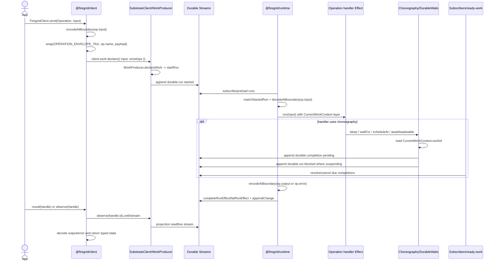

# Review: Firegrid Invocation Boundary

Date: 2026-05-06
Slice: W2A-INVOCATION-BOUNDARY-AUDIT
Scope: documentation and architecture report only

## ACIDs

- `firegrid-architecture-boundary.DEPENDENCY_GRAPH.1`: The client package may depend on substrate but must not depend on runtime.
- `firegrid-architecture-boundary.DEPENDENCY_GRAPH.2`: The runtime package may depend on substrate but must not depend on client.
- `firegrid-architecture-boundary.DEPENDENCY_GRAPH.3`: The substrate package must not depend on client, runtime, lab, or product-specific runtime packages.
- `firegrid-architecture-boundary.AUTHORITY.1`: Clients append operation messages and caller-owned EventStream rows, not execution facts.
- `firegrid-architecture-boundary.AUTHORITY.2`: Runtimes append execution facts only through substrate authority APIs.
- `firegrid-operation-messaging.RUNTIME_HANDLERS.2`: Runtime handlers run with CurrentWorkContext available in the Effect environment.
- `choreography-facade.CURRENT_WORK_CONTEXT.1`: Choreography operations read the current durable work identity from an Effect-provided CurrentWorkContext rather than requiring callers to pass work ids manually.

## Executive Summary

The current implementation has a coherent invocation boundary:

- The app-facing client owns operation send/call/result/observe and caller-owned EventStream emit/events.
- Substrate owns operation/EventStream descriptors, durable row schemas, state-machine builders, producer writes, projection reads, waits, subscribers, and choreography primitives.
- Runtime owns handler and materializer fibers. It consumes substrate rows and appends execution facts through substrate kernel APIs.
- Choreography enters only inside runtime handler Effects through `CurrentWorkContext`, `DurableWaits`, `TriggerMatchers`, and `Choreography`.

No package-boundary violations were found by the existing dependency-cruiser gate on this branch. The remaining boundary pressure is not a hard package cycle. It is surface-shape pressure: client internals still route operation sends through a substrate `work` facet, runtime imports the curated substrate root for `CurrentWorkContext`, and the client intentionally re-exports substrate descriptors for app ergonomics.

## Invocation Sequence

## 1. Client Operation Write And Read Path

App-facing API:

- `packages/client/src/firegrid/client.ts`
  - `FiregridClientService.send`
  - `FiregridClientService.call`
  - `FiregridClientService.result`
  - `FiregridClientService.observe`
- `packages/client/src/firegrid/operation-client.ts`
  - `buildFiregridClientService`
  - `FiregridClientLive`
  - `decodeOutput`
  - `decodeError`
  - local `wrap`

Write path:

1. `send(op, input)` in `buildFiregridClientService` encodes caller input with `encodeAtBoundary(op.input, ...)`.
2. `wrap(op.name, encoded)` creates an `OperationEnvelope` using `OPERATION_ENVELOPE_TAG`.
3. The wrapped envelope is passed to `client.work.declare({ input: ... })`.
4. `client.work.declare` is implemented by `makeWorkFacet` in `packages/client/src/client/work.ts`.
5. `makeWorkFacet` delegates to `WorkProducerService.declareWork`.
6. `SubstrateClientLive` in `packages/client/src/client/service.ts` wires `WorkProducer` through `SubstrateProducerLive`.
7. `SubstrateProducerLive` in `packages/substrate/src/producer.ts` calls `startRun` from `packages/substrate/src/schema/state-machine.ts`.
8. `appendChange` in `packages/substrate/src/descriptors/append.ts` appends the resulting `durable.run` started row to Durable Streams.

Read path:

1. `result(op, handle)` calls `client.work.observe(handle.id).until(isTerminalRun)`.
2. `observe(op, handle)` calls `client.work.observe(handle.id).stream()`.
3. `makeWorkFacet.observe` builds a `ProjectionQuery` over `snapshot.runs.get(workId)`.
4. Reads flow through substrate `ProjectionLive` for streaming and `rebuildProjection` for one-shot snapshots.
5. Completed rows decode through `decodeAtBoundary(op.output, ...)`; failed rows decode through `decodeAtBoundary(op.error, ...)`.

Boundary judgement:

- Satisfies `firegrid-architecture-boundary.AUTHORITY.1`: client writes only started operation-message rows through `WorkProducer.declareWork`.
- The app root hides raw row builders, but internal client files still use substrate `kernel` APIs. This is acceptable for current implementation internals and should be kept out of the app-facing root.

## 2. EventStream Write And Read Path

App-facing API:

- `packages/client/src/firegrid/event-client.ts`
  - `EventStreamClientService.emit`
  - `EventStreamClientService.events`
  - `buildEventStreamService`
  - `EventStreamClientLive`
- `packages/substrate/src/descriptors/event-stream.ts`
  - `EventStream.define`
  - `makeEventStreamStateRow`
  - `eventStreamEnvelopeFromStateRow`
  - `isEventStreamEnvelope`

Client write path:

1. `emit(stream, event)` encodes the caller event with `encodeAtBoundary(stream.event, ...)`.
2. `IdGen.nextId` supplies the EventStream event id.
3. `makeEventStreamStateRow` stores `{ _envelope: EVENT_STREAM_ENVELOPE_TAG, stream, event }` as a `firegrid.event` Durable State row.
4. `appendChange` appends the row to Durable Streams.

Client read path:

1. `events(stream)` opens `DurableStream.stream({ offset: "-1", live: true })`.
2. Raw rows are filtered through `eventStreamEnvelopeFromStateRow`.
3. Rows for other EventStream descriptors are skipped by comparing `envelope.stream` with `stream.name`.
4. Matching payloads decode through `decodeAtBoundary(stream.event, ...)`.

Runtime materializer path:

1. `Firegrid.eventStream(descriptor, materialize)` in `packages/runtime/src/runtime/firegrid.ts` builds a runtime `Layer`.
2. That layer delegates to `runEventStreamMaterializer` in `packages/runtime/src/runtime/internal/event-stream-materializer.ts`.
3. The materializer holds a long-lived `DurableStream.stream({ live: true })` session.
4. It filters State Protocol rows through `eventStreamEnvelopeFromStateRow` and `isEventStreamEnvelope`, then decodes with `decodeAtBoundary(descriptor.event, ...)`.
5. It runs the caller-supplied `materialize(event)` Effect for each matching event.

Boundary judgement:

- EventStream rows are caller-owned data, not execution authority.
- Runtime materializers read and run effects but do not append substrate authority rows from this path.

## 3. Runtime Handler Path

Public runtime API:

- `packages/runtime/src/runtime/firegrid.ts`
  - `Firegrid.handler`
- `packages/runtime/src/runtime/layer.ts`
  - `FiregridRuntimeBoot.attached`
  - `FiregridRuntimeBoot.embeddedDev`
  - `buildCoreRuntimeLayer`

Handler internals:

- `packages/runtime/src/runtime/internal/operation-handler.ts`
  - `runOperationHandler`
  - `runOperationDispatchLoopWithAcquire`
  - `matchStartedRun`
  - `currentWorkContextForRun`

Execution path:

1. `Firegrid.handler(op, run)` installs a runtime `Layer` and preserves the handler dependency channel as `Exclude<Exclude<R, CurrentWorkContext>, Scope.Scope> | RuntimeContext`.
2. `runOperationHandler` pulls `RuntimeContext`, then forks the dispatch loop in scope.
3. `runOperationDispatchLoopWithAcquire` acquires a live `SubstrateStreamDB` with `acquireSubstrateDb`.
4. Run-change wakes are produced by `db.collections.runs.subscribeChanges(wake)`.
5. Each wake reads `snapshotFromDb(db)` and scans started runs.
6. `matchStartedRun` accepts only `started` rows whose `data` is an `OperationEnvelope` and whose `operation` matches the descriptor name.
7. Input payload decodes with `decodeAtBoundary(op.input, ...)`.
8. The handler runs as `input.run(matched.input).pipe(Effect.provide(currentWorkContextForRun(cfg, matched.run)), Effect.exit)`.
9. `currentWorkContextForRun` provides:
   - `WorkId(run.runId)`
   - `OwnerId(cfg.processId)`
10. Success output encodes with `encodeAtBoundary(input.op.output, ...)`, then `completeRunEffect(matched.run, { result })`.
11. Failure payload encodes with `encodeAtBoundary(input.op.error, ...)` when possible; otherwise it falls back to `Cause.pretty(cause)`, then `failRunEffect(matched.run, { error })`.
12. Terminal rows append through `appendChange`.

Boundary judgement:

- Satisfies `firegrid-operation-messaging.RUNTIME_HANDLERS.2`: runtime handlers receive `CurrentWorkContext` from the Effect environment.
- Satisfies `firegrid-architecture-boundary.AUTHORITY.2`: runtime terminalization goes through substrate state-machine builders and append helpers.
- There is still no claim arbitration in this direct handler loop; the file documents v1 single-runtime-per-operation topology. Multi-runtime operation claim authority remains a separate design/implementation slice.

## 4. Choreography Path

Runtime-facing API:

- `packages/substrate/src/choreography/service.ts`
  - `Choreography`
  - `ChoreographyLive`
  - `ChoreographyService.sleep`
  - `ChoreographyService.waitFor`
  - `ChoreographyService.scheduleAt`
  - `ChoreographyService.awaitAwakeable`
- `packages/substrate/src/waits.ts`
  - `DurableWaits`
  - `DurableWaitsLive`
  - `workScopedAwakeableKey`
- `packages/substrate/src/subscribers.ts`
  - `runTimerSubscriberFromSnapshot`
  - `runScheduledWorkSubscriberFromSnapshot`
  - `runProjectionMatchSubscriberFromSnapshot`
- `packages/runtime/src/runtime/internal/runner.ts`
  - `runScopedSubscriberProgram`
  - `runScopedSubscriberLoopFromDb`
- `packages/runtime/src/runtime/firegrid.ts`
  - `Firegrid.subscribers.timer`
  - `Firegrid.subscribers.scheduledWork`

Choreography lowering:

1. A handler calls `Choreography.sleep`, `waitFor`, `scheduleAt`, or `awaitAwakeable`.
2. `ChoreographyLive` methods read `CurrentWorkContext` only for operations that suspend the current run.
3. `sleep` calls `DurableWaits.sleep`, which writes a pending `timer` completion with durable `{ durationMs, dueAtMs }`.
4. `waitFor` validates `TriggerMatchers`, then calls `DurableWaits.waitFor`, which writes a pending `projection_match` completion containing the serializable trigger and optional durable deadline.
5. `awaitAwakeable` calls `DurableWaits.awakeable` using `workScopedAwakeableKey(ctx.workId, input.name)`.
6. Suspending methods call `blockAndSuspend(completionId)`.
7. `blockAndSuspend` reads the authoritative current run through `readAuthoritativeRun`, builds a `blockRun` row, appends it, verifies the retained run fold, then signals `Effect.interrupt`.
8. `scheduleAt` creates a `scheduled_work` completion and returns without blocking the current run.

Subscriber and ready-work path:

1. Runtime subscriber layers call `runScopedSubscriberProgram`.
2. The runner holds one live `SubstrateStreamDB`, wakes from completion changes and deadline timers, and hands `snapshotFromDb(db)` to substrate scan functions.
3. Timer and scheduled-work subscribers resolve due completions.
4. Projection-match subscriber resolves matched completions or cancels timed-out completions.
5. Once a blocked run's completion terminalizes, ready-work derivation can identify the run as ready for operator-style processing.

Boundary judgement:

- Satisfies `choreography-facade.CURRENT_WORK_CONTEXT.1`: suspending choreography uses `CurrentWorkContext` instead of caller-passed work ids.
- Choreography does not expose raw run rows, stream URLs, or completion builders to normal runtime handler code.

## 5. Dependency And Boundary Leak Audit

Package-level evidence:

- `packages/client/package.json` depends on `@firegrid/substrate` and does not depend on `@firegrid/runtime`.
- `packages/runtime/package.json` depends on `@firegrid/substrate` and does not depend on `@firegrid/client`.
- `packages/substrate/package.json` has no dependency on `@firegrid/client`, `@firegrid/runtime`, or `@firegrid/lab`.
- `apps/lab/package.json` depends on `@firegrid/client` and `@durable-streams/client`, not runtime or substrate.
- `pnpm run lint:deps` on this branch reports: `no dependency violations found (115 modules, 278 dependencies cruised)`.

Static rule evidence:

- `.dependency-cruiser.cjs` enforces:
  - `client-no-runtime`
  - `runtime-no-client`
  - `lab-no-substrate-or-runtime`
  - `packages-no-apps`
  - `kernel-internals-stay-internal`
- `docs/dependency-graph.mmd` shows package/file direction flowing from client/runtime/lab toward substrate, not back upward.

Observed remaining boundary pressure:

1. Client internals use substrate kernel APIs.
   - Files: `packages/client/src/client/service.ts`, `packages/client/src/client/work.ts`, `packages/client/src/firegrid/operation-client.ts`.
   - Current role: internal implementation of app-facing APIs.
   - Risk: app vocabulary still maps through `work` internally, which can make future public API reviews harder.
   - Status: not a package violation and not exposed from `@firegrid/client` root.

2. Client re-exports substrate descriptors.
   - Files: `packages/client/src/index.ts`, `packages/client/src/firegrid/operation-client.ts`, `packages/client/src/firegrid/event-client.ts`.
   - Current role: app ergonomics for `Operation`, `OperationHandle`, and `EventStream`.
   - Evidence: `docs/effect-artifact-inventory.md` records these as re-export boundary crossings.
   - Status: intentional v1 shared descriptor surface, but a future `@firegrid/core` descriptor package would make the boundary cleaner.

3. Runtime imports `CurrentWorkContext` from the curated substrate root.
   - Files: `packages/runtime/src/runtime/internal/operation-handler.ts`, `packages/runtime/src/runtime/firegrid.ts`.
   - Current role: `CurrentWorkContext` is intentionally exported by substrate root; a local ESLint suppression documents this in `operation-handler.ts`.
   - Status: allowed, but it is a visible crossing between runtime handler dispatch and choreography context.

4. Lab browser source is clean against runtime/substrate imports.
   - Files: `apps/lab/src/lab/LabEventStreamClient.ts`, `apps/lab/src/lab/App.tsx`.
   - Current role: lab typed writes use `@firegrid/client/firegrid`; raw diagnostics use Durable Streams client.
   - Status: no runtime/substrate import leak in browser source.

No runtime-to-client, substrate-to-runtime/client/lab, or lab-to-runtime/substrate package import violation was found.

## 6. Exact Ownership Map

| Responsibility | Owner | Primary files/APIs |
| --- | --- | --- |
| Operation descriptor definition | Substrate descriptors | `packages/substrate/src/descriptors/operation.ts`, `Operation.define` |
| Operation client API | Client | `packages/client/src/firegrid/client.ts`, `FiregridClientService` |
| Operation input encode and envelope wrap | Client | `packages/client/src/firegrid/operation-client.ts`, `send`, `wrap`, `encodeAtBoundary` |
| Durable run start append | Substrate through client internals | `packages/substrate/src/producer.ts`, `WorkProducer.declareWork`, `startRun`, `appendChange` |
| Operation result/observe read | Client plus substrate projection | `packages/client/src/firegrid/operation-client.ts`, `result`, `observe`; `packages/client/src/client/work.ts`, `makeWorkFacet` |
| Runtime handler installation | Runtime | `packages/runtime/src/runtime/firegrid.ts`, `Firegrid.handler` |
| Handler row matching and input decode | Runtime | `packages/runtime/src/runtime/internal/operation-handler.ts`, `matchStartedRun` |
| CurrentWorkContext provision | Runtime plus substrate choreography context | `currentWorkContextForRun`, `packages/substrate/src/choreography/context.ts` |
| Run terminalization | Runtime through substrate authority | `completeRunEffect`, `failRunEffect`, `appendChange` |
| EventStream descriptor definition | Substrate descriptors | `packages/substrate/src/descriptors/event-stream.ts`, `EventStream.define` |
| EventStream client emit/events | Client | `packages/client/src/firegrid/event-client.ts`, `emit`, `events` |
| EventStream materializer | Runtime | `packages/runtime/src/runtime/firegrid.ts`, `Firegrid.eventStream`; `packages/runtime/src/runtime/internal/event-stream-materializer.ts` |
| Durable waits | Substrate | `packages/substrate/src/waits.ts`, `DurableWaitsLive` |
| Choreography facade | Substrate | `packages/substrate/src/choreography/service.ts`, `ChoreographyLive` |
| Timer/scheduled subscribers | Runtime runner plus substrate scans | `packages/runtime/src/runtime/internal/runner.ts`, `packages/substrate/src/subscribers.ts` |
| Projection-match subscriber | Substrate scan, host-provided evaluator | `packages/substrate/src/subscribers.ts`, `runProjectionMatchSubscriberFromSnapshot` |

## 7. Follow-up Slices

### W2B: Client Runtime Layout Cleanup

Goal: reduce internal naming pressure where the app-facing client still speaks through the substrate `work` facet.

Files:

- `packages/client/src/firegrid/operation-client.ts`
- `packages/client/src/client/service.ts`
- `packages/client/src/client/work.ts`
- `packages/client/src/index.ts`
- `packages/client/src/__tests__/client-foundations.test.ts`
- `packages/client/src/__tests__/client-work.test.ts`

Expected work:

- Keep public `send/call/result/observe` unchanged.
- Consider renaming or isolating internal `work` facet vocabulary so it does not look like an app-facing API.
- Preserve the existing substrate producer/projection implementation path.

### W2C: Boundary Tooling And Report Refresh

Goal: make this report reproducible from graph and Effect-artifact outputs rather than hand-assembled.

Files:

- `scripts/effect-artifacts/*`
- `scripts/effect-artifacts.mjs`
- `docs/effect-artifact-inventory.md`
- `docs/dependency-graph.mmd`
- `.dependency-cruiser.cjs`
- `docs/TOOLING.md`

Expected work:

- Add a documented command that regenerates `docs/dependency-graph.mmd`.
- Make the Effect inventory boundary-crossing section easier to filter by package pair and by descriptor re-export versus requirement-channel crossing.
- Optionally add a generated invocation-boundary appendix that lists the public entrypoints and their owning files.

### W2D: Descriptor Core Extraction Decision

Goal: decide whether `Operation`, `OperationHandle`, and `EventStream` should stay in substrate descriptors or move to a small shared descriptor/core package.

Files:

- `packages/substrate/src/descriptors/operation.ts`
- `packages/substrate/src/descriptors/event-stream.ts`
- `packages/client/src/firegrid/operation-client.ts`
- `packages/client/src/firegrid/event-client.ts`
- `packages/runtime/src/runtime/firegrid.ts`
- `packages/runtime/src/runtime/internal/operation-handler.ts`
- `packages/runtime/src/runtime/internal/event-stream-materializer.ts`

Expected work:

- If extracted, client/runtime would depend on descriptor/core and substrate would own only durable authority.
- If not extracted, document that substrate descriptors are the intentional shared descriptor kernel.

### W2E: Multi-runtime Operation Authority

Goal: close the direct-handler single-runtime topology gap.

Files:

- `packages/runtime/src/runtime/internal/operation-handler.ts`
- `packages/substrate/src/operator.ts`
- `packages/substrate/src/internal-claim.ts`
- `packages/substrate/src/projection/ready-work.ts`
- `packages/runtime/src/__tests__/operation-handler.test.ts`
- `packages/substrate/src/__tests__/operator*.test.ts`

Expected work:

- Decide whether `Firegrid.handler` should dispatch through claim/ready-work authority for multi-runtime operation competition.
- Preserve `CurrentWorkContext` provisioning and descriptor encode/decode boundaries.

## 8. Gaps Noted For Tooling

- `docs/dependency-graph.mmd` exists, but the command that generated it is not obvious from the doc itself. W2C should document or automate graph refresh.
- `docs/effect-artifact-inventory.md` usefully identifies re-export crossings, but descriptor re-exports dominate the crossing list. W2C should separate intended descriptor-sharing crossings from riskier requirement-channel or runtime/lab crossings.
- The invocation boundary is understandable from code now, but not generated. This report should be treated as a human audit until W2C makes it reproducible.
