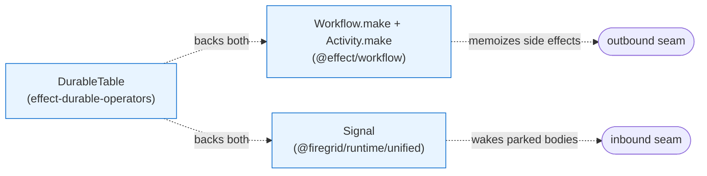
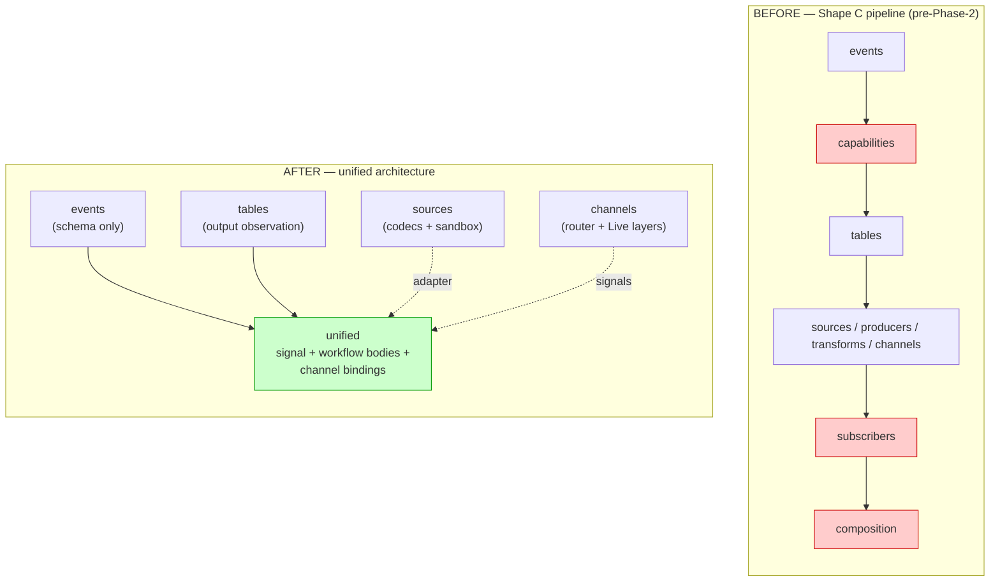
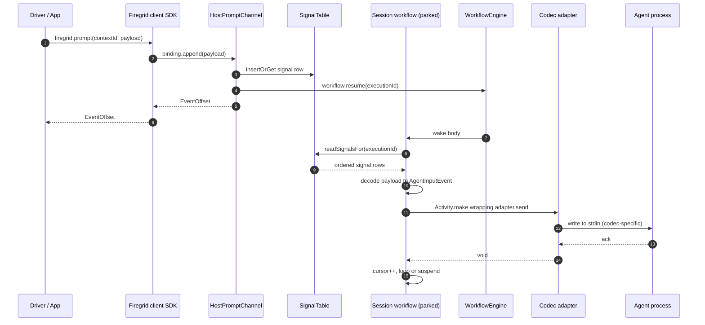
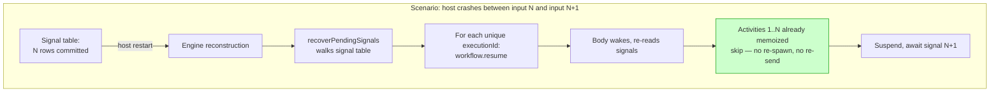
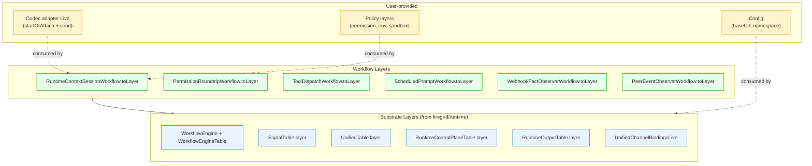

# Unified Architecture — Mental Model

Status: design partner aid (post-Phase 2 cutover)
Date: 2026-05-31
Owner: Firegrid Architecture
Predecessor: `2026-05-22-runtime-physical-target-tree.md` (now partially superseded — see §6)

Companion to `SDD_FIREGRID_PROTOCOL_RESPONSE_UNIFICATION.md` Phase 2. This doc exists to make the post-cutover architecture holdable in one head, so design decisions about the next phase can be made without re-deriving the substrate every time.

## 1. The whole runtime, in three primitives

Everything `@firegrid/runtime` does is built from three durable-execution primitives. There is no fourth.



| Primitive | What it gives you | Provided by |
|---|---|---|
| **Workflow + Activity** | A function body that can park (`Workflow.suspend`) and resume later. Activity calls are memoized — exactly-once side effects across replay. | `@effect/workflow` |
| **DurableTable** | Append-only durable rows with primary-key dedup + `rows()` stream. | `effect-durable-operators` over durable-streams |
| **Signal** | "Wake a specific workflow execution with this payload, durably." Analog of Temporal Signals, Restate Awakeables, AWS SFN task tokens. | `runtime/src/unified/signal.ts` (kernel-internal composition) |

That's the substrate. The rest of the runtime is just adapters to the outside world (`sources/codecs`, `sources/sandbox`) and dispatch surface for callers (`channels/`).

## 2. The pipeline collapsed

The pre-Phase-2 pipeline had seven tiers wired in strict order. Phase 2 deleted three of them.



- `subscribers/` (5,300 LoC) — gone. Replaced by workflow bodies in `unified/subscribers/`.
- `composition/` (2,500 LoC) — gone. Replaced by `UnifiedChannelBindingsLive` (200 LoC).
- `capabilities/` — was always empty; formally retired as a tier.
- `events/`, `transforms/`, `tables/`, `channels/`, `sources/`, `engine/` — survive, mostly intact.
- `unified/` — the new tier. Contains the substrate primitive (Signal), the row families the engine doesn't already track, the workflow bodies, and the channel Live layer that wires it all in.

## 3. End-to-end request flow

This is one request — `firegrid.prompt({contextId, payload})` — traced from the client SDK to the agent process.



Three things to notice:

1. **The channel `append` is durable-and-cheap.** It inserts a signal row and calls `engine.resume(executionId)`. The signal row IS the durable input log. No `inputIntents` table, no allocator, no sequence cursor.
2. **The workflow body PULLS its inputs.** It reads signals in `recordedAt` order from its own execution-scoped view. The signal table is structurally the body's input log.
3. **The only outbound seam is `Activity.make`.** Production wiring replaces the simulation's `RuntimeContextRecorder` with a real codec adapter at exactly that activity slot. No other production wiring is required for the session flow.

## 4. Durability — crash and replay

The reason the architecture is small is that the engine and the signal primitive together cover every durability case.



Two memoization layers:

| Layer | What it memoizes | Effect |
|---|---|---|
| **Engine activity memoization** | Each `Activity.make({name, execute})` call. After first success, the engine stores the return value in `WorkflowEngineTable.activities`. | Outbound side effects (spawn, send) run **exactly once**, even across crash/replay/resume. |
| **Signal-table durability** | Each `sendSignal(...)`. The signal row is the durable input log. | Inbound inputs are **never lost**, even if the engine has not yet woken the consumer. The recovery sweep finds them. |

There is no third durability mechanism. No `runs` table tracking spawn lifecycle (engine activity record is the spawn evidence). No `outputs` table tracking delivery completion (engine activity record is the delivery evidence). No `inputIntents` table tracking arrival (signal row is the arrival evidence).

## 5. Composition stack — what a host needs today

This is what a user assembling their own production host has to provide. It's the design target for the next-phase composition surface.



There are roughly **8 substrate pieces** and **6 workflow pieces** and **1–3 user pieces**. Whether the next-phase SDD ships a `FiregridHost` factory that pre-assembles the substrate + workflow tiers, or whether it stays primitive-only and documents the recipe, is the open design question.

The arrow `codec adapter → RuntimeContextSessionWorkflow.toLayer` is the load-bearing detail: the workflow currently takes the adapter via closure at Layer-build time (`buildRuntimeContextSessionLayer(adapter)`). For clean composition the adapter should become a `Context.Tag` — then the workflow Layer is static and the user provides the adapter Tag independently, like every other Tag-provided service.

## 6. Implications for the physical target tree

The pre-Phase-2 target tree (`2026-05-22-runtime-physical-target-tree.md`) declared seven tiers in strict order. Three of those tiers are gone:

| Tier | Status | Replacement |
|---|---|---|
| `subscribers/` | **retired** | `unified/subscribers/` (workflow bodies, not Shape-B/C/D handler loops) |
| `composition/` | **retired** | `unified/channel-bindings.ts` (one Live layer instead of a tier) |
| `capabilities/` | **retired** | (was always empty; folded into `events/` semantically) |
| `producers/` | **retired** (always empty in practice) | Production-side appends happen inline in channel Live layers |

The surviving target tree:

```text
packages/runtime/src/
├── engine/             # durable workflow execution
├── events/             # pure schema vocabulary
├── transforms/         # pure decoders
├── tables/             # output observation Tags
├── sources/            # codecs + sandbox (live I/O boundary)
├── channels/           # wire-edge dispatch (router + Live layers)
├── unified/            # signal + workflow bodies + channel bindings
└── verified-webhook-ingest/  # webhook verification
```

The pipeline ordering becomes:

```text
events + transforms   (pure schema)
            │
            ▼
       channels   ──signals──▶   unified   ──activities──▶   sources
   (dispatch in)                 (bodies)                    (I/O out)
            ▲                         │
            └──── observation ────────┘
                 (tables/runtime-output)
```

It's still a pipeline, but it's shorter and not strictly linear — `unified/` is the hub, and the other tiers plug into it.

## 7. The three open design questions

These are the questions the next-phase SDD has to answer. None are about the substrate (that's pinned). All are about the surface.

### Q1 — Adapter Tag shape

What's the canonical interface a codec adapter must satisfy?

Strawman:

```ts
export class RuntimeContextSessionAdapter extends Context.Tag(
  "@firegrid/runtime/RuntimeContextSessionAdapter",
)<RuntimeContextSessionAdapter, {
  readonly startOrAttach: (
    context: RuntimeContext,
    activityAttempt: number,
  ) => Effect.Effect<void, AdapterError>
  readonly send: (
    context: RuntimeContext,
    activityAttempt: number,
    event: AgentInputEvent,
  ) => Effect.Effect<void, AdapterError>
}>() {}
```

Question: does the adapter also expose `deregister(contextId)` (which the deleted `RuntimeContextWorkflowSession` had), or do session terminations just drop the entry on workflow completion?

### Q2 — Composition factory vs primitive-only

Two surfaces:

- **`FiregridHost(options)`** — one factory takes a small options bag, returns a fully composed Layer. `options.adapter` is required; everything else has defaults. Override via `.pipe(Layer.provide(...))`. Ergonomic but adds API surface.
- **Recipe-only** — document the 14-piece composition; users assemble. Smallest API surface; users feel the weight of every choice.

Recommendation: factory, with documented escape hatches. But "smallest surface area" pulls the other way — that's a real tension.

### Q3 — Bin / CLI shape

`packages/runtime/src/bin/` was deleted. `packages/cli/` still exists but its subprocesses point at nothing. Three options:

- **No bins.** Users wire their own process entrypoints. CLI becomes scaffolding-only.
- **Minimal bin.** `firegrid host` boots the `FiregridHost` factory with config from env vars. No `firegrid run`, no `firegrid acp` — those were Shape C lifecycle commands.
- **Full bins reconstructed.** Restore `firegrid run` and `firegrid acp` on the unified primitives.

The "smallest surface area" principle says option 1 unless option 2 is genuinely load-bearing for usability.

## 8. What this doc does NOT decide

- Whether `@firegrid/host-sdk` (currently `export {}`) gets deleted or repurposed. Independent decision; not blocking.
- The exact shape of the adapter error vocabulary. Depends on codec spec, not on architecture.
- Tool dispatch's invocation seam (sibling workflow vs Activity vs signal). Currently solved in the simulation; production may need tuning.
- Permission roundtrip's UI integration (the `permissions` row is render-ready; how a UI subscribes is a separate concern).

These are intentionally out of scope so the SDD can stay tight.

---

If the diagrams above hold the system clearly enough, the next-phase SDD's content is just the three questions in §7. The substrate is settled; the surface is the design work.
