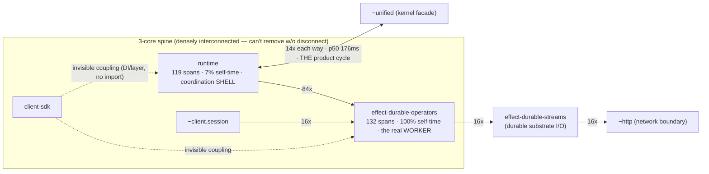

# Runtime dynamics map (current state) — 2026-06-02

The **dynamic** companion to `2026-06-02-runtime-structure-map.md`. Where the
static map shows which modules *could* connect (imports), this shows how data
*actually* flows at runtime — the DI / Effect-layer / channel / signal coupling
that never appears as an import — by collapsing an OTel span tree into a
subsystem×subsystem graph and running networkx over it.

Generated with the repo's own instrument (`scripts/runtime-flow-map.py`, the
runtime-shrink-loop tool — `docs/architecture/runtime-shrink-loop.md`):

```bash
# fixed-corpus scenarios → traces (keyless deterministic + any keyed live runs)
bash scripts/runtime-corpus.sh measure
# union the current traces + static overlay, emit reports + artifacts
uv run --with networkx --with scipy python3 scripts/runtime-flow-map.py \
  docs/architecture/corpus/.runs/*.jsonl \
  --depcruise=docs/architecture/corpus/.runs/depcruise.json \
  --granularity=subsystem --contracts --skeleton \
  --dot=docs/architecture/runtime-flow.dot --timeline=docs/architecture/runtime-timeline.svg
```

**Corpus this run:** union of `codex-acp-tool-calls` (150 spans, keyed live path)
+ `control-plane-cancel-close` (190 spans, deterministic) = **340 spans**.
Topology (`N`, SCCs) is volume-independent, so this small union is representative.

**Artifacts (committed alongside this doc):**
- `runtime-flow.svg` / `runtime-flow.dot` — the subsystem flow graph (red edges =
  invisible coupling: runtime flow with no static import).
- `runtime-timeline.svg` — LTR swimlane of flow over wall-time (control-plane scenario).

## The two shrink-loop numbers (measured now)

| Metric | Pre-unified (2026-05-22 corpus) | **Now (2026-06-02)** | Reading |
|---|--:|--:|---|
| **`N`** = condensation nodes (irreducible logical units) | 25–38 | **11** (13 nodes, 2 cycles) | The unified collapse **roughly halved+ the irreducible-unit count** — a measured structural win, not a claim. |
| **`C`-ish** contract coverage | C=17–23 | 11/67 seams (16%), 142/340 spans (**41%**) | Most hot seams still carry no `firegrid.contract.id` — the annotation worklist below. |

> Caveats (honest): (1) the committed shrink-loop **baselines are pre-unified**
> (`runtime-shape-baseline*.json`, N=25/33) and the **corpus `manifest.json`
> references deleted sims** (`wait-pre-attach-roundtrip`, `delegation-proof-cap4`
> are now `UnknownSimulation`; current set: `channel-completion-contracts`,
> `child-output-existing-channel-router`, `codex-acp-tool-calls`,
> `control-plane-cancel-close`, `unified-kernel-validation`). So `runtime-corpus.sh
> check` cannot currently run its gate — see "Tooling drift" below. (2) `N` here is
> a 2-scenario union; widen the corpus before treating it as the global number.

## The one structural target: `unified ⇄ runtime`



Condensation collapses the 13 subsystems to **11 DAG nodes via 2 cycles**:
- **`unified ⇄ runtime`** — the **only product cycle** (the other, `side.driver ⇄
  firelab`, is sim-harness, ignore). 14 calls each direction, p50 ~176ms.
  Per the shrink-loop playbook this is the **#1 structural target**: make the SCC
  *gone* — either co-locate the reciprocal pair into one module (`N`→10) or cleanly
  break it with a typed one-directional boundary (kernel facade `unified/index.ts`
  ↔ the runtime tiers). A clean break that raises `N` is still success.

### Other evidence-backed reads
- **`effect-durable-operators` is the only real worker** (100% self-time, 132
  spans, 3-core, articulation) — the durable substrate. Everything routes *through*
  `runtime`, but `runtime` does almost no work itself (7% self-time): it's a
  coordination shell. Volume ≠ value — don't "preserve" `runtime` for its span count.
- **0 collapse-candidate relays / 0 contractible relays** — the unified arch has no
  dead pure-indirection to inline. (Pre-unified maps flagged several.) The collapse
  already removed that class.
- **Invisible coupling (DI/layer/channel, no static import):** `client-sdk → runtime`,
  `client-sdk → effect-durable-operators`, `firelab → effect-durable-operators`.
  These are real runtime edges with no import — worth a deliberate seam in the re-arch
  rather than implicit layer wiring.

## Annotation worklist (top NEEDS-CONTRACT seams — raise `C`)

Each exercised seam should declare the invariant it enforces (`firegrid.contract.id`)
or be a collapse candidate. The heaviest uncontracted seams this corpus:

| Seam (op family) | Calls | Proxy reason |
|---|--:|---|
| `http.client POST` | 16 | process/network boundary |
| `firegrid.durable_streams.http.request` | 16 | process/network boundary |
| `firegrid.durable_table.rows` | 14 | structural cut-vertex |
| `firegrid.workflow_engine.workflow.register` | 7 | structural cut-vertex |
| `firegrid.unified.signal.arm_session` | 4 | structural cut-vertex |
| `firegrid.agent_event_pipeline.source.local_process.*_bytes` | 4×3 | process boundary |
| `firegrid.unified.{adapter,session}.*` | 2×several | structural cut-vertex |

(Full list: re-run `--contracts`. The proxy triages; the author adjudicates — name
the ACID/SDD each seam enforces, or collapse it.)

## Tooling drift found while running this (fix candidates)

1. **Corpus manifest references deleted sims** — `docs/architecture/corpus/manifest.json`
   lists `wait-pre-attach-roundtrip` + `delegation-proof-cap4`, both now
   `UnknownSimulation`. `runtime-corpus.sh check` can't complete its gate until the
   scenario set is realigned to the current sims (+ the keyed gating re-decided).
2. **Shrink-loop baselines are pre-unified** (`runtime-shape-baseline*.json`, N=25/33)
   — they predate the collapse; a coordinator re-baseline (`runtime-corpus.sh baseline`)
   against the realigned corpus is needed before the gate is meaningful again.

> These are **coordinator-owned** (the shrink loop is Gary's playbook + the baselines
> gate `N`/`C`); flagged here, not silently rewritten.
