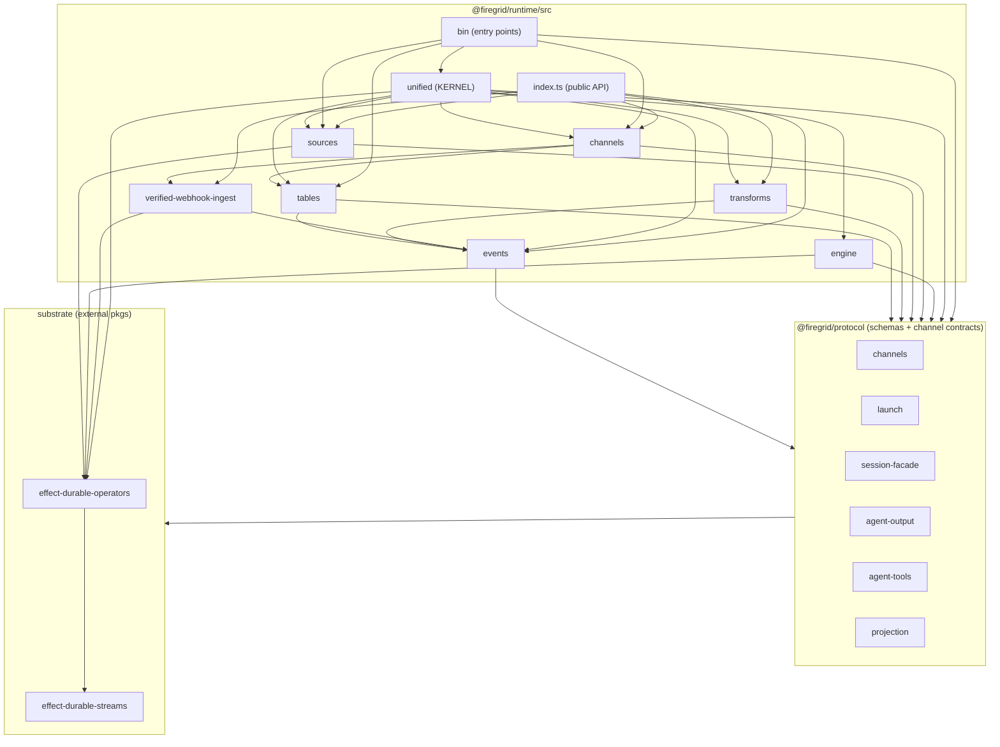

# Runtime structure map (current state) — 2026-06-02

A **current-state** design + visualization aid for the runtime re-architecture.
Descriptive, not prescriptive — the target arch is owned by the active SDDs/handoffs;
this is the ground-truth picture to re-architect *from*.

Generated with the repo's own tooling:
- `pnpm run arch:deps` / `arch:deps:runtime` / `arch:deps:runtime:detail` →
  the dependency-cruiser Mermaid graphs under `docs/dependency-graph*.mmd`
  (refreshed this date; the previous artifacts predated the unified collapse).
- Inventory + edge reading below is measured from `packages/runtime/src` on `main`.

> Tooling note: `arch:deps`/`arch:deps:client` were failing on a stale
> `packages/client/src` path (the package is `client-sdk`); fixed in
> `scripts/tooling.mjs` so the full set regenerates.

## 1. `packages/runtime/src` inventory (measured)

| Dir | Files | LOC | Role | State |
|---|--:|--:|---|---|
| `unified/` | 18 | 4307 | **The kernel** — host composition, channel-bindings, codec-adapter, signal, subscribers, mcp-host, observers, tables | LIVE (target) |
| `sources/` | 26 | 4663 | Codecs + sandbox + agent-adapters (ACP etc.) — the largest module | LIVE |
| `channels/` | 18 | 1938 | Channel router + typed channel targets | LIVE |
| `engine/` | 5 | 837 | Workflow/durable engine internals | LIVE |
| `verified-webhook-ingest/` | 4 | 593 | Verified webhook ingest adapter | LIVE |
| `bin/` | 6 | 556 | Entry points (`firegrid`, `acp`, `run`, `_compose`, `_main`) | LIVE |
| `tables/` | 6 | 406 | DurableTable authority modules | LIVE |
| `events/` | 6 | 232 | Event vocabulary | LIVE |
| `transforms/` | 4 | 217 | Pure `(state, event) → (state, actions)` transforms | LIVE |
| `_archive/` | 0 | 0 | Time-boxed holding pen (Archive Rule), now drained | code-empty; `DEPRECATED.md` only |
| `capabilities/` | 0 | 0 | **Reserved tier** — pipeline pos **1b**, pure declarations | code-empty; `README.md` only (intentional slot) |
| `producers/` | 0 | 0 | **Reserved tier** — pipeline pos **3b** | code-empty; `README.md` only (intentional slot) |

Plus root files `index.ts` (public surface) and `runtime-errors.ts` (internal,
cycle-break).

**Headline:** of 12 top-level dirs, **3 carry no code**, but they are NOT all
deletable residue (verified by reading their marker docs):
- `_archive/` is the drained holding pen named by the Archive Rule in
  `docs/architecture/2026-05-22-runtime-physical-target-tree.md` (and referenced by
  dep-cruiser/ESLint guards) — removable only once the cutover formally closes.
- `capabilities/` (pos 1b) and `producers/` (pos 3b) are **intentional reserved
  tiers** from that same target-tree design, deliberately kept as documented-but-
  empty slots — *do not* blind-delete; collapsing them is a design decision.

The "three-primitive" kernel lives in `unified/`; the populated tier dirs
(`events`, `tables`, `transforms`, `sources`, `channels`) + `engine/` are the live
substrate it composes.

## 2. Observed dependency layering (from `dependency-graph-runtime.mmd`)

Read bottom-up; arrows point at the dependency (importer → imported).

### What the layering shows
- **`unified/` is the convergence point** — it imports nearly every tier
  (`channels`, `engine`, `sources`, `tables`, `events`, `transforms`) plus the
  protocol surfaces. It is the kernel the re-architecture centers on.
- **Clean-ish tier DAG**: `events` is the base; `tables`/`transforms` sit on
  `events`; `channels` sits on `tables`; `sources` and `engine` are siblings on
  the substrate. No tier reaches *up* into `unified` (good — the kernel composes
  the tiers, not vice versa).
- **`index.ts` (public API) re-exports the tiers but NOT `unified/`** — the
  kernel is reached through `bin/` entry points, not the package barrel. Worth a
  decision in the re-arch: is `unified/` intended public surface or internal-only?
- **`sources/` is the heavyweight** (4663 LOC, 26 files) — codecs + sandbox +
  agent-adapters. If the re-arch wants smaller modules, this is the first split
  candidate.

## 3. Companion visualizations (regenerated this date)

| Artifact | Scope | Regenerate with |
|---|---|---|
| `docs/dependency-graph.mmd` | workspace package-level (collapsed) | `pnpm run arch:deps` |
| `docs/dependency-graph-detail.mmd` | workspace, file-level | `pnpm run arch:deps:detail` |
| `docs/dependency-graph-runtime.mmd` | `runtime/src`, dir-collapsed (source for §2) | `pnpm run arch:deps:runtime` |
| `docs/dependency-graph-runtime-detail.mmd` | `runtime/src`, file-level | `pnpm run arch:deps:runtime:detail` |
| `docs/dependency-graph-client.mmd` | `client-sdk/src` | `pnpm run arch:deps:client` |
| `docs/dependency-graph-protocol.mmd` | `protocol/src` | `pnpm run arch:deps:protocol` |

## 4. Concrete, low-risk re-architecture starters (grounded in the above)

1. **Resolve the 3 code-empty dirs — as a design decision, not a sweep:**
   `_archive/` can be removed once the cutover formally closes (it's referenced by
   the Archive Rule + guards, so coordinate that). `capabilities/` (1b) and
   `producers/` (3b) are reserved tiers — keep them as design slots, or *decide* to
   collapse them if the re-arch drops those pipeline positions. Either way it's a
   target-tree decision, not blind deletion.
2. **Decide `unified/`'s surface** — it's the kernel but absent from `index.ts`;
   either export it intentionally or document it internal-only.
3. **`sources/` split** — the largest module (4663 LOC); natural seams are
   `codecs/`, `sandbox/`, `agent-adapters/`.

For the dependency-rule view that *enforces* this layering, see
`.dependency-cruiser.cjs` (the runtime tier rules) and `docs/static-analysis-catalog.md`.
