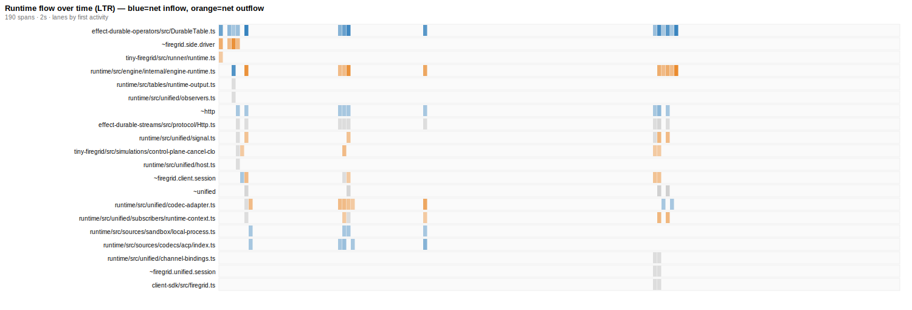

# Runtime Dynamics Map — host-sdk / runtime

**For the team.** This is the coherent picture of how data *actually flows* through the runtime at execution time — the thing the prose docs don't give and `depcruiser` structurally can't see. Use it to decide what's safe to cut, what's load-bearing, and where the hidden wiring lives before refactoring `packages/host-sdk` / `packages/runtime`.

**Generated:** 2026-05-22 · **Coverage:** union of 3 scenarios (112,406 spans, 43 nodes): `acp-tool-elicitation` (prompt/output), `codex-acp-tool-calls` (tool-call), `wait-pre-attach-roundtrip` (wait/attach).

**How it's made:** OTel spans are a contrast agent already injected into the runtime — every span knows the file that emitted it (its `withSpan` / `Activity.make` site), its parent, and its `context.id`. `scripts/runtime-flow-map.py` collapses the parent→child span tree into a module graph (networkx) and overlays it on depcruiser's static import graph.

```bash
npx depcruise --config .dependency-cruiser.cjs --output-type json packages/*/src > /tmp/dc.json
uv run --with networkx --with scipy python3 scripts/runtime-flow-map.py \
  <trace…> --depcruise=/tmp/dc.json --contracts --skeleton --dot=docs/architecture/runtime-flow.dot
dot -Tsvg docs/architecture/runtime-flow.dot -o docs/architecture/runtime-flow.svg
# temporal view (SINGLE trace): … --timeline=docs/architecture/runtime-timeline.svg
```


> Red/bold edges = **invisible coupling** (runtime flow with no static import). Node size ∝ span volume. Clusters = packages.

---

## 0. The mental model: value ≠ volume

The trap is reading "carries lots of data" as "load-bearing." It isn't. An edge carrying 37k calls can be pure overhead; a 3-call edge can be irreducible. The right axis is **irreducibility** — *does this hop cross a boundary that exists for a reason other than moving data?*

A hop is **load-bearing** only if it: **transforms** data, crosses an **authority/trust** boundary, crosses a **durability** boundary (the replay seam), crosses a **process/network** boundary, introduces a **concurrency** seam, or enforces **ordering**. Everything else — same domain, same shape, single consumer, in-process, no durable write — is **pure indirection**, collapsible *regardless of traffic*.

The practice that operationalizes this is **contract-coverage** (§4): every exercised seam must declare the invariant it enforces, or it's a collapse candidate.

---

## 1. The gravitational centers — and the coordination shell

`pagerank` (centrality) × `self-time%` (own work) separates true centers from routers:

| Module | spans | pagerank | self-time % | reading |
|---|---|---|---|---|
| `effect-durable-operators/DurableTable.ts` | 47,806 | 0.184 | **98%** | true gravitational center — storage substrate, does real work. Fixed mass. |
| `runtime/workflow-engine/internal/engine-runtime.ts` | 19,944 | 0.057 | **52%** | the real engine — claims, resumes, executes. Does work. |
| **`runtime/workflow-engine/workflows/runtime-context.ts`** | **27,272** | 0.030 | **3%** | **coordination shell** — 2nd-highest volume, near-zero own work. |
| `effect-durable-streams/Http.ts` | 5,927 | 0.16 | 9% | process/network boundary — irreducible (crosses to the durable-streams server) despite low self-time. |

> The auto-instrumented HTTP-client bucket `~http` is omitted from this table: it has no emitting source file, so its "100% self-time" is a mechanical artifact (an unattributed node has no children to subtract), not a finding.

**The key reframe:** `runtime-context.ts` (the workflow body) is a **high-volume, ~3%-self-time coordination shell**. It routes 27k spans but does almost no compute itself — the actual work lives in `engine-runtime`, `DurableTable`, the recorder, and `per-context-output`. By *volume* it looks like a center to preserve; by *value of its own logic* it's a thin dispatcher. The heaviest single edge, `engine-runtime → DurableTable.get` at **37,724 calls**, says the engine is overwhelmingly a storage driver (the per-step read storm the tf-aseo work targets).

---

## 2. The hidden wiring (invisible coupling)

Edges with real runtime flow but **no static import** — wired by Effect layers / DI / channels / workflow signals. This is the coupling **nothing in the source or depcruiser shows**, and each is a contract a refactor can silently break.

| flow | calls | what it is |
|---|---|---|
| `runtime-context.ts` ⇄ `engine-runtime.ts` | **13,551 → / 5,883 ←** | **The central seam.** Workflow body ⇄ engine, bidirectional, no import either way. The #1 thing to document before touching either file. |
| `runtime-context.ts → per-context-output.ts` | 769 | body publishes agent output via a layer, not an import |
| `runtime-context.ts → runtime-control-plane-recorder.ts` | 186 | body records control-plane facts via injected recorder |
| `channels/router.ts → runtime-context.ts` | 112 | channel dispatch into the body (the inbound edge) |
| `control-request-dispatcher.ts → recorder / engine-runtime` | 16 / 9 | control plane dispatches via dynamic dispatch |
| `kernel/runtime-context-workflow-runtime.ts → runtime-input-deferred.ts` | 22 | kernel wires deferred input into the engine |

---

## 3. The structural shrink (`condensation`)

The headline is a structural claim the graph algorithm found independently: **`engine-runtime ⇄ runtime-context.ts ⇄ runtime_context.workflow ⇄ runtime-control` form a single strongly-connected component** — `nx.condensation` collapses these four into *one* DAG node. They are **one logical unit**: reason about them together, and treat **co-location** (not "preserve the coupling") as the refactor. This is the same seam §2 flags as invisible coupling, now confirmed by SCC analysis rather than edge volume.

Overall the condensation shrinks **43 nodes → 38**. The other two cycles are smaller and likely less consequential: `control-request-dispatcher.ts ⇄ protocol/otel/row-otel.ts` (control-request path ⇄ its OTel row) and `host-sdk/mcp-host.ts ⇄ Toolkit` (registration ⇄ invocation).

**The runtime has little fat to delete — the leverage is reshaping, not removal.** Relay-contraction (collapsing pure-indirection nodes) removes only 1 node in this corpus (`tool-call.ts`); every other node is an articulation point or boundary-crosser, i.e. genuinely structural. So the shrink that matters is the *condensation* (merge the co-located unit), not deletion.

---

## 4. The practice: contract-coverage (the headline)

> This section **proposes a practice**; §1–§3 and §5–§7 stand on their own measurement and do not depend on it being adopted.

**Every exercised seam must declare the invariant it enforces (`firegrid.contract.id` = an ACID/SDD/decision-doc id) or it is a collapse candidate.** This inverts the static-lint problem we (correctly) rejected: not "should this have a span?" (no oracle, false-positive-prone) but **"this span *ran* — what invariant does it carry?"** — answerable by the author at annotation time, runtime-grounded, span-specific. The remediation is binary: **annotate, or collapse.** Stated positively (declare your invariant), it becomes a CI ratchet once adopted.

**Today: 0% (schema not yet adopted). The pre-triaged worklist is the value** — derivable proxies pre-sort the 135 exercised seams:

- **NEEDS-CONTRACT — 120 seams** (cross a real boundary → annotate with the ACID/SDD): e.g. `durable_table.get` (26,024×), `workflow_engine.deferred.result` (7,072×), `durable_table.action` (6,861×, durability/commit), `runtime_context.workflow.input.completed` (6,801×).
- **REVIEW — 14 seams** (carry work, no boundary proxy → author decides): e.g. `acp.session_update` (751×), `durable_tools.wait_for.upsert_active` (240×).
- **COLLAPSE-CANDIDATE — 1 seam** (no invariant + pure indirection → inline/remove): `agent-tool-call.execute` @ `tool-call.ts`.

That collapse candidates are *rare* and contract-justification is the *bulk* is the point: **contract-coverage is the practice; collapse-detection is the consequence.**

### Proposed seam schema (minimal, high-leverage)
Annotate each span's own properties once; derive edge boundary-crossings from the endpoint pair (don't double-annotate in/out).

| Attribute | Why | Cost |
|---|---|---|
| `firegrid.seam.kind` ∈ {transform, authority, durability, process, concurrency, ordering, **bridge_debt**, relay} | master classifier | 1 enum/site |
| **`firegrid.contract.id`** | the architectural anchor — a hot edge that can't name a spec/invariant is suspect by default | 1 string/site |
| `firegrid.state.effect` ∈ {none, read, write, append, claim, commit} | durability seam (derivable-ish from name now) | cheap |
| `firegrid.replay.phase` ∈ {live, replay, resume} | Firegrid-specific — the tf-7kq8/tf-aseo replay storm lives here | cheap |

Make **`bridge_debt`** first-class: an edge load-bearing *operationally* but not *architecturally* (connects two eras) — "don't delete, change shape toward the SDD table-owned seam." The unclassifiable seams from the derivable proxies are exactly the backlog needing real annotation.

---

## 5. Coverage 2×2 + a corrected finding (`--coverage`)

Runtime-flow × static-consumers. **Zero provably-dead files** in this corpus — everything dark is still imported (often via a barrel), so nothing is deletable on import-evidence alone. Dark-but-wired files are **coverage gaps**, not residue.

> ⚠️ **Corrected finding (chasing changed the conclusion).** `runtime/streams/runtime-observation-streams.ts` was first flagged dead because its spans never fire. **Wrong.** It provides the `RuntimeObservationStreams` service that **`wait-for.ts` consumes**. Its spans are dark only because the wait/observe read-path isn't exercised here (`wait-for.ts` is dark too), compounded by tf-aseo moving output observation to the per-context skip-cursor. **Live, not residue.** Lesson: dark = coverage gap; verify consumers before calling anything dead.

---

## 6. Temporal view (`--timeline`, single trace)



LTR swimlane of the elicitation run (106,209 spans / 78s). Lanes = components ordered by first activation; cell color = **net flow direction** (blue = receiving, orange = emitting), intensity ∝ volume. Surfaces the **per-turn rhythm**, **who drives whom and when** (edge/router emit orange at turn boundaries; engine/DurableTable pulse blue through each turn), and **bursts vs idle** (the `durable_table.get` storms are time-localized). Single trace only — a multi-trace union yields a meaningless multi-day axis.

---

## 7. What this says about the live decision (tf-jpcg)

tf-jpcg proposes an "external await into `RuntimeContextWorkflow`" seam so the MCP handler can run a tool and get the result by `toolUseId` (prerequisite for deleting `ToolCallWorkflow`). There are **two readings of the data — they imply different fixes, but both argue against hardening tf-jpcg's current framing.** State which you're taking:

- **Reading A (stronger, from the SCC):** body and engine are **one condensed unit** (§3) wired by **invisible coupling** (§2). So the file boundary `runtime-context.ts` vs `engine-runtime.ts` is *already wrong* — the seam *can* live in the body, but the refactor is to **co-locate body+engine** and let the tool input/result be workflow-owned state, not to add an await across a boundary that shouldn't exist. This matches `SDD_TARGET_TINY_FIREGRID_ARCHITECTURE_REFERENCE.md` (workflow-owned DurableTable seam).
- **Reading B (supporting, from self-time):** `runtime-context.ts` is a **coordination shell** (§1: 3% self-time) — a router, not where work belongs. This reading says the seam should live *elsewhere* (closer to the executor), not be bolted onto the router.

Both reject "external await into the workflow as currently shaped." Under the §4 schema the seam classifies as **`bridge_debt`** (no `contract.id` to the target SDD; same-domain dynamic dispatch) — *don't delete `ToolCallWorkflow` by adding another engine/deferred bridge; change shape toward the table-owned seam first.* The SCC result makes Reading A the load-bearing one.

---

## 8. Caveats & next captures

- **Single-corpus bias:** 3 agent-driven scenarios. Control-plane lifecycle (cancel/close/resume) and multi-context fan-out are under-represented (`control-request-dispatcher.ts` shows only ~75 spans here). Capture those before drawing control-plane conclusions, then re-run the union — it hardens both the cold-edge and contract-coverage claims.
- **Not yet checked per-scenario:** the §1 `runtime-context.ts` 3%-self-time and the §3 four-way SCC are properties of *this union*. They are likely to hold (the body is a dispatcher in every path), but readers will cite them as system properties — they have **not** been verified to be stable across each scenario in isolation. Treat as strong hypotheses pending a per-scenario pass.
- **Proxies, not ground truth:** `seam.kind`/`contract.id` are 0% today, so §4 verdicts are derivable *proxies*. They triage; they don't replace the author's annotation.
- This is a **measurement**, not a spec. A "healthy" number is whatever the team decides; the map shows what the code *does*, not what it *should*.

**Tooling:** `scripts/runtime-flow-map.py` (networkx; modes `--contracts` `--skeleton` `--coverage` `--depcruise` `--dot` `--timeline` `--focus`). Run with `uv run --with networkx --with scipy`.
