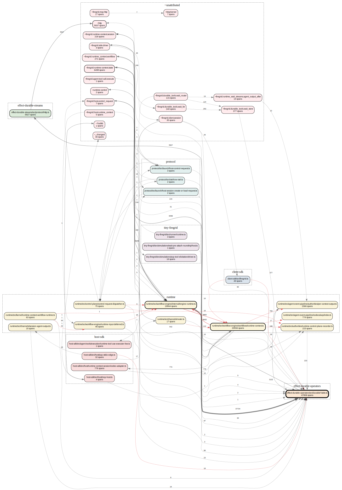

# Runtime Dynamics Map — host-sdk / runtime

**What this is:** the coherent picture of how data *actually flows* through the runtime at execution time — the thing the prose docs don't give and that `depcruiser` structurally can't see. Generated by injecting OTel spans as a "contrast agent" and reading the flow back out (see `scripts/runtime-flow-map.py`). Use it to decide what's safe to cut, what's load-bearing, and where the hidden wiring lives before refactoring `packages/host-sdk` / `packages/runtime`.

**Generated:** 2026-05-22 · **Granularity:** file · **Coverage:** union of 3 scenarios (112,406 spans, 3 contexts): `acp-tool-elicitation` (prompt/output), `codex-acp-tool-calls` (tool-call), `wait-pre-attach-roundtrip` (wait/attach).

**Regenerate:**
```bash
npx depcruise --config .dependency-cruiser.cjs --output-type json packages/*/src > /tmp/dc.json
python3 scripts/runtime-flow-map.py <trace1> <trace2> … --depcruise=/tmp/dc.json --dot=docs/architecture/runtime-flow.dot
dot -Tsvg docs/architecture/runtime-flow.dot -o docs/architecture/runtime-flow.svg
```



> Red/bold edges = **invisible coupling** (runtime flow with no static import). Node size ∝ span volume. Clusters = packages.

---

## 1. The three gravitational centers (hubs)

Decomposition has to treat these as fixed mass — everything orbits them.

| Module | role | in/out | spans | emits |
|---|---|---|---|---|
| `effect-durable-operators/src/DurableTable.ts` | **the storage substrate** — every durable read/write funnels here | 20 in / 2 out | 47,806 | `durable_table.{get,action,query,producer_append,insert_or_get,…}` |
| `runtime/src/workflow-engine/internal/engine-runtime.ts` | **the execution engine** — claims, resumes, executes activities, fires the clock | 11 in / 4 out | 19,944 | `workflow_engine.{activity.execute,activity.claim,execution.resume,deferred.result,clock.*}` |
| `runtime/src/workflow-engine/workflows/runtime-context.ts` | **the workflow body** — the per-context state machine (input/output/event/state-transition) | 4 in / 9 out | 20,556 | `runtime_context.workflow.{input.*,output.*,event.*,state.transition,session.*}` |

`DurableTable` alone carries **45k+** of the 112k spans. The single heaviest edge is `engine-runtime → DurableTable` at **37,724 calls** — i.e. the engine is overwhelmingly a durable-storage driver. If you only optimize one thing, it's the engine's per-step `durable_table.get` chatter (p50 ~0ms each, but 37.7k of them).

---

## 2. The hidden wiring (invisible coupling)

These edges carry real runtime flow but have **no static import** between the files — they're wired by Effect layers / DI / channels / workflow signals. **This is the coupling no one has a grasp on**, because nothing in the source or `depcruiser` shows it. Each is a contract that a refactor can silently break.

| flow | calls | what it really is |
|---|---|---|
| `runtime-context.ts` ⇄ `engine-runtime.ts` | **6,835 → / 5,883 ←** | **The central seam.** The workflow body and the engine talk *bidirectionally* through dynamic dispatch (engine resumes the body; body yields activities/effects back). No import either way. This is the #1 thing to document before touching either file. |
| `runtime-context.ts → per-context-output.ts` | 769 | workflow body publishes agent output via the per-context output authority (channel/layer, not import) |
| `runtime-context.ts → runtime-control-plane-recorder.ts` | 186 | body records control-plane facts via injected recorder |
| `channels/router.ts → runtime-context.ts` | 112 | channel dispatch into the workflow body (the inbound edge) |
| `control-request-dispatcher.ts → recorder / engine-runtime.ts` | 16 / 9 | **control plane** dispatches to the recorder + engine via dynamic dispatch (matches the HostKernelWorkflow direction) |
| `kernel/runtime-context-workflow-runtime.ts → runtime-input-deferred.ts → engine-runtime.ts` | 22 / 18 | kernel wires deferred runtime-input into the engine |
| `client-sdk/firegrid.ts → DurableTable / runtime-context.ts` | 26 / 10 | the client SDK reaches the durable substrate + workflow directly (cross-package, no import — via the durable-streams protocol) |

> Reproduce/extend: `python3 scripts/runtime-flow-map.py … --focus=<file>` to see everything touching a module.

---

## 3. Feedback cycles (mutually-recursive clusters)

Cycles are where "simple" refactors cause re-entrancy bugs (the replay-storm class).

1. **The workflow core (6 nodes):** `runtime_context.workflow` ↔ `runtime-context.state` ↔ `runtime-context.session` ↔ `runtime-context.ts` ↔ `runtime-control` ↔ `engine-runtime.ts`. The engine ⇄ body ⇄ durable-state loop — expected, but it means none of these can be reasoned about in isolation.
2. `control-request-dispatcher.ts` ↔ `protocol/otel/row-otel.ts` — the control-request path and its OTel row representation are mutually dependent.
3. `Toolkit` ↔ `host-sdk/mcp-host.ts` — the MCP host and the toolkit re-enter each other (tool registration ↔ invocation).

---

## 4. Leak-points (dropped causal context)

Spans whose parent link is broken but `context.id` continues — i.e. the runtime hands off work and **loses the causal thread**. These are both instrumentation gaps *and* architectural seams (where one subsystem fire-and-forgets into another).

| module | leaked spans | reading |
|---|---|---|
| `workflow-engine/workflows/runtime-context.ts` | 1,312 | the body spawns work (events/outputs) without trace-context propagation — the dominant fragmentation source |
| `agent-event-pipeline/codecs/acp/index.ts` | 746 | the ACP codec emits decoded events on a detached context (the byte-stream/turn-trace disconnect) |
| `engine-runtime.ts` | 54 | engine resumes that lose the originating span |
| `kernel/runtime-context-workflow-runtime.ts` | 35 | kernel handoffs |

Fixing these (propagate W3C context / a `turnId` link) is the highest-leverage instrumentation investment — it makes every other metric here trustworthy.

---

## 5. Decomposition signals

### Likely-dead / residue (verify, then cut)
- **`runtime/src/streams/runtime-observation-streams.ts`** — emits 4 span types (`runtime_observation_streams.agent_output_after{,.initial}`, `agent_output.for_context`, `caller_fact`) but **zero appear across all 3 scenarios**. Only importer is the `streams/index.ts` barrel. Its op names *overlap* the heavily-trafficked `per-context-output.ts` (`runtime_output.per_context.agent_output.after`) — almost certainly **superseded residue from the tf-aseo output-cursor cutover**. Strong deletion candidate; confirm with git history + a scenario that *should* exercise observation, then remove it + the barrel re-export.
- **748 cold static edges** (import exists, zero flow in this corpus). NOT yet deletion-grade — this corpus is only 3 scenarios. Union more scenarios (control-plane lifecycle, cancel/close, multi-context) before treating any as dead. The script lists them under `COLD STATIC EDGES`.

### Pure structural glue (low runtime mass — easy to relocate/inline)
- **`host-sdk/src/host/runtime-context-workflow-support.ts`** — emits a single `…workflow_support.layer` span. It's a DI/Layer wiring module, not a behavioral component; its "size" in the codebase is wiring, not logic.

### Load-bearing — do NOT cut, document first
- The `engine-runtime ⇄ runtime-context` invisible bidirectional seam (§2 row 1) and the `DurableTable` hub (§1). These are the runtime; refactors must preserve these contracts explicitly.

### Consolidation candidates (chatty seams)
- `engine-runtime ⇄ runtime-context` is chatty by design (it's the step loop). The actionable chatter is the **count**, not the coupling: 37.7k `engine-runtime → DurableTable.get` calls suggest a per-step read that could be cached/batched (cross-reference the tf-aseo durable loop-state work, which already attacks this).

---

## 6. Caveats

- **Single-corpus bias:** 3 scenarios, all agent-driven. Control-plane lifecycle (cancel/close/resume) and multi-context fan-out are under-represented — `control-request-dispatcher.ts` shows only 75 spans / 3 contexts here. Capture those before drawing conclusions about the control plane.
- **Amplification metric** uses `context.id` as denominator; with only 2–3 contexts in this corpus it mostly reflects raw span volume. It becomes meaningful with many-context captures.
- **`tool-call balance` / tool spans:** known `acp-trace-health.py` artifact; not relevant to this map.
- This is a **measurement**, not a spec. A "healthy" number is whatever the team decides; the map shows what the code *does*, not what it *should* do.

---

## 7. Next captures to make this trustworthy

1. A **control-plane scenario** (cancel / close / resume / reconcile) — lights up `control-request-dispatcher.ts` and the HostKernelWorkflow path.
2. A **multi-context scenario** (parent + child sessions) — makes amplification + fragmentation real.
3. Then **re-run the union** and diff against this map (`scripts/runtime-flow-map.py` contrast-diff, planned) to confirm cold edges are genuinely cold before deleting.
