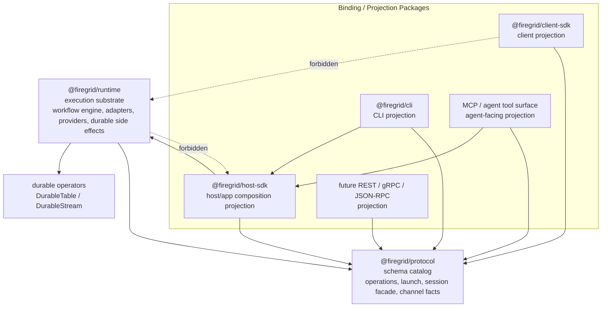
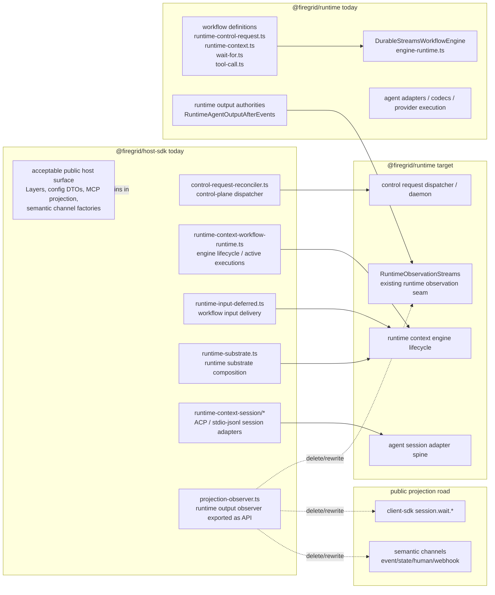
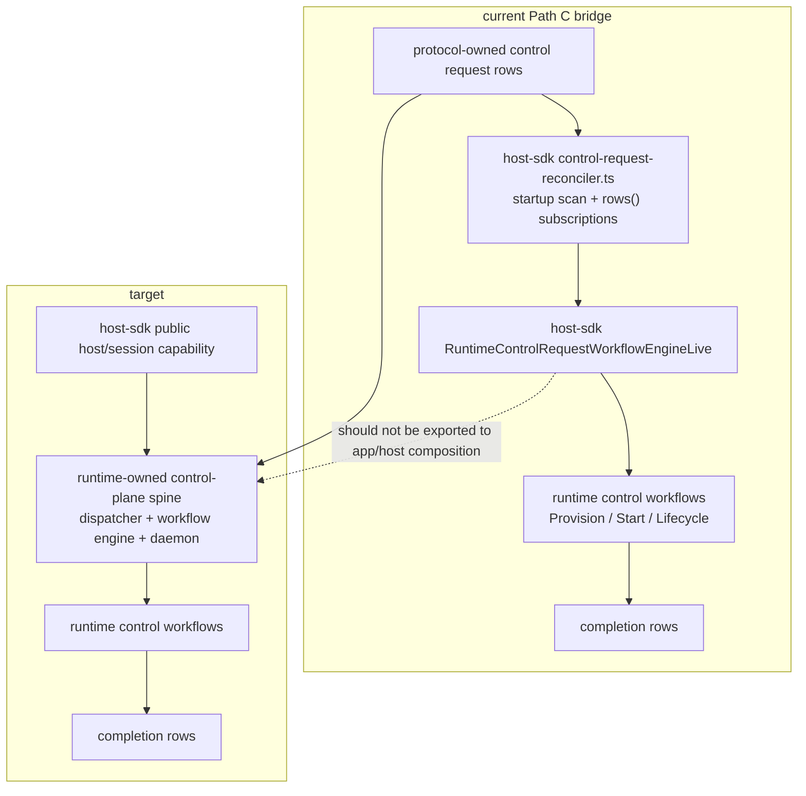
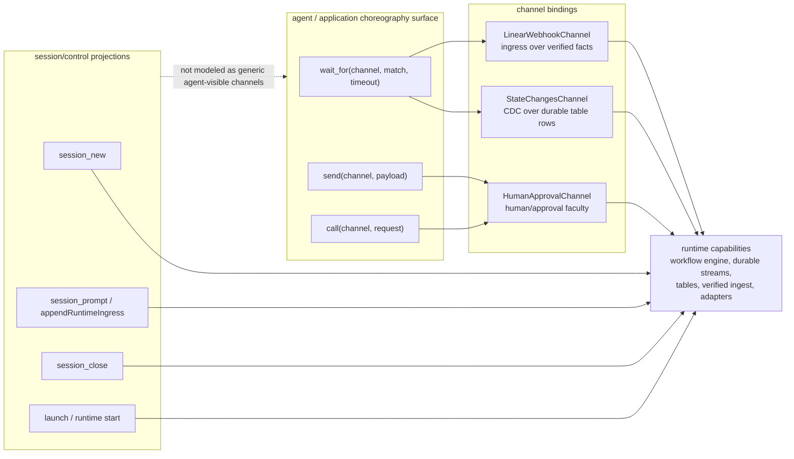
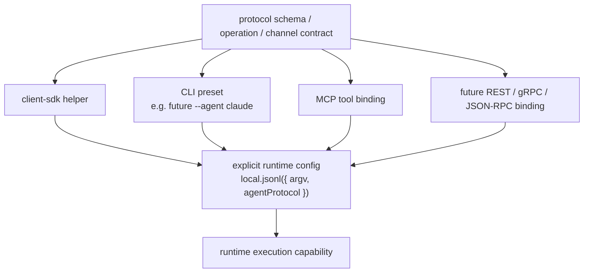
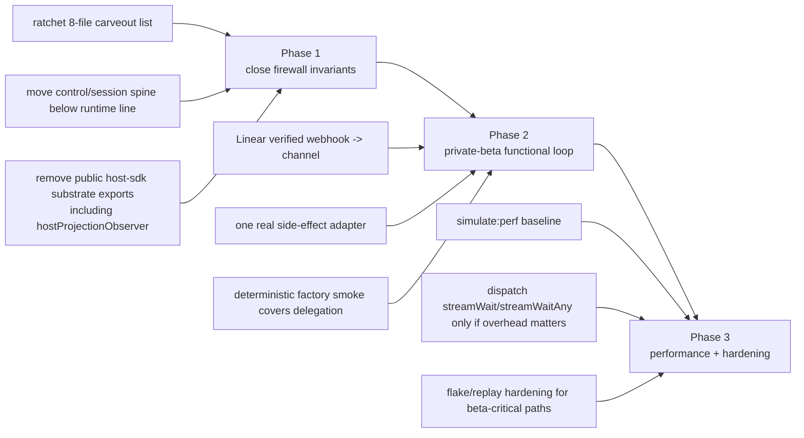

# Gary Architecture Assessment — Canonical Convergence

Date: 2026-05-20
Assessed main: `7ecaa9102` (`tf-ygz3 Lane D slice 7`, PR #528)
Audience: coordinator handoff / next-wave dispatch

Update mode: this document is now a running architecture-assessment log for
post-wave findings that should be batched to the coordinator for backlog,
priority, and sequencing decisions.

## Current Verdict

Firegrid is now **about 90-93% converged** on the target architecture from
`docs/architecture/host-sdk-runtime-boundary.md`.

Companion refinement: treat that as the **substrate-boundary** convergence
number. Public-surface hygiene is lower, roughly **75-80%**, because package
barrels, package READMEs, simulation methodology, client/CLI projection
catalogs, and span-name conventions can still re-teach older substrate paths.
The consolidated dispatch surface for both dimensions is now:

- `docs/handoffs/sprint-to-private-beta/architecture/00-README.md`
- `docs/handoffs/sprint-to-private-beta/architecture/01-convergence-scoreboard.md`
- `docs/handoffs/sprint-to-private-beta/architecture/02-surface-hygiene-gates.md`

That number is materially higher than the earlier `tf-k4uo` assessment because
the load-bearing wave after PR #512 landed the big missing pieces:

- `packages/runtime/src/durable-tools/` was finally deleted in PR #519.
- `ChannelRegistry` was replaced by Effect-native channel Tags plus
  `ChannelInventory` in PR #502.
- Runtime-owned workflow definitions moved under runtime paths across PRs
  #499, #503, and #507.
- `RuntimeAgentToolExecution` is now a real runtime execution seam, not just a
  proposal: PR #504 plus PR #518 moved the first meaningful tool arms.
- Dependency guardrails are hard-error, with explicit debt carveouts now reduced
  to 8 files by PRs #509, #520, #524, #526, and #528.
- Schema projection moved several shared shapes into `@firegrid/protocol`,
  including observations, verified-webhook schemas, projection helpers, and
  operation-entry wrapper cleanup.
- Dark-factory deterministic substrate smokes now prove sleep and waitFor over
  the public-ish path without LLM/provider dependency.

The remaining work is not architectural discovery. It is gap closure around
known seams.

Since the first pass, PR #529 also added the compact `docs/cannon/` source of
truth, refreshed the public README around choreography rather than
orchestration, and aligned the package README surfaces around "protocol schema
catalog -> multiple bindings/projections -> runtime substrate." Treat that as a
documentation/canon clarity improvement, not as a change to the core boundary
verdict below.

## Generated Architecture Evidence

Regenerated the useful Mermaid dependency graphs from `package.json` scripts in
the PR #529 worktree after the latest convergence wave:

```bash
pnpm run arch:deps:workspace
pnpm run arch:deps:workspace:detail
pnpm run arch:deps:protocol
pnpm run arch:deps:runtime
pnpm run arch:deps:runtime:detail
```

Updated artifacts:

- `docs/dependency-graph.mmd` — package/module-level workspace graph.
- `docs/dependency-graph-detail.mmd` — file-level workspace graph.
- `docs/dependency-graph-protocol.mmd` — protocol package graph.
- `docs/dependency-graph-runtime.mmd` — runtime package graph.
- `docs/dependency-graph-runtime-detail.mmd` — runtime file-level graph.

What the regenerated graphs concretely support:

- The workspace detail graph still places `control-request-reconciler.ts`,
  `runtime-context-workflow-runtime.ts`, `runtime-input-deferred.ts`,
  `runtime-substrate.ts`, `runtime-context-workflow-support.ts`,
  `per-context-runtime-output.ts`, `runtime-context-session/*`, and
  `agent-tool-host-live.ts` inside `packages/host-sdk/src/host`. That matches
  the boundary-debt findings below.
- The runtime detail graph shows the workflow definitions already live under
  `packages/runtime/src/workflow-engine/workflows/`, including
  `runtime-control-request.ts`, `runtime-context.ts`, `runtime-context-run.ts`,
  `runtime-ingress-transform.ts`, `wait-for.ts`, and `tool-call.ts`. That
  confirms the remaining issue is not "where do workflow types belong"; it is
  the live dispatcher/session/control spine still stranded in host-sdk.
- The workspace graph shows `host-sdk` depending on runtime/protocol/durable
  operators, which is directionally correct for a binding package, but the
  file-level graph tells us the dependency is too behavior-heavy in specific
  host-sdk files. Use the detail graph, not the package graph alone, for
  dispatch targeting.
- The runtime graph remains below protocol/durable-streams/durable-operators and
  does not need host-sdk as an input. This supports keeping the hard "runtime
  must never import host-sdk" invariant.

One tooling drift finding: `pnpm run arch:deps:client` currently fails because
the target still points at `packages/client/src`, while the current package is
`packages/client-sdk`. Fix this under the projection-surface backlog
(`tf-aago`) so the client SDK projection graph is regenerable before private
beta docs are treated as externally reliable.

### High-Signal Architecture Diagrams

The full generated dependency graphs are intentionally large. Use the diagrams
below as the compact review surface and the generated `.mmd` files above as raw
evidence.

#### Target Firewall



Load-bearing rule: protocol owns stable contracts; bindings project those
contracts into public surfaces; runtime owns execution. Runtime must not depend
on host-sdk, and public client surfaces must not reach around protocol into
runtime substrate.

#### Current Boundary Gap



The regenerated detail graph supports this exact shape: workflow definitions
are already in runtime, but live control/session/observer mechanics are still
clustered in host-sdk.

#### Control Plane Path C: Current Bridge vs Target Encapsulation



This is not a deletion target until the durable request-row compatibility
surface is gone. It is a relocation and encapsulation target: runtime should own
the spine; host-sdk should expose only the top-level composition capability.

#### Channels vs Session/Control Projections



Channels hide low-level event/fact transports for agent choreography. They do
not replace launch/start/prompt/session control APIs, which are separate
protocol/session projections over the same lower substrate.

#### Projection Surface Model



Convenience surfaces should lower to protocol-owned launch/channel contracts.
They should not create a parallel runtime configuration language.

#### Next-Wave Sequencing



## What Still Remains

### P0: Finish The 8-File Host-SDK Substrate Debt

The source of truth is `currentHostSdkSubstrateDebt` in `.dependency-cruiser.cjs`.
As of `7ecaa9102`, the 8 carved-out files are:

- `packages/host-sdk/src/agent-tools/execution/tool-use-to-effect.ts`
- `packages/host-sdk/src/agent-tools/execution/toolkit-layer.ts`
- `packages/host-sdk/src/host/control-request-reconciler.ts`
- `packages/host-sdk/src/host/internal/runtime-context-helpers.ts`
- `packages/host-sdk/src/host/runtime-context-workflow-core.ts`
- `packages/host-sdk/src/host/runtime-context-workflow-runtime.ts`
- `packages/host-sdk/src/host/runtime-input-deferred.ts`
- `packages/host-sdk/src/host/session-log-channel.ts`

These carveouts are the finish-line scoreboard. Do not reframe the architecture
again until this list is near zero.

Recommended split:

1. **Consumer migration / shim retirement.** Move remaining consumers off
   host-sdk re-export shims such as `runtime-context-workflow-core.ts`.
2. **Execution relocation.** Finish moving agent-tool execution mechanics from
   host-sdk into runtime-owned services.
3. **Runtime shell relocation.** Move engine lifecycle/input-deferred/control
   request mechanics below the binding line, leaving host-sdk as Layer
   composition.
4. **Immediate guardrail ratchet.** After each merge, remove the matching
   carveout and run `pnpm run lint:deps`.

Gaps acceptable for private beta: zero or one well-named compatibility shim with
no runtime behavior. Gaps not acceptable: host-sdk owning live workflow bodies,
durable substrate mechanics, or common operation execution.

### P2: Defer `session_new_all` Unless Evidence Demands It

`docs/research/tf-lwqm-spawn-all-wiring.PROPOSAL.md` correctly identifies that
legacy `spawn_all` returns terminal artifacts, while the §6 factory flow needs
running child session handles.

Updated recommendation: do **not** make this a private-beta blocker. Repeated
`session_new` calls are sufficient unless measured usage proves that a batch
primitive is needed.

If the work is ever taken, introduce **new `session_new_all`** rather than
bending `spawn_all`, for the reasons already documented:

- It matches the existing session-plane vocabulary (`session_new`,
  `session_prompt`, `session_close`).
- It returns running handles, which are semantically distinct from terminal
  spawn results.
- It keeps legacy `spawn_all` behavior available for historical tests or
  non-session execution if needed.

This is now P2 optional ergonomics. Keep it in the backlog as a clean future
projection, but spend near-term capacity on the 8-file carveout reduction,
external trigger path, and projection-surface cleanup.

### P0/P1: Projection Surface Cleanup

The root README and package README refresh established the intended product
framing: client SDK, CLI, MCP/tool surface, and future REST/gRPC/JSON-RPC
surfaces are all projections of protocol-owned contracts over the same runtime
substrate.

Open follow-up already captured: `tf-aago` — "Projection surfaces: client SDK
and CLI presets over protocol launch/channel contracts."

Target shape:

```text
protocol operation / channel schema
  -> client SDK helper
  -> CLI preset or explicit config
  -> MCP/tool binding
  -> future REST/gRPC/JSON-RPC binding
  -> runtime capability
```

Important example: CLI convenience flags such as a future `--agent claude` or
`--agent codex` should lower to explicit protocol launch/runtime config such as
`local.jsonl({ argv, agentProtocol: "stdio-jsonl" })`. They should not become a
separate runtime configuration language.

This is P0 if a private-beta user will start from CLI/client docs. It is P1 if
private beta is driven by operator-owned host composition.

### P0/P1: External Trigger Path

Runtime already owns verified webhook ingestion, and protocol now owns the
stable verified-webhook schema projection. The remaining question is the first
application binding:

```text
real webhook request
  -> runtime verified ingest
  -> durable fact / channel source
  -> host/app channel binding
  -> planner wait_for(channel)
```

Recommendation: Linear first, because it matches the factory-vision narrative.
Route installation belongs in the app or host-sdk integration layer; signature
verification and durable fact writes stay in runtime.

This can be P1 if deterministic §6 smokes remain enough for the immediate
private-beta candidate. It becomes P0 if private beta means "real external event
starts the factory" rather than "operator/test harness starts the factory."

### P1: Real Side-Effect Adapters

The next correctness frontier is not Firegrid substrate correctness; it is
world-facing effects:

- Linear issue/comment/read integration.
- GitHub PR/comment/status integration.
- Slack/human notification integration.

The architectural placement should follow the canonical firewall:

- protocol owns request/response schemas when shared;
- runtime owns execution adapters if they touch providers, credentials,
  retries, or durable side effects;
- host-sdk/app composition installs the live Layers and channel bindings.

Recommended order: GitHub or Linear first, not both. Pick the one that unlocks
the first private-beta story and keep the first adapter intentionally narrow.

### P1: Rebaseline Schema Projection

`tf-krts` was the right inventory, but the wave consumed and obsoleted several
items. Run a new schema-projection inventory against `7ecaa9102` before
dispatching more schema moves.

Private beta can ship with minor protocol projection gaps if the app/agent
surface does not expose them. It should not ship with a shape that client-sdk
and host-sdk both define separately.

### P2: Engine-Native Primitives

`streamWait`, `streamWaitAny`, and related engine primitives still look like
the right long-term substrate. They are not required to complete this private
beta if the current workflow-backed wait path remains correct and performance
is acceptable.

Keep the trigger condition concrete: open this track if measured system latency
approaches a meaningful fraction of LLM/provider network latency, or if another
workflow-body composition leak appears. Until then, do not block private beta on
engine-native primitive work.

## Running Boundary Findings

Use this section as a live log for new architecture findings that are real but
not yet sequenced into implementation beads.

### Finding: `appendRuntimeIngress` Is Control-Plane Authority, Not A Channel

`packages/host-sdk/src/host/commands.ts` still implements
`appendRuntimeIngress` by reading `RuntimeContextRead`, obtaining
`RuntimeControlPlaneTable`, inserting a `RuntimeInputIntent`, and returning a
pending ingress row.

This is direct durable-table authority in `host-sdk`. That is a real boundary
debt, but the target is **not** "turn every control-table write into a
channel." The cleaner distinction is:

- channels are agent/application semantic event capabilities;
- launch/start/prompt/session control are protocol/session operations projected
  through client SDK, CLI, MCP, REST, etc.;
- runtime tables/workflows remain implementation substrate below both surfaces.

Recommended backlog shape: move `appendRuntimeIngress` and related prompt/start
write paths behind a narrow runtime/control-plane capability or session facade.
Do not expose `RuntimeControlPlaneTable` upward, and do not model launch/prompt
as arbitrary agent-visible `send(control.table, ...)` unless there is a
deliberate body-plan faculty for it.

Private-beta impact: acceptable if hidden behind current host/client helpers and
not exposed in end-user docs; not acceptable if new public examples require
callers to import durable tables or construct table rows.

### Finding: `state-changes-channel.ts` Is The Correct CDC-Channel Pattern

`packages/host-sdk/src/host/state-changes-channel.ts` wraps
`DurableTable.rows()` / `ProjectionStream<Row>` behind an opaque ingress
channel. Its test asserts that the agent-visible wait input contains only the
semantic channel name, not the backing table name.

This is a good boundary example:

```text
host/app binding adapter may touch DurableTable.rows()
  -> StateChangesChannel<Row>
  -> agent sees wait_for("state.rows", ...)
```

The adapter can live in `host-sdk` or app integration if it remains a
presentation binding over a narrow runtime/provider tag. If it starts owning
runtime execution, durable write authority, or workflow mechanics, move that
portion below the runtime line.

### Finding: Channels Are Not A Universal Replacement For Control APIs

Channels should hide low-level transports for event/fact observation and
semantic send/call faculties. They should not become a vague replacement for
every runtime control operation.

Recommended rule:

- `wait_for(channel)`, `send(channel)`, `call(channel)` for agent choreography;
- `session.prompt`, `session.start`, `session.close`, launch, and permissions
  response helpers as protocol/session projections;
- implementation may lower both through runtime capabilities, durable streams,
  workflow engine, tables, or future engine-native primitives.

This keeps "channels as nervous system" from turning into "channels as naked
database driver with a prettier name."

### Finding: `control-request-reconciler.ts` Still Has A Real Runtime Purpose

`packages/host-sdk/src/host/layers.ts` still composes
`RuntimeControlRequestReconcilerLive`, `RuntimeControlRequestWorkflowEngineLive`,
and, unless disabled, `RuntimeControlRequestReconcilerDaemonLive` into
`FiregridRuntimeHostLive`.

That file is not dead code. Its current job is the Path C hybrid bridge:

```text
protocol-owned control request rows
  -> host-side daemon observes context/start/lifecycle request rows
  -> runtime control workflows execute/claim the request
  -> completion rows record terminal outcome
```

PRs #499/#503/#507 moved the workflow definitions below the runtime line:
`RuntimeContextProvisionWorkflow`, `RuntimeStartWorkflow`, and
`RuntimeLifecycleWorkflow` now live in
`packages/runtime/src/workflow-engine/workflows/runtime-control-request.ts`.

What did **not** move is the live control-plane ingress engine/dispatcher:
`RuntimeControlRequestWorkflowEngineLive`, workflow registration, request-row
subscription, startup backfill, and the start/lifecycle side effects still live
inside host-sdk. That is why it remains on the 8-file
`currentHostSdkSubstrateDebt` carveout list.

Important correction: the `pollIntervalMs` option is vestigial in the current
implementation. The daemon performs one startup reconciliation scan via table
queries, then subscribes to `contextRequests.rows()`, `startRequests.rows()`,
and `lifecycleRequests.rows()`. The only sleep in the live daemon is a one-second
restart-on-failure backoff. So the current smell is not an active 5s polling loop
anymore; it is:

- stale API/name (`Reconciler`, `pollIntervalMs`) from the pre-reactive shape;
- host-sdk still owning the dispatcher/daemon implementation;
- direct `RuntimeControlPlaneTable` access in a binding package.

Recommended backlog shape: split this file into:

- runtime-owned control request dispatcher/daemon implementation, likely under
  `packages/runtime/src/workflow-engine/` or `packages/runtime/src/control-plane/`
  as a sibling to the workflow definitions, not inside the pure
  `workflows/` definition-only folder;
- a runtime-owned host/control-plane spine Layer that installs the dispatcher
  internally;
- host-sdk composition that receives only the public host/session/control
  capabilities, not the dispatcher/daemon/exported workflow-engine internals;
- protocol-owned request/completion row schemas.

Do not delete it as unused unless the client-facing durable request-row
compatibility surface is removed too. Do not turn it into an agent-facing
channel. The right near-term target is stronger than "host-sdk composes the
runtime dispatcher": runtime owns and encapsulates the control-plane spine;
host-sdk/app code composes the top-level runtime host capability and never sees
`RuntimeControlRequestWorkflowEngineLive` / dispatcher internals as an export.
The right cleanup target is likely renaming it from "reconciler" to a
control-request dispatcher once relocated, then hiding that dispatcher behind the
runtime host layer.

### Finding: Host Directory Substrate Audit

Quick audit target: `packages/host-sdk/src/host`.

The 8-file dependency-cruiser carveout list is the hard scoreboard, but it is
not the whole architectural picture. Several files outside the current carveout
list are acceptable host bindings only if they remain thin adapters. The review
found these buckets:

#### P0: Runtime spine stranded in host-sdk

- `control-request-reconciler.ts` — covered above. Runtime control-plane ingress
  dispatcher; should be encapsulated in runtime.
- `runtime-context-workflow-runtime.ts` — host-scoped
  `DurableStreamsWorkflowEngine` lifecycle, active execution map,
  `RuntimeContextInput`, checkpoint source, and `RuntimeInputIntentDispatcher`.
  This is runtime execution spine, not SDK presentation.
- `runtime-input-deferred.ts` — reads workflow-engine deferred rows and calls
  `engine.deferredDone(...)`. This is workflow-engine input-delivery substrate.
- `runtime-substrate.ts` and `runtime-context-workflow-support.ts` — compose
  observation substrate, runtime tool executor, workflow support, and workflow
  instance/engine services. These are runtime support layers. Host-sdk should not
  own the substrate choreography.
- `commands.ts` — mixed. `startRuntime` and `appendRuntimeIngress` are public-ish
  command helpers, but their implementation reaches into workflow engine,
  runtime context runtime, and `RuntimeControlPlaneTable`. Target is a
  protocol/session facade over runtime-owned capabilities.
- `agent-tool-host-live.ts` — mixed. It currently owns session_new/session_prompt,
  lifecycle request writes, approval-call routing, child workflow starts, and
  sandbox execution. The host binding/provider edge can remain in host-sdk; the
  control/session execution and workflow/control-plane writes should move below
  the runtime line.

#### P1: Runtime authorities exposed through channel bindings

- `per-context-runtime-output.ts` — owns per-context `RuntimeOutputTable` writers
  and `RuntimeAgentOutputAfterEvents` providers. This is runtime output
  authority. Host-sdk may expose channels over it, but the writer/provider
  implementation belongs in runtime.
- `channels/session-self/index.ts` — good channel idea, mixed implementation.
  The public channel targets/schemas can stay as host/app presentation, but the
  checkpoint stream currently reads workflow-engine execution/activity/deferred/
  clock tables directly. Runtime should expose a normalized checkpoint/lifecycle
  observation stream; host-sdk should wrap that as `session.self.*` channels.
- `runtime-context-session/*` — raw/codec session adapters open byte pipes,
  manage codec sessions, journal stderr/logs, and write runtime output. These
  are runtime agent-adapter/session execution modules. `codec-adapter.ts` is
  especially clear: it selects ACP vs stdio-jsonl, builds `AgentSession` Layers,
  injects the runtime-context MCP URL, journals codec stderr, streams agent
  outputs, and sends encoded input events back to the agent session. That is the
  runtime agent-session spine. Host-sdk may expose the top-level host Layer and
  MCP route that supply host-local configuration, but should not own these
  adapter bodies long-term.

#### P1: Internal harness helpers leaking as host-sdk API

- `projection-observer.ts` — small observer over `RuntimeAgentOutputAfterEvents`.
  This looked harmless as a host binding helper, but source inspection showed it
  is exported from `packages/host-sdk/src/host/index.ts` as
  `hostProjectionObserver` plus `HostProjectionObserverOptions`, and simulations
  now import it from `@firegrid/host-sdk`. That makes runtime-output projection
  machinery look like public host-sdk API. Target: delete/rewrite it onto the
  existing paved roads rather than relocating it as another observation
  interface. Public simulation assertions should use client-sdk waits where
  possible; semantic event observation should use channels; runtime-internal
  consumers should use `RuntimeObservationStreams` directly.

#### P2 / keep thin

- `session-log-channel.ts` — channel binding is fine, but the schema currently
  uses `DurableTable.primaryKey` in host-sdk. If session log becomes public or
  multi-binding, move the schema to protocol and keep only the binding adapter in
  host/app integration.

#### Host-sdk-shaped and acceptable

- `channel.ts`, `event-channel.ts`, `state-changes-channel.ts`, `human-channel.ts`
  — semantic channel factories/bindings. They may accept `Stream`, `append`, or
  narrow collection facets as adapter inputs; they should not own runtime
  execution or durable-table write authority beyond an injected binding.
- `mcp-host.ts` and `mcp-channel-metadata.ts` — MCP/Effect-AI projection and
  metadata enrichment. Host-sdk is the right tier.
- `config.ts`, `config-live.ts`, `types.ts`, `sync-run.ts` — host/CLI binding DTO
  and composition helpers. Keep them projection-safe; they should lower to
  protocol launch/runtime config rather than inventing substrate config.
- `layers.ts` — host composition belongs here, but its current composition of
  runtime spine internals is the symptom. As runtime spine moves down, this file
  should shrink to top-level public Layers/capabilities.

Recommended sequencing: do not dispatch a broad "move host to runtime" lane.
Dispatch by spine:

1. Runtime context workflow spine:
   `runtime-context-workflow-runtime.ts`, `runtime-input-deferred.ts`,
   `runtime-substrate.ts`, `runtime-context-workflow-support.ts`.
2. Control-plane spine:
   `control-request-reconciler.ts`, `commands.ts` control/session internals,
   `agent-tool-host-live.ts` lifecycle/session execution pieces.
3. Runtime output/session adapters:
   `per-context-runtime-output.ts`, `runtime-context-session/*`,
   `channels/session-self/index.ts` observation providers.

Each lane should leave host-sdk with only public composition, route/tool
projection, and semantic channel binding wrappers.

### Finding: `runtime-substrate.ts` Is The Remaining Host-SDK Substrate Knot

`packages/host-sdk/src/host/runtime-substrate.ts` is not merely a host binding
helper. It composes several lower-tier concerns in one host-sdk file:

- runtime control-plane authorities via `RuntimeControlPlaneRecorderLive`;
- runtime output observation providers via
  `RuntimeAgentOutputEventsLayer` / `RuntimeObservationStreamsLive`;
- runtime tool execution tags via
  `RuntimeAgentToolExecution` / `RuntimeToolUseExecutor`;
- host-sdk agent-tool lowering via `toolUseToEffect`;
- channel inventory and host tool bindings through `ChannelInventory` and
  `AgentToolHost`;
- workflow-engine scope re-provisioning for tool execution.

That explains why the file feels confusing: it is the composition knot where
runtime substrate, host topology, workflow support, and agent-tool projection
still meet. It also reveals the simpler boundary rule: host-sdk should be a
composition boundary, not a substrate owner. The resources composed by host-sdk
should be semantic/projection resources that can lower into runtime; host-sdk
itself should not assemble workflow engines, durable table facades,
deferred-row drivers, observation authorities, or control-plane dispatch loops.

The target is not to delete every concept in the file at once; the target is to
split ownership:

- runtime owns observation substrate providers, workflow support, control-plane
  authority providers, and the execution service tags;
- host-sdk owns top-level host composition and projection/binding Layers;
- agent-tool bindings supply host-specific implementations through runtime-owned
  capability tags, not by importing substrate composition from `host/`.

`packages/host-sdk/src/agent-tools/execution/toolkit-layer.ts` demonstrates the
same knot from the other side. It currently composes
`HostRuntimeObservationSubstrateLive`, `HostRuntimeObservationStreamsLive`, and
`RuntimeAgentToolExecutionLive` from `host/runtime-substrate.ts` so MCP tool
calls can run a `ToolCallWorkflow`. That is a valid bridge for the current
system, but it should not be the settled shape. The toolkit projection should
eventually depend on a runtime-owned tool-execution capability; host-sdk should
provide route/tool bindings and host-local capabilities, not assemble runtime
observation substrate directly.

Two runtime files clarify the intended lower-tier home:

- `packages/runtime/src/authorities/runtime-control-plane-recorder.ts` is a
  legitimate runtime authority provider. It supplies narrow Effect services and
  streams over `RuntimeControlPlaneTable`: context insert/read, run attempt
  allocation, run status writes, and context/run observation streams. This
  belongs below the host-sdk line.
- `packages/runtime/src/authorities/README.md` is a useful local convention
  only if read narrowly: "authority" means the unique live provider for narrow
  capability tags over a durable table family. It should not become public API
  or a parallel framework. Its value is preventing `DurableTable` facades from
  leaking upward.

One more misplacement surfaced during this read:
`packages/runtime/src/agent-event-pipeline/subscribers/runtime-tool-use-executor.ts`
does not define a subscriber. It defines the `RuntimeToolUseExecutor` service
tag used by runtime workflow code to convert `ToolUse` output into `ToolResult`
input. The sibling `subscribers/README.md` says subscriber fibers are
host-scoped drivers over durable observations, and that legacy tool routing has
moved out of subscribers. The file path is therefore stale. Move it under
`agent-event-pipeline/tool-execution/` or a workflow/tool-execution module when
the next boundary lane touches this area.

Recommended backlog shape:

1. Move or split `runtime-substrate.ts` by capability family rather than by
   file: observation substrate, workflow support, control-plane authority
   providers, and tool execution.
2. Move `RuntimeToolUseExecutor` out of `subscribers/` and update the
   subscriber README so the directory only contains long-running observation
   drivers.
3. Refactor `toolkit-layer.ts` so it depends on runtime-owned execution
   services and channel capabilities. It should stop importing
   `host/runtime-substrate.ts`.
4. Keep `authorities/` in runtime, but enforce the narrow-capability rule:
   export tags/layers, not table facades or public product contracts.

Priority: P0/P1 boundary cleanup after the current private-beta evidence wave.
This does not invalidate the runtime path; it names the remaining knot that
keeps host-sdk looking like infrastructure.

### Finding: `hostProjectionObserver` Is A Simulation Harness Leak

`packages/host-sdk/src/host/projection-observer.ts` implements a scoped observer
over runtime output:

```text
RuntimeAgentOutputAfterEvents.forContext(contextId)
  -> Stream.mapAccum(project)
  -> first match
  -> onMatch(...)
```

That is a useful helper for tiny-firegrid simulations: it lets the host side
stop a run when a trace-visible condition has appeared, while keeping the driver
on the public client surface. But it is not a public host-sdk product API.
More importantly, it should not become a new blessed observation interface in a
different package. Firegrid already has paved roads for this:

- client-visible assertions use `client-sdk` projection waits such as
  `session.wait.forAgentOutput(...)` / `session.wait.forPermissionRequest(...)`;
- agent/application event observation uses semantic channels over `Stream` /
  `Sink` / `Effect` bindings;
- runtime-internal consumers use `RuntimeObservationStreams` and typed runtime
  observation tags;
- package-local tests can use direct Effect `Stream` combinators in the owning
  package without minting a reusable product API.

Current leak path:

- `packages/host-sdk/src/host/index.ts` exports `hostProjectionObserver` and
  `HostProjectionObserverOptions`.
- The same barrel also re-exports `RuntimeAgentOutputObservation` from
  `@firegrid/runtime/runtime-output`.
- `packages/tiny-firegrid/src/simulations/codex-acp-tool-calls/host.ts` imports
  both from `@firegrid/host-sdk`.
- `packages/tiny-firegrid/src/simulations/wait-pre-attach-roundtrip/host.ts`
  does the same.
- `packages/tiny-firegrid/docs/methodology.md` currently instructs future sims
  to use `hostProjectionObserver` from `@firegrid/host-sdk`.

Why this matters: permissive host-sdk exports let internal runtime observation
machinery become a de facto supported SDK surface. That fights the firewall even
when the only consumers are tests and simulations, because new examples copy the
available import path.

Recommended backlog shape:

1. Prefer migrating simulations to client-sdk projection waits in the driver
   when the observed condition is client-visible. That keeps tiny-firegrid on the
   public surface it is supposed to validate.
2. Where the stop condition is genuinely host-only instrumentation, write the
   observer locally using existing `Stream` / `RuntimeObservationStreams`
   primitives in that simulation or test package. Do not create another
   reusable Firegrid observation facade unless a repeated need is proven.
3. If the observed thing is an application fact/event, express it as a channel
   binding and wait on the channel rather than observing runtime output rows
   directly.
4. Update `packages/tiny-firegrid/docs/methodology.md` so host observers are
   described as exceptional harness-private instrumentation, not host-sdk API.
5. Remove `hostProjectionObserver`, `HostProjectionObserverOptions`, and
   `RuntimeAgentOutputObservation` from the host-sdk root export barrel unless a
   real product binding needs them through a narrower, named surface.
6. Keep the driver rule unchanged: tiny-firegrid drivers import only
   `@firegrid/client-sdk`; host files may compose host Layers, but should not
   normalize private substrate helpers as public SDK imports.

Priority: P1 for private beta public-surface hygiene. It does not block
substrate correctness, but it should land before the next wave of examples or
docs presents host-sdk as stable public API.

## Recommended Sequencing To Private Beta

## Dynamic Data-Plane Evidence Added

New simulation candidate:
`packages/tiny-firegrid/src/simulations/acp-sdk-example-agent/`.

Purpose: drive the installed `@agentclientprotocol/sdk` example ACP agent
through the public Firegrid client session projection, not through host-sdk
internals. The driver intentionally uses only the exposed client surface:

- `firegrid.launch(...)`
- `firegrid.prompt(...)`
- `firegrid.open(...).snapshot`
- `firegrid.watchContexts(...)`
- `firegrid.sessions.createOrLoad(...)`
- `firegrid.sessions.attach(...)`
- `firegrid.sessions.prompt(...)`
- `firegrid.permissions.respond(...)`
- `local.jsonl({ agentProtocol: "acp", argv: ["node", agentPath] })`
- `session.whenReady`
- `session.permissions.autoApprove("allow")`
- `session.prompt(...)`
- `session.start()`
- `session.snapshot()`
- sequential `session.wait.forAgentOutput(...)`
- `session.wait.forPermissionRequest(...)`

Latest clean run:
`2026-05-20T22-03-21-597Z__acp-sdk-example-agent`.

Evidence from the trace:

- Full ACP data plane exercised: process launch, ACP initialize/newSession,
  prompt, text chunks, two tool calls, permission request, permission response,
  tool-call completion, final text, and turn completion.
- Broader client surface exercised without host/runtime imports in the driver:
  launch-only context creation, context watch, context open/snapshot, top-level
  prompt append, session create/attach/open/snapshot, scoped prompt/start,
  scoped output waits, scoped permission wait, scoped auto-approve, top-level
  permission response, and top-level `sessions.prompt`.
- Driver span status is OK and annotates:
  `launch_context_id`, `watched_launch_context_id`,
  `launch_prompt_input_id`, `attached_session_id`,
  `opened_session_context_id`, `scoped_prompt_input_id`,
  `session_prompt_input_id`, `top_level_permission_response_input_id`,
  `ready_tag=Ready`, `read_tool_name=Reading project files`,
  `edit_tool_name=Modifying critical configuration file`,
  `permission_request_tag=PermissionRequest`,
  `completed_edit_status=tool_call_update`, `turn_complete_tag=TurnComplete`.
- `simulate:perf` on that run: 1158 spans over 5345ms; no idle gaps above
  threshold. Top self-time is expected ACP example behavior
  (`firegrid.agent_event_pipeline.acp.prompt` ~5076ms; the upstream example has
  1s sleeps between updates). SDK projection waits show repeated
  `firegrid.durable_table.rows` waits around 1s plus one ~4167ms scoped
  auto-approve waiter interrupted at scope close, which is acceptable for this
  deterministic example but should be watched in beta perf gates.
- HTTP rolls still include
  `POST /v1/stream/tiny-firegrid.firegrid.host.tiny-firegrid-host.durableTools`
  despite durable-tools deletion. This may be a historical stream namespace
  label rather than resurrected durable-tools code, but it is worth grepping
  before private-beta trace artifacts are published.

Ergonomics finding:

- The driver originally grew local helpers for retrying client writes,
  predicate-waiting over outputs, and summarizing snapshots. Those helpers were
  removed on purpose. If an end-user-like example needs those helpers, that is a
  client SDK surface gap, not simulation code to hide.
- `session.permissions.autoApprove("allow")` is the correct public API for the
  permission path. It must be called after `session.whenReady`; starting it
  before the context exists can make its internal wait fail and kill the scoped
  auto-approve fiber. This should either be documented or hardened.
- There is no public `wait.forAgentOutputWhere(...)` / typed output predicate
  helper. The current end-user-like code must make repeated
  `session.wait.forAgentOutput()` calls and narrow event tags manually. That is
  acceptable for the deterministic sim, but it is a public SDK ergonomics gap to
  backlog under the projection-surface work.

Runner finding:

- One failed intermediate run produced a driver span with status error
  (`expected edit Status`) while `simulate:run` still exited zero with
  `outcome=DriverCompleted`. The runner appears to classify driver fiber
  completion without propagating failure as a failing process outcome. Before
  relying on tiny-firegrid as a private-beta gate, add an acceptance check that
  errored driver spans or failed driver exits make the simulation command fail.

### Finding: Duplicate Session Operation Catalogs

There is another projection-surface drift point:

- `packages/protocol/src/session-facade/operations.ts` exports
  `FiregridClientOperations` from the protocol package. This version is closer
  to the canonical schema-projection model: it uses
  `defineFiregridOperation(...)`, reads operation metadata from Effect Schema
  annotations, and is exported from `@firegrid/protocol/session-facade`.
- `packages/client-sdk/src/operations.ts` defines a second local
  `FiregridClientOperations` object with the same shape and name. Client code
  imports this local copy, and client projection tests assert against it.

This was probably useful while the session facade was being carved out, but it
is now the kind of parallel helper surface that will drift as channels and other
projection bindings settle. It also cuts against the
`SDD_FIREGRID_SCHEMA_PROJECTION_CONTRACT` rule that protocol owns the schema
catalog and bindings are projections of it.

Recommended backlog shape:

1. Make `packages/protocol/src/session-facade/operations.ts` the single
   operation catalog for session/client projection schemas.
2. Replace `packages/client-sdk/src/operations.ts` with a compatibility
   re-export, or delete it after updating imports to
   `@firegrid/protocol/session-facade`.
3. Move client projection tests so they prove client-sdk imports the protocol
   catalog rather than proving a duplicate local object happens to reference the
   same schemas.
4. Apply the same rule to future REST/gRPC/JSON-RPC/MCP projections: no
   package-local operation catalogs that copy protocol entries. Surface-specific
   names and helpers can exist, but the schema and operation metadata source of
   truth is protocol.

Priority: P1 under the projection-surface umbrella (`tf-aago`). This does not
block runtime correctness, but it should land before more public API docs or
binding generators grow around the duplicate client-sdk catalog.

### Finding: Divergent Projection-To-Substrate Pathways

Deep scan target: production code under `packages/client-sdk/src`,
`packages/cli/src`, `packages/host-sdk/src`, `packages/protocol/src`, and
`packages/runtime/src`.

The current architecture is converging, but there are still several different
ways for a caller-facing surface to reach durable streams:

1. **Client SDK as direct durable-table transport.**
   `packages/client-sdk/src/firegrid.ts` imports
   `RuntimeControlPlaneTable`, `RuntimeOutputTable`, and
   `RuntimeOutputTableService` from protocol. It materializes table Layers,
   queries `control.runs`, queries `output.events` / `output.logs`, subscribes
   to `output.events.rows()`, waits on `control.contexts.rows()`, and writes
   `control.inputIntents.insertOrGet(...)`. The public package also exports
   `FiregridRuntimeTables`, `FiregridControlPlaneTableLive`, and
   `runtimeControlPlaneStreamUrl`.

   This is browser-safe in dependency terms, but it is not yet a clean
   projection boundary. The client projection is both the public API and a
   durable-table transport implementation. Target: keep the public client API
   protocol-shaped, and isolate direct durable table access behind a
   `client-sdk` transport/provider implementation that can be swapped with
   REST, gRPC, JSON-RPC, or in-process host transports later.

2. **Protocol exposes live table declarations as normal public vocabulary.**
   `packages/protocol/README.md` currently describes protocol as owning
   "schemas, operation contracts, and DurableTable declarations" and shows
   importing `RuntimeControlPlaneTable` / `RuntimeOutputTable` directly from
   `@firegrid/protocol/launch`. The row schemas belong in protocol; the table
   tags are lower-tier coordinates. If they stay in protocol for schema sharing
   or browser-safe transport construction, docs and guardrails should make clear
   that projection packages do not treat table facades as the semantic API.

3. **Host-sdk barrels export substrate internals.**
   `packages/host-sdk/src/index.ts` and `packages/host-sdk/src/host/index.ts`
   still export `HostRuntimeObservationStreamsLive`,
   `HostRuntimeObservationSubstrateLive`, `RuntimeAgentToolExecutionLive`,
   `RuntimeToolUseExecutorLive`, `RuntimeAgentOutputObservation`,
   `CallerOwnedFactStreams`, `RuntimeControlRequestWorkflowEngineLive`,
   `RuntimeControlRequestReconcilerDaemonLive`, `hostProjectionObserver`, and
   codec-adapter helpers. Some of these exports are legitimate internal
   composition seams today, but their root/host barrel visibility makes them
   easy to copy into app code, simulations, or future projections as public API.
   Target: narrow export barrels to public composition and binding surfaces;
   move substrate helpers to runtime subpaths or package-internal modules.

4. **CLI uses multiple projection/control paths in one command.**
   `packages/cli/src/bin/run.ts` composes `@firegrid/host-sdk` and
   `@firegrid/client-sdk/firegrid`, then calls
   `firegrid.sessions.createOrLoad(...)`, `reconcileRuntimeControlRequestsOnce()`,
   and `appendRuntimeIngress(...)` directly. This is understandable for an
   in-process local host, but it means the CLI is both a client projection and
   a host-control caller. Target: CLI commands should project protocol
   operations into a single command flow, then delegate to a host/runtime
   composition that owns reconciliation and ingress delivery internally.

5. **Channel constructors are mostly right, but some helpers still teach table
   facades.** `channel.ts` uses the right substrate vocabulary:
   `Stream`, effectful append, and effectful call bindings. But
   `event-channel.ts`, `state-changes-channel.ts`, and `session-log-channel.ts`
   expose `fromCollection(...)` helpers over `DurableTableCollectionFacade`,
   while `channels/session-self/index.ts` reads workflow-engine execution,
   activity, deferred, and clock tables directly. Keep the generic
   `Stream`/append/call constructors as the paved road. Treat
   `fromCollection(...)` helpers as adapter-edge conveniences, not the semantic
   channel model, and move session/workflow table readers below runtime
   observation capabilities.

6. **Runtime docs and comments still describe older surfaces.**
   `packages/runtime/ARCHITECTURE.md` references `@firegrid/client`,
   `@firegrid/runtime/runtime-host`, and `@firegrid/runtime/agent-tools`
   surfaces that do not match the current package export map. The
   `client-sdk` `projection-wait.ts` comment still says durable agent-tool waits
   use "runtime/durable-tools wait_router", even though durable-tools is gone.
   These are documentation hazards: future lanes may rebuild the wrong shape if
   they trust stale local docs over the canonical architecture.

Single interaction pattern to enforce:

```text
protocol operation / observation / channel contract
  -> environment projection package
  -> transport or runtime-owned capability tag
  -> runtime authority / workflow / adapter
  -> durable streams substrate
```

Direct durable-table access is allowed only in runtime authorities, host/runtime
composition internals, or a named transport implementation. It should not be the
public semantics of client SDK methods, CLI commands, MCP tools, channels, or
examples.

Recommended backlog:

1. Define a `client-sdk` transport/provider seam for durable-streams-backed
   local use. Move `RuntimeControlPlaneTable` / `RuntimeOutputTable` access
   behind it, then leave `Firegrid` methods as pure protocol projection.
2. Update protocol docs to distinguish row schemas/operation contracts from
   live table/provider handles.
3. Shrink host-sdk public barrels so substrate seams are only reachable through
   narrow, intentional subpaths while the relocation lanes continue.
4. Rework CLI command internals so `run/start` are protocol projection flows
   over host/runtime composition, not ad hoc mixes of client methods plus
   host-sdk command helpers.
5. Keep channel public constructors generic over `Stream` / append `Effect` /
   call `Effect`; move workflow-table and DurableTable collection helpers behind
   adapter/private modules where possible.
6. Refresh `packages/runtime/ARCHITECTURE.md` and stale comments after the
   canon docs land, or explicitly mark them retired.

Priority: P0/P1 for private-beta maintainability. The current code can run, but
leaving these paths divergent will make every new projection surface reinvent
launch, prompt, wait, observe, and channel plumbing differently.

### Contract: Observations And Projected Client Interactions

The protocol package currently has three related but not yet fully unified
surfaces:

- `packages/protocol/src/agent-tools/schema.ts` — operation-shaped schemas for
  the agent/tool projection. Despite the path name, this file is not just an
  MCP host helper; it currently defines many user-facing operation schemas and
  `FiregridAgentToolOperations`.
- `packages/protocol/src/session-facade/operations.ts` — session/client
  operation catalog, also named `FiregridClientOperations`.
- `packages/protocol/src/observations/schema.ts` — neutral runtime observation
  source names such as `firegrid.runtime.agent-output-events`.

The concern is real: if each projected surface owns its own schema catalog,
Firegrid will drift across MCP tools, client SDK methods, CLI commands, and
future REST/gRPC/JSON-RPC endpoints.

Recommended contract:

1. **Protocol owns semantic contracts.** Operation input/output schemas,
   normalized observation schemas, observation source names, and projection
   metadata live in `@firegrid/protocol`. Bindings do not copy them.
2. **Runtime owns execution and stream resolution.** Runtime may define internal
   resolver tags such as `RuntimeObservationStreams` and internal wait payloads
   such as `WaitForWorkflowPayload`. It should not become the public schema
   catalog. It consumes protocol contracts and produces/observes durable rows.
3. **Bindings are projections.** Client SDK, MCP/agent tools, CLI, REST, gRPC,
   and JSON-RPC serialize the same protocol operation entries into different
   shapes. They may add ergonomic methods, naming, transport adapters, and
   help text, but not new semantic schema families.
4. **Channels are semantic observation/capability projections.** Product/app
   facts such as Linear webhooks, human approvals, lifecycle changes, and
   domain events should be exposed as channels over protocol-owned row/fact
   schemas and runtime/host-provided `Stream`/`Sink`/`Effect` bindings. Agent
   `wait_for(channel)` should never receive runtime observation source
   discriminators, stream URLs, table names, or workflow handles.
5. **Session facade is a product-facing runtime-session projection.**
   `session.wait.forAgentOutput`, `session.wait.forPermissionRequest`,
   `session.permissions.respond`, `session.prompt`, and `session.start` are
   session/control projections over protocol schemas. They are not generic
   channels, and they should not each grow one-off operation contracts outside
   the protocol catalog.
6. **Observation source names are identifiers, not APIs.**
   `FiregridRuntimeObservationSourceNames` belongs in protocol because it is
   stable metadata used by multiple bindings. But observing a source is done via
   the right layer for the caller:
   - client/app code uses session waits/snapshots or semantic channels;
   - agent code uses channel verbs;
   - runtime code uses `RuntimeObservationStreams`;
   - tests may use local `Stream` expressions inside the owning package.

How to read the current files:

- `packages/protocol/src/observations/schema.ts` is intentionally tiny today:
  it only centralizes source-name constants. That is fine as a start, but it is
  not a complete observation contract. The normalized observation schemas live
  across `session-facade/schema.ts`, `agent-output/schema.ts`, launch/runtime
  row schemas, and verified-webhook schemas.
- `packages/runtime/src/streams/sources.ts` is runtime-internal source
  selection for engine waits. It should remain below the runtime line unless a
  public binding genuinely needs to name those sources. Agent/application
  surfaces should go through channels instead.
- `packages/protocol/src/agent-tools/schema.ts` is acceptable as a compatibility
  catalog only while it remains protocol-owned and its cross-surface operations
  are shared by identity with the neutral/session catalog. It should not be
  treated as "MCP-specific schema." If an operation can appear in client, CLI,
  MCP, REST, or gRPC, its schema belongs to a neutral operation catalog and the
  agent-tool file should import/re-export/project it.

Consolidation target:

```text
@firegrid/protocol
  operations/              # neutral semantic operation entries
    session.ts             # session.createOrLoad, session.prompt, ...
    permissions.ts         # permission.respond, approval calls
    channels.ts            # channel.waitFor, channel.send, channel.call
    scheduling.ts          # sleep, schedule_me
  observations/            # observation source names + normalized observation schemas
    runtime.ts             # runtime runs/output/ingress names and public observation views
    agent-output.ts        # normalized agent-output observation views
    webhook.ts             # verified webhook observation facts
  projections/
    metadata.ts            # Effect Schema annotation readers only

@firegrid/client-sdk
  imports protocol operation entries; implements app-safe methods

@firegrid/host-sdk
  imports protocol operation entries; composes host/channel Layers

@firegrid/runtime
  imports protocol operation entries; implements execution handlers and stream resolvers

@firegrid/cli / MCP / future REST/gRPC/JSON-RPC
  import protocol operation entries; project names/help/transports
```

Near-term backlog:

1. Collapse duplicate `FiregridClientOperations` to the protocol copy.
2. Rename or split `agent-tools/schema.ts` so cross-surface operations stop
   appearing to be MCP-only. Keep public exports compatible if needed, but make
   the source of truth neutral.
3. Expand `observations/` from name constants into the canonical observation
   catalog index that re-exports normalized observation schemas by domain.
4. Add tests that assert identity, not shape similarity:
   `ClientOperations.sessions.prompt.inputSchema ===
   NeutralOperations.session.prompt.inputSchema`, agent-tool projection entries
   share the same schema values where semantics overlap, and observation source
   names are imported from `@firegrid/protocol/observations`.
5. Add a guardrail preventing new binding packages from defining
   `defineFiregridOperation(...)` catalogs outside protocol.

### Convergence Target: Projection Packages As Enforced Boundaries

The projection contract should become physically enforceable through package
boundaries. The target is:

```text
@firegrid/protocol
  -> @firegrid/client-sdk       # browser/edge/app client projection
  -> @firegrid/agent-tools      # or equivalent MCP / Effect AI projection
  -> @firegrid/cli              # terminal / Node projection
  -> @firegrid/rest             # future HTTP server projection
  -> @firegrid/grpc             # future gRPC server projection
  -> @firegrid/jsonrpc          # future JSON-RPC projection
  -> @firegrid/runtime          # execution substrate
```

Each projection package is an environment-specific adapter. It may own
transport glue, runtime/environment dependencies, auth/config parsing,
surface-specific names/help, serialization, and ergonomic wrappers. It must not
own semantic contracts: no independent operation schemas, no independent
observation schemas, no copied operation catalogs, no workflow handles as public
API, and no durable-table details as public API.

`@firegrid/host-sdk` should be understood separately: it is the host composition
package that wires runtime capabilities and selected projection adapters for a
local host. It is not the source of truth for client, agent, CLI, REST, gRPC, or
JSON-RPC contracts.

Guardrail target:

```text
projection package -> @firegrid/protocol
projection package -/-> another projection package
projection package -/-> @firegrid/runtime
@firegrid/runtime -> @firegrid/protocol
@firegrid/runtime -/-> projection packages
```

Server-side projection packages that need execution should be depended on by an
owning host/runtime surface, not made into runtime substrate owners. For
example, a REST server package can validate protocol operations and delegate to
host/runtime composition, but it should not define its own wait/session/channel
schemas or import workflow-engine internals directly.

### Phase 1: Close Architectural Invariants

Goal: make the canonical firewall true enough that private beta bugs are product
bugs, not substrate ambiguity.

1. Finish the highest-value `RuntimeAgentToolExecution` arms still in host-sdk.
2. Move/retire the pure re-export shims and ratchet carveouts after each move.
3. Move the control-request runtime shell below the binding line, or explicitly
   document any remaining host-sdk piece as host composition rather than
   substrate.
4. Put `appendRuntimeIngress`/session control writes behind a narrow
   runtime/control-plane capability or session facade when that area is touched.
5. Stop when `.dependency-cruiser.cjs` has either zero carveouts or only named
   compatibility shims with no behavior.

Acceptance:

- `pnpm run verify` green.
- `pnpm run lint:deps` green with no broad carveout growth.
- `rg "@firegrid/host-sdk" packages/runtime/src` stays zero.
- `packages/runtime/src/durable-tools/` stays deleted.
- Dark-factory deterministic smoke covers sleep, waitFor, and delegation.
- End-user docs/examples do not teach durable-table or workflow-engine handles as
  public launch/prompt/channel APIs.

### Phase 2: Private-Beta Functional Loop

Goal: make one credible end-to-end factory loop work without architectural
shortcuts.

1. Choose external trigger source: recommend Linear.
2. Implement verified webhook route + channel binding in app/host integration.
3. Add one real side-effect adapter: recommend GitHub PR/comment or Linear
   comment, depending on the beta story.
4. Extend deterministic smoke before live LLM/provider smoke.
5. Run a bounded live smoke only after deterministic path is green.

Acceptable beta gaps:

- One external integration instead of all planned integrations.
- `session_new_all` entirely deferred; repeated `session_new` is sufficient.
- Protocol projection backlog for surfaces not exposed to beta users.
- Engine-native primitives deferred if performance is comfortably below LLM
  latency budget.
- `appendRuntimeIngress` still implemented in host-sdk internals if hidden behind
  host/client helpers and tracked as boundary debt.

Unacceptable beta gaps:

- Runtime imports host-sdk.
- Client-sdk imports runtime.
- durable-tools resurrection or wait-router compatibility shims.
- Host-sdk common operation execution growing new behavior.
- Agent-facing channels exposing workflow handles, execution ids, stream URLs,
  table names, or engine services.
- Public client/CLI examples requiring durable-table imports, table-row
  constructors, or workflow engine handles.

### Phase 3: Performance And Product Hardening

Goal: convert a correct private-beta loop into a robust beta.

1. Run `pnpm --filter @firegrid/tiny-firegrid simulate:perf` after the loop is
   stable.
2. Compare Firegrid overhead to provider/LLM latency. If internal overhead is
   material, dispatch engine-native `streamWait/streamWaitAny`.
3. Add multi-run flake detection and replay artifacts for beta-critical paths.
4. Expand real adapters only after one adapter has the correct retry,
   credential, and observation model.

## What Coordinator Should Include In Their Handoff

Please fold these points into
`docs/handoffs/COORDINATOR_HANDOFF_canonical_convergence_2026-05-20.md`:

- The current convergence number should be stated as **~90-93%**, not the older
  65% from `tf-k4uo`.
- The **8-file carveout list** is now the most useful objective scoreboard.
  Future coordinators should inspect `.dependency-cruiser.cjs` first.
- PR #519 is the architectural turning point: durable-tools deletion is done.
  Do not let future work reintroduce durable-tools or wait-router compatibility
  surfaces.
- The remaining high-value work is a three-track finish:
  1. carveout ratchet to zero;
  2. external trigger + first real side-effect adapter;
  3. projection-surface cleanup across README/client SDK/CLI/MCP.
- Lane D's no-ratchet finding is healthy, not a failure. It tells us the next
  reductions require consumer migration or real substrate moves, not grep-only
  cleanup.
- Private beta can tolerate narrow integration coverage, deferred
  `session_new_all`, and deferred engine-native primitives. It cannot tolerate
  architectural invariant violations or public docs that teach substrate handles.
- The next coordinator should avoid another broad SDD wave. Dispatch small
  implementation slices tied to specific files, invariants, and acceptance
  greps.

## Coordinator Dispatch Shape

Recommended next dispatches:

1. **Runtime boundary lane:** pick two of the 8 carveout files and move/retire
   them; update `.dependency-cruiser.cjs` in the same PR.
2. **Projection lane:** use `tf-aago` to align CLI/client SDK launch/channel
   helpers with protocol-owned contracts and the README's projection framing.
3. **Integration lane:** draft Linear verified-webhook trigger path and a first
   narrow adapter plan; implement only after route/channel placement is
   confirmed.

Keep one lane free for merge/rebase/guardrail repair. At this point, progress
will be constrained more by merge discipline than by lack of architectural
clarity.
