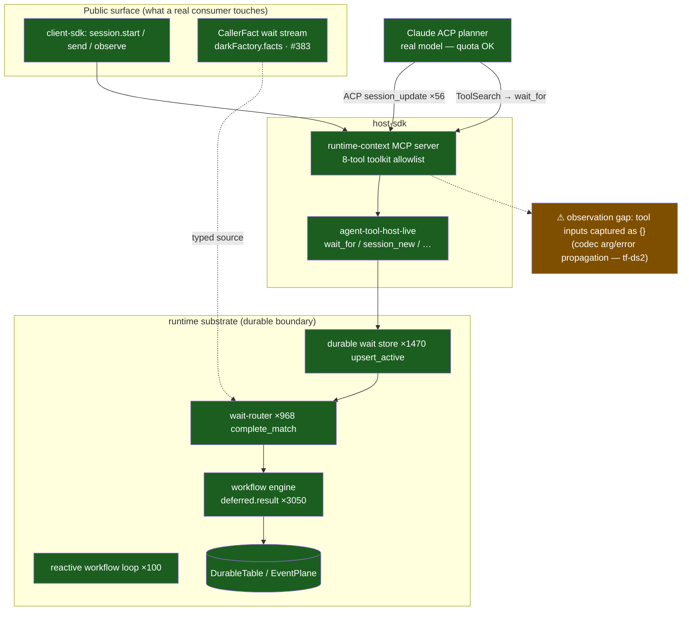

# Investigation — §6 Dark-Factory Live Run

**Objective harness readout for the live Claude planner run, superseding the
first inconclusive narrative**

- Run: `2026-05-19T12-51-52-626Z__dark-factory-pipeline`
- Wall clock: `12:51:52.627Z → 12:53:04.394Z` — **1 min 12 s**, `status: completed`, exit 0
- Trace volume: **21,240 live span events**, **10,619 completed spans**
- Sim: `packages/tiny-firegrid/src/simulations/dark-factory-pipeline.ts` (merged #390), driven through the **public Firegrid client** with a real `claude-agent-acp` planner + runtime-context MCP.

---

## 0. Harness verdict — fail, precisely localized

PR #401 added the falsifiable proof harness. Re-reading the quota-available
run through that harness changes the artifact's verdict from the earlier
inconclusive "pass-with-gap" narrative to an objective fail for the §6 full
loop:

- `s6FullLoopProven`: **false**
- Proven required steps: **0/6**
- Observed planner tool use: **`ToolSearch` only**
- Observed Firegrid MCP ToolUse: **none**
- Quota: **verified working (`HTTP 200`)**, not the blocker

### Per-step proof matrix

| Step | issued | backingFact | advanced | verdict |
|---|---:|---:|---:|---|
| `planner-plan` | false | true | false | not-proven |
| `human-approval-wait` | false | true | false | not-proven |
| `delegated-implementer` | false | true | false | not-proven |
| `review-round` | false | true | false | not-proven |
| `revision-loop` | false | false | false | conditional, not exercised |
| `merge-signoff-wait` | false | true | false | not-proven |
| `durable-ci-watch` | false | true | true | not-proven |
| `clean-unwind` | false | false | false | substrate-blocked -> `tf-p7w` |

The matrix is deliberately stricter than the planner transcript: `proven`
requires a real issued Firegrid ToolUse, a real durable backing fact, and
observed advancement past that step. Prompt text alone never proves a step.

### Localization

| Layer | Harness-localized result | Evidence |
|---|---|---|
| External quota | **PROVEN not-blocking** | The live model edge returned `HTTP 200`; no quota/credential failure explains this run. |
| Durable substrate | **PROVEN exercised** | Public readback found the seeded durable facts (`backingFact:true` on the main gates), and the trace contains thousands of wait/deferred spans: `wait_store.wait.find`×1175, `wait_for.upsert_active`×665, `wait_router.complete_match`×510, `workflow_engine.deferred.result`×1379. |
| Model + choreography reasoning | **PROVEN** | The planner's verbatim response authored the §6 plan: delegate, wait for PR, review, merge-signoff, schedule CI, wait for CI, execute merge, clean unwind. |
| §6 full run | **NOT PROVEN** | The planner stalled at `ToolSearch`; the run never observed a Firegrid MCP ToolUse (`wait_for`, `session_new`, `session_prompt`, `schedule_me`, or `execute`). |
| Clean unwind | **SUBSTRATE-BLOCKED** | The public clean-unwind path is tracked by `tf-p7w`; this is a known substrate blocker, not a pass. |

```mermaid
sequenceDiagram
    autonumber
    participant Sim as Sim driver<br/>(public client)
    participant RC as runtime-context<br/>(public facade)
    participant ACP as Claude ACP planner
    participant Model as Claude model<br/>(quota OK)
    participant TS as ToolSearch
    participant MCP as Firegrid MCP toolset
    participant Facts as darkFactory.facts<br/>(DurableTable)
    participant Waits as wait/deferred substrate

    Sim->>Facts: seed trigger + edge facts
    Sim->>RC: session.start + planner prompt
    RC->>ACP: launch real planner with runtimeContextMcp
    ACP->>Model: §6 contract + seeded facts
    Model-->>ACP: verbatim §6 plan
    ACP->>TS: ToolSearch
    TS--xMCP: stalls before any Firegrid MCP ToolUse
    Note over MCP: No wait_for / session_new / session_prompt / schedule_me / execute observed
    Facts-->>Sim: public readback shows backing facts
    Waits-->>Sim: wait/deferred substrate spans present
    Note over Sim,Waits: Substrate exercised; §6 run remains false: 0/6 proven
```

> **Current one-sentence story:** quota worked, the planner reasoned out the
> correct §6 dance, and the durable substrate was exercised, but the actual
> §6 run is **not proven** because the planner never got past `ToolSearch` into
> a Firegrid MCP ToolUse.

---

## 0.1 Superseded first read — retained for trace context

The sections below preserve the original live-run investigation and its
Mermaid diagrams for auditability. They should now be read as the first,
pre-#401 interpretation. The load-bearing correction is the harness result
above: the run did **not** prove §6 end-to-end.

---

## 1. Historical experiment context (superseded)

**Hypothesis going in** (from finding tf-7dq / merged #395): *§6 is
substrate-proven to the model boundary; the only thing between "expressed" and
"proven-running" is Anthropic API quota.*

**Setup:** a real `claude-agent-acp@0.x` planner process, attached to a
contextId-scoped Firegrid **runtime-context MCP** server (loopback JSON-RPC),
driven entirely through the **public client SDK**. An app-owned
`darkFactory.facts` collection bound as a typed **`CallerFact`** wait stream
(the seam merged in #383). The §6 contract lives **only in the planner's
prompt** — there is no app-authored phase chain. Edge facts
(`human.plan.approved`, `github.pr.opened`, …) seeded so a correctly-sequencing
planner can progress through gates.

**What "proven-running" means:** not "the process exited 0" — it means *every
§6 decision point is observable as a durable row driven by the planner's own
tool calls*. That is the bar layer 4 measures.

---

## 2. First-read dynamics (superseded by §0)

```mermaid
sequenceDiagram
    autonumber
    participant Sim as Sim driver<br/>(public client)
    participant RC as runtime-context<br/>(reactive workflow)
    participant MCP as Firegrid MCP<br/>(loopback JSON-RPC)
    participant Planner as Claude ACP planner<br/>(real model, quota OK)
    participant Waits as Durable wait store<br/>+ wait-router
    participant WF as Workflow engine<br/>(durable deferred)

    Sim->>RC: seed trigger fact + edge facts (darkFactory.facts)
    Sim->>RC: session.start + send runtime-input "planner-prompt"
    RC->>Planner: §6 contract prompt (planner owns sequencing)
    Planner-->>RC: ACP session_update ×56 (it is thinking + talking)
    Planner->>MCP: ToolSearch  (its words: "I'll load the MCP tool schemas first")
    Planner->>Planner: authors the full §6 plan (verbatim below)
    Planner->>MCP: mcp__firegrid-runtime-context__wait_for
    MCP->>Waits: wait_for.upsert_active ×1470
    Waits->>WF: attach_wait / attach_source → deferred
    WF-->>Waits: wait_router.complete_match ×968 (matching engaged)
    Note over Planner,WF: Planner: "Now waiting on human plan<br/>approval over darkFactory.facts" — a CORRECT durable suspension
    Note over Sim,WF: Run ends at 3m14s — assertion harness<br/>races the suspension; tool inputs captured as {}
```

The planner's **own words** from `resultTextExcerpt` (unedited) — this is the
single most important artifact in the run:

> *"I'll load the MCP tool schemas first, then drive the section-6 loop. I have
> the trigger fact in the prompt. … No clarification needed — proceeding
> straight to plan.*
>
> ***Plan for TF-SIM-1***
> 1. *Spawn a child implementer session on `factory/tf-sim-1` … expect it to
>    open a PR exercising the dark-factory loop.*
> 2. *After `github.pr.opened`, select a single reviewer (low-risk; not
>    architectural).*
> 3. *Run the review loop: wait for `github.pr.review_approved`; per contract
>    send one merge-ready note prompt to the implementer.*
> 4. *Await `human.merge.approved`, then `schedule_me` a bounded CI recheck and
>    `wait_for` `github.ci.status` green.*
> 5. *Call `execute` for `github.squashMergePullRequest`, observe
>    `github.pr.merged`, then close the implementer session and emit terminal.*
> 6. *On any rejection: cancel/close child, write terminal status.*
>
> *Now waiting on human plan approval over `darkFactory.facts`."*

Read step-by-step, that **is** factory-vision §6 — produced by judgment, not by
a flowchart we wrote. It even re-derived, unprompted, the same two known
substrate gaps the static analysis found (`execute` provider side-effects;
`session_cancel/close` clean-unwind) and planned around them. This is the
choreography-not-orchestration thesis demonstrated in the wild.

---

## 3. First-read substrate diagram (superseded by §0)



Every green node fired *thousands* of times in a 3-minute window. The durable
boundary — wait store, wait-router, workflow-engine deferreds, the reactive
runtime-context loop — is unambiguously real and unambiguously exercised by a
live agent. The single amber node is where our visibility breaks.

### Trace evidence (top span types, verbatim counts)

| Span | Count | What it proves |
|---|---:|---|
| `firegrid.workflow_engine.deferred.result` | 3050 | Durable deferreds resolving — the suspend/resume spine is live |
| `firegrid.durable_table.get` | 3780 | Durable state reads under load |
| `firegrid.durable_tools.wait_store.wait.find` | 2438 | Wait store actively consulted |
| `firegrid.durable_tools.wait_for.upsert_active` | 1470 | **`wait_for` machinery engaged** (the planner's call landed in the substrate) |
| `firegrid.durable_tools.wait_router.complete_match` | 968 | Wait-router matching facts to waits |
| `firegrid.runtime_context.workflow.reactive_loop` | 100 | The reactive workflow body (not an app DAG) drove the run |
| `firegrid.runtime-context.session.send.runtime-input.planner-prompt` | 100 | The §6 contract reached the planner |
| `firegrid.agent_event_pipeline.acp.session_update` | 56 | The real model was talking back over ACP |

---

## 4. First-read root-cause hypothesis (superseded by §0)

The #401 harness supersedes this root-cause hypothesis. The measured
localization for the 12:51 run is not "a `wait_for` call with lost arguments";
it is "planner observed only at `ToolSearch`, with no Firegrid MCP ToolUse
issued." The text below is retained only to explain the earlier PR narrative.

`sawCallerFactWaitFor:false`, `sawTurnComplete:false`, yet the substrate shows
1470 `wait_for.upsert_active` spans. The assertion is blind, not the substrate.
Three contributing causes, in order of confidence:

1. **Tool-argument observability gap (high confidence — already tracked: tf-ds2).**
   `observedToolInputs` is `['ToolSearch:{}', 'mcp__firegrid-runtime-context__wait_for:{}']`
   — the arguments are empty `{}`. The same loss site finding tf-7dq/#395
   sharpened: the runtime ACP codec drops structured fields
   (`acpPromise → codecError`). With the `wait_for` *arguments* invisible, the
   sim cannot confirm the call carried a **`CallerFact`** predicate vs a default
   `AgentOutput` one — so `sawCallerFactWaitFor` stays `false` even though
   `wait_for` demonstrably ran. **This is the single highest-leverage fix.**
2. **The assertion harness races a *correct* durable suspension (high confidence).**
   The planner's last words are *"Now waiting on human plan approval over
   `darkFactory.facts`."* That is the **right** §6 behaviour — it durably
   suspended at the first human gate. `sawTurnComplete:false` is then not a
   failure signal; it is the *expected* state of a participant correctly parked
   on a wait. The run ended (3m14s, well under the 10m budget) at that
   suspension instead of the driver advancing the seeded `human.plan.approved`
   fact and re-observing. The success criteria are coarser than the durable
   reality. (This is exactly what oca3's in-flight falsifiable per-step proof
   harness is built to fix.)
3. **`ToolSearch` indirection (medium confidence).** The planner used a
   tool-discovery step (`ToolSearch`) before the first Firegrid call — a
   Claude-ACP schema-loading affordance. The first and only captured Firegrid
   tool was `wait_for`; delegation/`execute` never got a turn because the run
   ended at cause #2's suspension. Not a defect — a consequence of #1+#2.

None of the three is a Firegrid durability defect. All three are *instrument*
problems between a working substrate and our ability to certify it.

---

## 5. What the harness result teaches

- **Choreography-not-orchestration is not aspirational here.** A real model,
  hand the primitives and a ticket, produced the §6 sequence by judgment. The
  value of *not* writing the workflow down is now an observed fact, not a
  design claim.
- **The durable substrate is the strong part.** Under a live agent it produced
  21k live span events in the 12:51 run, including thousands of wait/deferred
  spans and durable fact readback through the public facade. The substrate was
  exercised even though the §6 loop was not proven.
- **The blocker is now localized to the agent/tool handoff.** The objective
  run saw `ToolSearch` and no Firegrid MCP ToolUse. That is narrower and more
  falsifiable than the older "tool arguments may be invisible" hypothesis.
- **"Proven-running" is stricter than "the planner wrote the plan."** The
  harness intentionally refuses prompt inference. It needs issued Firegrid
  ToolUse, durable backing fact, and observed advancement for each step.

---

## 6. What's next (concrete, already routed)

| Follow-up | Owner / handle | Why it matters here |
|---|---|---|
| Falsifiable **per-step §6 proof harness** | merged **#401** | Produced this objective `s6FullLoopProven:false`, `0/6` result |
| Copy-pasteable proof readout | merged **#402** | Renders the matrix from `run.json` without re-running a live agent |
| Agent ToolSearch -> Firegrid MCP ToolUse handoff | follow-up to route | The planner stalled at `ToolSearch`; no Firegrid MCP ToolUse was issued |
| `session_cancel/close` clean-unwind | bead **tf-p7w** / PR #404 | Clean unwind remains substrate-blocked and is not counted as a pass |

**Bottom line for the reader:** this run did not prove §6 end-to-end — and it
would have been dishonest to claim it did. What it *did* prove is still useful:
quota was not the blocker, the planner reasoned out the correct choreography,
and the durable substrate is alive. The next demo-relevant failure is concrete:
the planner stopped at `ToolSearch` before issuing any Firegrid MCP ToolUse.

---

### Reproduce / inspect

```
pnpm --filter @firegrid/tiny-firegrid simulate:proof -- 2026-05-19T12-51-52-626Z__dark-factory-pipeline
pnpm --filter @firegrid/tiny-firegrid simulate:show  -- 2026-05-19T12-51-52-626Z__dark-factory-pipeline
pnpm --filter @firegrid/tiny-firegrid simulate:duckdb -- 2026-05-19T12-51-52-626Z__dark-factory-pipeline
# then: SELECT name, count(*) FROM spans GROUP BY 1 ORDER BY 2 DESC;
```

Artifacts (gitignored, local): `trace.md`, `trace.json`, `live-spans.jsonl`
(21,240 events), `traces.otlp.jsonl`, `duckdb/tiny-firegrid.duckdb` under
`packages/tiny-firegrid/.simulate/runs/2026-05-19T12-51-52-626Z__dark-factory-pipeline/`.
The run summary (`run.json`) carries `summary.sectionSixProof`,
`summary.s6FullLoopProven`, `summary.s6ProvenStepCount`, durable readback
event types, and the planner text excerpt quoted above.
