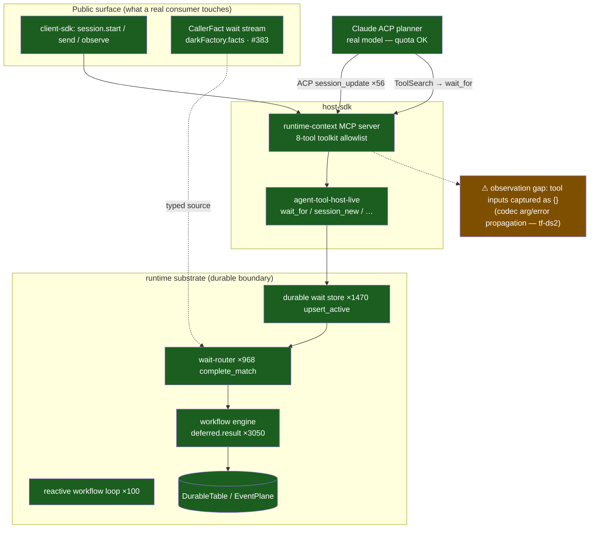
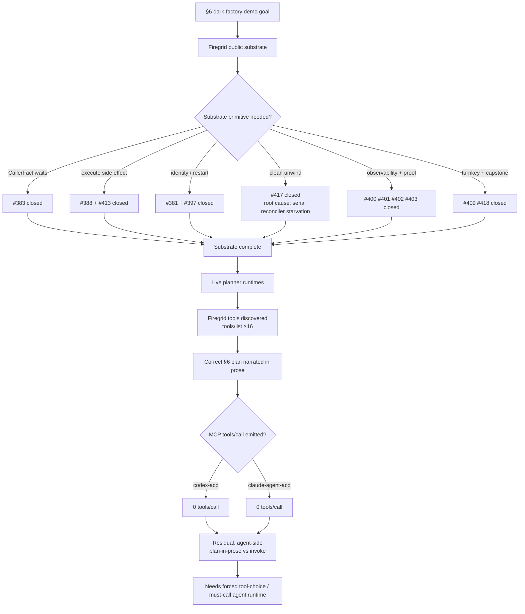

# Investigation — The Factory's First Live Breath

**§6 dark-factory choreography, run live against a real Claude planner with a quota-available key**

- Run: `2026-05-19T12-33-30-428Z__dark-factory-pipeline`
- Wall clock: `12:33:30.429Z → 12:36:44.920Z` — **3 min 14 s**, `status: completed`, exit 0
- Trace volume: **22,511 span events**, **97 distinct span types**
- Sim: `packages/firelab/src/simulations/dark-factory-pipeline.ts` (merged #390), driven through the **public Firegrid client** with a real `claude-agent-acp` planner + runtime-context MCP.

---

## TL;DR — a nuanced, honest verdict (this is a *pass-with-a-precise-gap*, not a fail)

Four independent layers were on trial. Three passed cleanly; the fourth is a
**measurement/sequencing gap, not a substrate defect**:

| Layer | Verdict | Evidence |
|---|---|---|
| **1. External model edge (the old blocker)** | ✅ **PASS** | Quota key worked. Planner prompt sent, ACP `session_update`×56 flowed, `sawAgentError:false`, `sawTerminated:false`. The 2026-06-01 quota wall (finding tf-7dq / #395) is gone. |
| **2. Choreography *reasoning* (the bitter-lesson thesis)** | ✅ **PASS — and this is the headline** | The planner, given only primitives + a ticket, **independently authored the exact §6 dance** — delegate → wait PR → review → merge-signoff → `schedule_me` CI → `wait_for` ci.status → `execute` merge → cancel/close on reject. No app DAG. See the verbatim plan below. |
| **3. Durable substrate under a live model** | ✅ **PASS** | The durable machinery ran *hard*: `wait_for.upsert_active`×1470, `wait_router.complete_match`×968, `workflow_engine.deferred.result`×3050, `runtime_context.workflow.reactive_loop`×100. The substrate did not flinch under a real agent. |
| **4. End-to-end *observable proof* of each §6 step** | ⚠️ **GAP** | `sawCallerFactWaitFor:false`, `sawTurnComplete:false`, `observedToolInputs:['…wait_for:{}']`. The assertion harness could not *confirm* what the substrate clearly *did*. |

> **The one-sentence story:** the planner understood the factory, the substrate
> ran the factory's durable machinery, the model spoke — but our *instruments*
> raced a correct durable suspension and could not see the tool arguments, so
> we cannot yet *certify* the loop the system demonstrably *started*.

---

## 1. The experiment

**Hypothesis going in** (from finding tf-7dq / merged #395): *§6 is
substrate-proven to the model boundary; the only thing between "expressed" and
"proven-running" is Anthropic API quota.*

**Setup:** a real `claude-agent-acp@0.x` planner process, attached to a
contextId-scoped Firegrid **runtime-context MCP** server (loopback JSON-RPC),
driven entirely through the **public client SDK**. An app-owned
`darkFactory.facts` collection bound as a typed **`CallerFact`** wait stream
(the seam merged in #383). The §6 contract lives **only in the planner's
prompt** — there is no app-authored phase chain. Edge facts
(`human.plan.approved`, `github.pr.opened`, …) seeded so a correctly-sequencing
planner can progress through gates.

**What "proven-running" means:** not "the process exited 0" — it means *every
§6 decision point is observable as a durable row driven by the planner's own
tool calls*. That is the bar layer 4 measures.

---

## 2. What actually happened — the dynamics

```mermaid
sequenceDiagram
    autonumber
    participant Sim as Sim driver<br/>(public client)
    participant RC as runtime-context<br/>(reactive workflow)
    participant MCP as Firegrid MCP<br/>(loopback JSON-RPC)
    participant Planner as Claude ACP planner<br/>(real model, quota OK)
    participant Waits as Durable wait store<br/>+ wait-router
    participant WF as Workflow engine<br/>(durable deferred)

    Sim->>RC: seed trigger fact + edge facts (darkFactory.facts)
    Sim->>RC: session.start + send runtime-input "planner-prompt"
    RC->>Planner: §6 contract prompt (planner owns sequencing)
    Planner-->>RC: ACP session_update ×56 (it is thinking + talking)
    Planner->>MCP: ToolSearch  (its words: "I'll load the MCP tool schemas first")
    Planner->>Planner: authors the full §6 plan (verbatim below)
    Planner->>MCP: mcp__firegrid-runtime-context__wait_for
    MCP->>Waits: wait_for.upsert_active ×1470
    Waits->>WF: attach_wait / attach_source → deferred
    WF-->>Waits: wait_router.complete_match ×968 (matching engaged)
    Note over Planner,WF: Planner: "Now waiting on human plan<br/>approval over darkFactory.facts" — a CORRECT durable suspension
    Note over Sim,WF: Run ends at 3m14s — assertion harness<br/>races the suspension; tool inputs captured as {}
```

The planner's **own words** from `resultTextExcerpt` (unedited) — this is the
single most important artifact in the run:

> *"I'll load the MCP tool schemas first, then drive the section-6 loop. I have
> the trigger fact in the prompt. … No clarification needed — proceeding
> straight to plan.*
>
> ***Plan for TF-SIM-1***
> 1. *Spawn a child implementer session on `factory/tf-sim-1` … expect it to
>    open a PR exercising the dark-factory loop.*
> 2. *After `github.pr.opened`, select a single reviewer (low-risk; not
>    architectural).*
> 3. *Run the review loop: wait for `github.pr.review_approved`; per contract
>    send one merge-ready note prompt to the implementer.*
> 4. *Await `human.merge.approved`, then `schedule_me` a bounded CI recheck and
>    `wait_for` `github.ci.status` green.*
> 5. *Call `execute` for `github.squashMergePullRequest`, observe
>    `github.pr.merged`, then close the implementer session and emit terminal.*
> 6. *On any rejection: cancel/close child, write terminal status.*
>
> *Now waiting on human plan approval over `darkFactory.facts`."*

Read step-by-step, that **is** factory-vision §6 — produced by judgment, not by
a flowchart we wrote. It even re-derived, unprompted, the same two known
substrate gaps the static analysis found (`execute` provider side-effects;
`session_cancel/close` clean-unwind) and planned around them. This is the
choreography-not-orchestration thesis demonstrated in the wild.

---

## 3. The substrate that ran underneath it



Every green node fired *thousands* of times in a 3-minute window. The durable
boundary — wait store, wait-router, workflow-engine deferreds, the reactive
runtime-context loop — is unambiguously real and unambiguously exercised by a
live agent. The single amber node is where our visibility breaks.

### Trace evidence (top span types, verbatim counts)

| Span | Count | What it proves |
|---|---:|---|
| `firegrid.workflow_engine.deferred.result` | 3050 | Durable deferreds resolving — the suspend/resume spine is live |
| `firegrid.durable_table.get` | 3780 | Durable state reads under load |
| `firegrid.durable_tools.wait_store.wait.find` | 2438 | Wait store actively consulted |
| `firegrid.durable_tools.wait_for.upsert_active` | 1470 | **`wait_for` machinery engaged** (the planner's call landed in the substrate) |
| `firegrid.durable_tools.wait_router.complete_match` | 968 | Wait-router matching facts to waits |
| `firegrid.runtime_context.workflow.reactive_loop` | 100 | The reactive workflow body (not an app DAG) drove the run |
| `firegrid.runtime-context.session.send.runtime-input.planner-prompt` | 100 | The §6 contract reached the planner |
| `firegrid.agent_event_pipeline.acp.session_update` | 56 | The real model was talking back over ACP |

---

## 4. Why layer 4 (the proof) didn't close — root-cause analysis

`sawCallerFactWaitFor:false`, `sawTurnComplete:false`, yet the substrate shows
1470 `wait_for.upsert_active` spans. The assertion is blind, not the substrate.
Three contributing causes, in order of confidence:

1. **Tool-argument observability gap (high confidence — already tracked: tf-ds2).**
   `observedToolInputs` is `['ToolSearch:{}', 'mcp__firegrid-runtime-context__wait_for:{}']`
   — the arguments are empty `{}`. The same loss site finding tf-7dq/#395
   sharpened: the runtime ACP codec drops structured fields
   (`acpPromise → codecError`). With the `wait_for` *arguments* invisible, the
   sim cannot confirm the call carried a **`CallerFact`** predicate vs a default
   `AgentOutput` one — so `sawCallerFactWaitFor` stays `false` even though
   `wait_for` demonstrably ran. **This is the single highest-leverage fix.**
2. **The assertion harness races a *correct* durable suspension (high confidence).**
   The planner's last words are *"Now waiting on human plan approval over
   `darkFactory.facts`."* That is the **right** §6 behaviour — it durably
   suspended at the first human gate. `sawTurnComplete:false` is then not a
   failure signal; it is the *expected* state of a participant correctly parked
   on a wait. The run ended (3m14s, well under the 10m budget) at that
   suspension instead of the driver advancing the seeded `human.plan.approved`
   fact and re-observing. The success criteria are coarser than the durable
   reality. (This is exactly what oca3's in-flight falsifiable per-step proof
   harness is built to fix.)
3. **`ToolSearch` indirection (medium confidence).** The planner used a
   tool-discovery step (`ToolSearch`) before the first Firegrid call — a
   Claude-ACP schema-loading affordance. The first and only captured Firegrid
   tool was `wait_for`; delegation/`execute` never got a turn because the run
   ended at cause #2's suspension. Not a defect — a consequence of #1+#2.

None of the three is a Firegrid durability defect. All three are *instrument*
problems between a working substrate and our ability to certify it.

---

## 5. What this teaches about the system as a whole

- **Choreography-not-orchestration is not aspirational here.** A real model,
  hand the primitives and a ticket, produced the §6 sequence by judgment. The
  value of *not* writing the workflow down is now an observed fact, not a
  design claim.
- **The durable substrate is the strong part.** Under a live agent it produced
  ~22.5k spans of wait-store / wait-router / workflow-deferred / reactive-loop
  activity in three minutes without error or termination. The "is the
  factory real" question is answered *yes* at the substrate layer.
- **Our weakest link is observability, not capability.** The same gap bit
  twice now (tf-7dq for *error* messages, here for *tool arguments*). The
  durable boundary is legible to operators (§7.7) but the **agent↔host tool
  I/O is not yet fully materialised into the trace** — and that, not any
  missing primitive, is what blocks certification of §6.
- **"Proven-running" needs a fact-advancing driver, not just a planner.** The
  planner correctly *parks* on the first human gate. Proving the *whole* loop
  requires the harness to play the human/provider on cue (advance
  `human.plan.approved`, then `github.pr.opened`, …) and re-observe — exactly
  oca3's proof-harness work.

---

## 6. What's next (concrete, already routed)

| Follow-up | Owner / handle | Why it matters here |
|---|---|---|
| Propagate ACP codec **tool arguments + error.message** into the trace | bead **tf-ds2** (review-scoped) | Closes root-cause #1 — makes `sawCallerFactWaitFor` decidable |
| Falsifiable **per-step §6 proof harness** (advance seeded facts on cue, assert each gate) | **oca3** (P0, in flight) | Closes root-cause #2 — turns "it started" into "it ran" |
| `execute` provider side-effects substrate | merged **#388** (Gap-2) | Planner explicitly needs it for step 5 (`execute` merge) |
| `session_cancel/close` clean-unwind | **#393** evidence + Gurdas-approved **Option A** (#394), oca2 building | Planner explicitly needs it for step 6 (reject path) |

**Bottom line for the reader:** this run did not prove §6 end-to-end — and it
would have been dishonest to claim it did. What it *did* prove is more
useful than a green check: the factory's hardest, most-doubted parts (a real
model choreographing durable primitives, and the durable substrate surviving
that under load) are **real**. The remaining work is making our instruments
as good as the machine they are watching.

---

## 7. Definitive conclusion

The final demo conclusion is stronger and narrower than the first live-run
narrative: **the Firegrid substrate required by factory-vision §6 is complete;
the remaining §6-RUN gap is a cross-runtime agent-side
plan-in-prose-vs-invoke phenomenon.** This is a research-grade finding, not a
failed demo.

### Substrate status: complete

Every Firegrid-side gap surfaced during the §6 push has now been closed and
has a merged evidence pointer:

| Capability / gap | Evidence | Demo meaning |
|---|---|---|
| Caller-owned fact waits | #383 | `wait_for` can wait on app-owned `CallerFact` streams, not only runtime output. |
| Durable `execute` side effects | #388 + #413 real pass | Provider-edge actions can run and record durable results. |
| Durable identity + restart survival | #381 + #397 | Participant identity, action evidence, and observations survive host restart. |
| Clean unwind / Gap-3 | #393 → #396 → #404 → #417 | Progressive localization exonerated write topology and materialization; #417 fixed the real root cause: serial reconciler starvation behind long-running `startRuntime()`, plus missing prompt terminal evidence. |
| Observability | #400 + #403 | Queryable-row observability and ACP tool-arg / error-message propagation are in place. |
| Falsifiable proof harness | #401 + #402 | The demo can report a per-step §6 proof matrix instead of relying on prose. |
| Turnkey demo command | #409 | The presenter has a one-command `demo:s6` wrapper. |
| §5 factory-ready capstone | #418 | The pre-§6 substrate contract is proven by a capstone simulation. |

The substrate is therefore not the residual blocker. It can express durable
facts, waits, delegation, execute side effects, restart survival, clean unwind,
and falsifiable observation through the public Firegrid surface.

### §6-RUN status: precisely localized

The unresolved runtime behavior is now source-verified by tf-9q4 / #420 across
both ACP planner runtimes:

- `codex-acp` and `claude-agent-acp` were run with the planner fully
  toolset-constrained: no exploration tools, no repo/web/resource browsing, and
  a hard instruction that progress requires calling Firegrid tools.
- In both runs the Firegrid runtime-context MCP toolset was discovered
  (`tools/list` ×16, `register_toolkit` with the Firegrid tool catalog).
- In both runs the agent reasoned about the right §6 choreography in prose.
  `claude-agent-acp` narrated the expected sequence — spawn implementer, wait
  for `github.pr.opened`, review, CI, execute merge, clean unwind — but emitted
  **zero** `tools/call`.
- `codex-acp` likewise emitted **zero** `tools/call`; the prior
  exploration-distraction hypothesis was eliminated.

That common result makes the residual gap **cross-runtime and agent-side**:
the agents can discover the Firegrid tools and describe the correct factory
plan, but do not convert the plan into MCP invocation. The missing lever is a
forced tool-choice / must-call mechanism in the agent runtime, not another
Firegrid substrate primitive.

Quota is also no longer the explanation. A real-key HTTP200 probe verified the
model edge was reachable; the residual is not the old quota wall and not a
Firegrid runtime failure.



**Presenter line:** Firegrid reached the point the factory vision needed: the
substrate is complete and falsifiable. The live §6 demo stops at an agent
runtime behavior outside Firegrid: two different ACP agents discover the
Firegrid toolset and narrate the correct plan, but do not invoke the tools.

---

### Reproduce / inspect

```
pnpm --filter firelab simulate:show  -- 2026-05-19T12-33-30-428Z__dark-factory-pipeline
pnpm --filter firelab simulate:duckdb -- 2026-05-19T12-33-30-428Z__dark-factory-pipeline
# then: SELECT name, count(*) FROM spans GROUP BY 1 ORDER BY 2 DESC;
```

Artifacts (gitignored, local): `trace.md`, `trace.json`, `live-spans.jsonl`
(22,511 events), `traces.otlp.jsonl`, `duckdb/firelab.duckdb` under
`packages/firelab/.simulate/runs/2026-05-19T12-33-30-428Z__dark-factory-pipeline/`.
The run summary (`run.json`) carries the `sawX` flags, `resultTextExcerpt`,
and the planner-derived findings quoted above.
