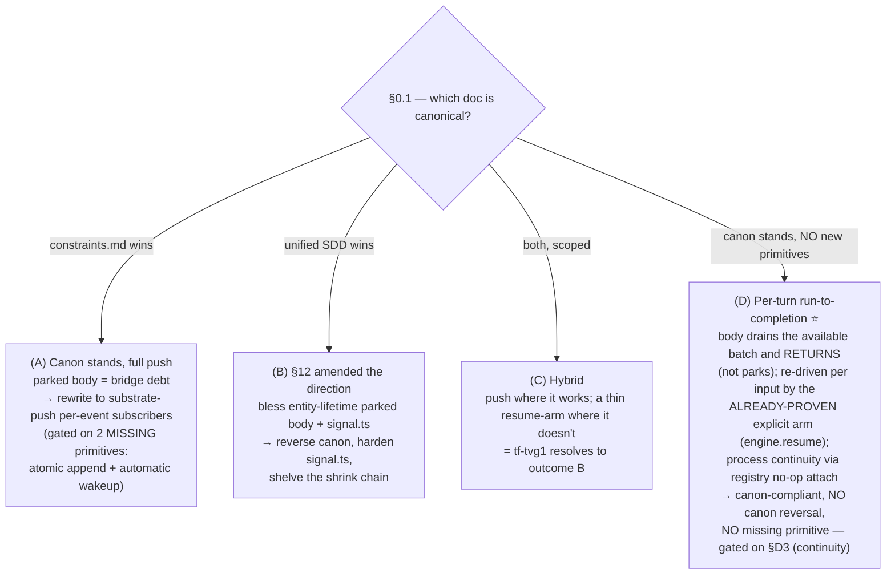
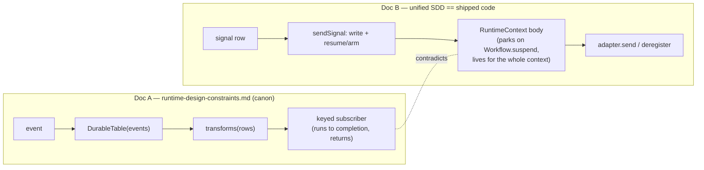
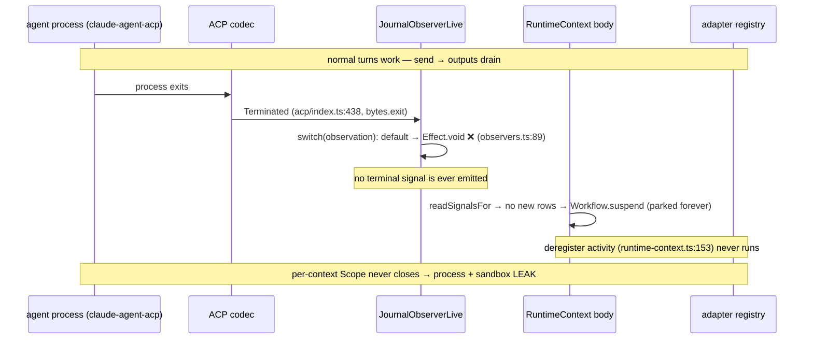
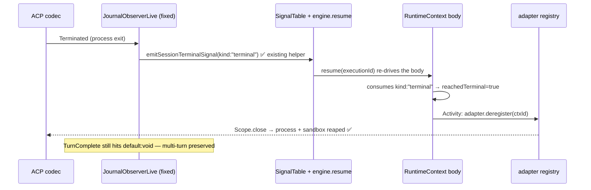
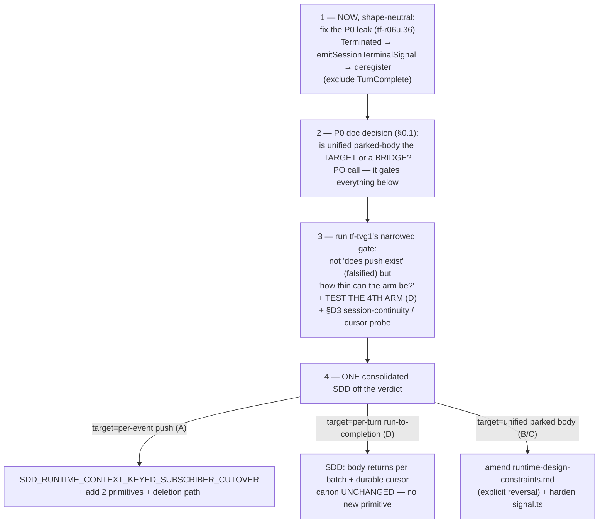

# Proposal — Reconcile the RuntimeContext body with the keyed-subscriber canon

- **Date:** 2026-06-02
- **Status:** proposal for review (decision is the PO's; this frames it)
- **Revision:** v3 — reconciles **two** peer reviews, both verdict *amend*, all
  corrections independently source-verified by the coordinator: **#842** (Agent0)
  and the **Opus diversity-review** (`tf-1axl`). Net change from v1: the trichotomy
  is now **A/B/C/D** (Opus found the omitted canon-compliant option), the leak fix
  excludes `TurnComplete` (#842 caught the bug), and the B/C lean is **withdrawn**
  as a mechanism-vs-shape non-sequitur (Opus §D2). See §7.
- **Main:** `origin/main` post-§12 (`c24c87f60`+)
- **Surfaced by:** the `tf-0awo.34` alignment audit + a `bv --robot-insights`
  structural read (`tf-tvg1` / `tf-r06u.14` are betweenness keystones).

---

## §0 — The load-bearing decision (and the blocker that gates it)

There are **two** decisions here, and peer review established that they are
nested — the second cannot be answered until the first is.

### §0.1 — P0, gates everything: *which doc is canonical?*

Post-§12 the architecture docs **contradict each other**, not just the code:

- `docs/sdds/SDD_FIREGRID_UNIFIED_PRODUCTION_WIRING.md` says Phase 2 *"collapsed
  the substrate to three primitives (Workflow + DurableTable + Signal)"* and
  *"the substrate is settled. This phase is surface work"* — i.e. the
  **parked-body + signal** shape is the **target**.
- `docs/cannon/architecture/runtime-design-constraints.md` says keyed subscribers
  *"run to completion, and return"* and bans *"a workflow body representing the
  lifetime of an entity and parking across many events"* — i.e. the parked body
  is **forbidden debt**.

These are two *current* documents giving opposite answers. **This is the
highest-order blocker**: it changes the meaning of every downstream RuntimeContext
bead (`tf-tvg1`, `tf-r06u.36`, the shrink chain). Until it's resolved, "fix the P0
now" and "run the `tf-tvg1` gate" can each be read two incompatible ways.

> Amending `runtime-design-constraints.md` to bless the parked body would be a
> **real architecture reversal**, not clerical doc-hygiene. That is why it is a PO
> call, not a coordinator edit.

### §0.2 — The architecture choice (gated on §0.1)

> **Review correction (Opus, `tf-1axl`, §D1):** the original A/B/C was a
> **near-false trichotomy** — it omitted a 4th, **canon-compliant** option (D),
> biasing the PO toward "amend canon." Added below.



**Option D in one line:** keep the explicit *mechanism* (write + `engine.resume`,
proven by `tf-e5rf`) but drop the parked *shape* — the body consumes the
currently-available signals, **returns** (records `finalResult`), and is re-driven
by the next signal's arm. `startOrAttach` no-ops on an already-registered context
(`codec-adapter.ts:408` — *verified*), so the OS process survives across
executions. It satisfies canon's *"runs to completion and returns"* **without**
either missing substrate primitive **and without** a canon amendment. **It is
neither A (no new primitives) nor B (no canon reversal).** Its one open risk is
§D3 (session-state continuity across per-turn executions) + a durable consume
cursor — both for `tf-tvg1` to validate; D is *not* proven, it is an option the
trichotomy omitted.

**This proposal does not pick A/B/C/D, and does not pick §0.1.** It (1) names the
P0 doc conflict, (2) widens the option set so the PO is not steered by omission,
(3) argues the cheap *order of operations* to settle the rest, and (4) identifies
**one fix to do now regardless of the choice** — corrected below after review
caught a real bug in the original fix.

---

## §1 — The contradiction, at source (canon-vs-canon)

> **Review correction (#842):** the original framing was "code violates the
> obviously-current canon; canon wins." That is wrong. The code *matches* the
> unified production SDD; the conflict is **doc-vs-doc**. Restated here.

**Doc A — `docs/cannon/architecture/runtime-design-constraints.md` (allowlisted):**
> `events -> DurableTable(events) -> transforms(rows) -> keyed subscribers(rows)`
> … A keyed subscriber *"is invoked for events for its key, runs to completion,
> and returns. It does not park on a deferred, keep a fiber alive across
> events…"* (`:80`, `:83`). It is **not** anti-workflow — it explicitly permits
> `@effect/workflow` as execution machinery (`:88`); the banned shape is *"a
> workflow body representing the lifetime of an entity and parking across many
> events"* (`:92`). It names the active validation path as `tf-tvg1` (`:474`,
> `:479`) and labels controller-owned write+arm a *migration safety primitive*,
> *"not the target abstraction"* (`:488`, `:494`).

**Doc B — `docs/sdds/SDD_FIREGRID_UNIFIED_PRODUCTION_WIRING.md` (current SDD):**
> *"collapsed the substrate to three primitives (Workflow + DurableTable +
> Signal)"* (`:12`); *"The substrate is settled. This phase is surface work."*
> (`:14`). It defines the session lifecycle around a **workflow body whose
> terminal action calls `deregister`** (`:20`, `:34`).

**The shipped code matches Doc B** (`runtime-context.ts:113-145`):

```ts
// packages/runtime/src/unified/subscribers/runtime-context.ts
let consumed = 0
let reachedTerminal = false
while (!reachedTerminal) {
  const rows = yield* readSignalsFor(signals, executionId).pipe(Effect.orDie)
  if (consumed >= rows.length) {
    return yield* Workflow.suspend(instance)           // ← park the entity body
  }
  while (consumed < rows.length && !reachedTerminal) {
    const input = yield* decodeSessionInputPayloadJson(rows[consumed]!.payloadJson) // …
    if (input.kind === "terminal") { reachedTerminal = true; consumed += 1; break }
    yield* Activity.make({ /* unified.session.send */ execute: adapter.send(...) })
    consumed += 1
  }
}
// only reached after a terminal signal is consumed:
yield* Activity.make({ name: `unified.session.deregister/${ctxId}`,
                       execute: adapter.deregister(ctxId) })  // ← kills the process
```

This is exactly the shape Doc A bans: **one entity-lifetime body** that parks on
`Workflow.suspend` and drains a merged input loop. `signal.ts`'s `sendSignal` is
the **write+arm** mechanism Doc A names as a migration primitive.



> **Review correction (#842) — `signal.ts` is *write+arm*, not atomic.** The file
> comment says *"Atomically: records the signal row, performs the …"*
> (`signal.ts:25`), but the impl is **sequential**:
> ```ts
> const writeSignalRow = (options) => Effect.gen(function*() {
>   yield* insertSignalRow({ ... })   // signal.ts:168 — append the signal row
>   yield* options.write(options.value) // signal.ts:180 — then the domain row
> })
> // sendSignal then arms: workflow.resume(executionId)  (or a custom arm)
> ```
> It is a durable *write-then-arm composition*, **not** an all-or-nothing
> multi-row transaction. The comment over-claims; correct the wording wherever
> "atomic" is implied.

---

## §2 — The open P0 leak (`tf-r06u.36`/`tf-ll90.5`) — and the corrected fix

The parked body is also the root of the **terminal-completion process leak**.
This is independently shippable and **the one thing to do now regardless of
A/B/C** — but the *original* fix in v1 had a bug that review caught.

### §2.1 — The leak chain (source-verified)



The dispatcher today (`observers.ts:53-90`) handles only `PermissionRequest` and
`ToolUse`; **everything else — including `Terminated` — hits `default:
Effect.void`**:

```ts
// packages/runtime/src/unified/observers.ts:55
switch (observation._tag) {
  case "PermissionRequest": return Effect.fork(PermissionRoundtripWorkflow.execute({...}))
  case "ToolUse":           return Effect.fork(ToolDispatchWorkflow.execute({...}))
  default:                  return Effect.void   // ← Terminated falls here → no cleanup
}
```

### §2.2 — The corrected fix: `Terminated` ONLY, reusing the existing helper

> **Review correction (#842), decision-grade:** v1 said *"wire
> `Terminated`/`TurnComplete` → terminal signal → deregister."* Routing
> **`TurnComplete` is a bug.** The adapter registry is **cross-turn continuity** —
> *"The same `claude-agent-acp` process serves many inputs across attempts; the
> registry is the cross-attempt continuity"* (`codec-adapter.ts:7`), and
> `deregister` closes the per-context Scope, **killing the process**
> (`codec-adapter.ts:518`). `TurnComplete` fires after *every* prompt turn
> (`acp/index.ts:768`, derived from `stopReason`). Wiring it to cleanup would
> **deregister after the first turn and break multi-turn sessions.** Only
> `Terminated` (process exit, `acp/index.ts:438`, from `bytes.exit`) + the
> already-wired explicit cancel/close are terminal.

The fix is small because the producer already exists. Cancel/close already emit
the shared terminal signal via `signalSessionTerminal` →
`emitSessionTerminalSignal` (`channel-bindings.ts:287`, `:442`, `:485`), which
writes a `{ kind: "terminal" }` `SessionInputPayload`. The body already consumes
`kind: "terminal"` and runs `deregister` (`runtime-context.ts:131`, `:153`). The
**only** missing leg is *natural process exit*:

```ts
// packages/runtime/src/unified/observers.ts — corrected dispatcher
switch (observation._tag) {
  case "PermissionRequest": return Effect.fork(PermissionRoundtripWorkflow.execute({...}))
  case "ToolUse":           return Effect.fork(ToolDispatchWorkflow.execute({...}))

  case "Terminated":        // NEW — natural process exit only
    return Effect.fork(
      emitSessionTerminalSignal({
        signals, engineTable, engine,
        contextId: observation.contextId,
        idempotencyKey: `terminated:${observation.contextId}:${observation.activityAttempt}`,
        payloadJson: JSON.stringify({ reason: "process-exit" }),
      }).pipe(Effect.provide(captured), Effect.orDie),
    )

  // NOTE: do NOT add `case "TurnComplete"` — it is per-turn; it would
  // deregister after the first turn and break multi-turn sessions.
  default:                  return Effect.void
}
```



**Why not a direct `observer → adapter.deregister`?** It would close the registry
but leave the workflow body *suspended without its final result* (the body's
`return {...}` never runs). Going through the terminal-signal path lets the body
complete its own lifecycle. (#842, §4a.)

This fix is **shape-neutral**: if the eventual decision is (A) per-event
subscribers, the same `Terminated → terminal contract` edge has to exist there
too. So it does not pre-commit A/B/C. **`tf-r06u.36` stays P0.**

---

## §3 — Why the broader rewrite isn't already settled (the real substrate facts)

`tf-vrz6` (the input-table cutover) **STOP'd** on source-verified substrate gaps.
Review (#842, §2) amended one of the two:

| Substrate question | Status | Evidence |
|---|---|---|
| Atomic multi-row append on `DurableTable`? | **NO** | `CollectionFacade` exposes only row-level `insert/insertOrGet/upsert/delete/get/query/subscribe` + `awaitTxId`; one State-Protocol event per write; `insertOrGet` is *"not a lock/claim/coordination primitive."* (`DurableTable.ts:117/146/155/368/426`) |
| **Automatic** table-write-driven wakeup (a bare row insert wakes a suspended body)? | **NO** | DurableTable writes don't intrinsically wake executions. |
| **Explicit** table-write + `engine.resume` wakeup (no `DurableDeferred` mailbox)? | **YES — proven** | test `tf-e5rf` (`DurableStreamsWorkflowEngine.test.ts:927`); `engine.resume` re-drives the body (`engine-runtime.ts:182/206/350`) |
| **Session-state continuity** across *per-turn* executions (does the agent/codec session survive when the body returns and a later execution re-attaches)? | **OPEN — unchecked** | gates option D; see below |

> **Review addition (Opus, `tf-1axl`, §D3) — the one load-bearing fact neither
> this proposal nor #842 checked.** Both implicitly assumed the entity-lifetime
> parked body is the *only* way to get multi-turn continuity. Option D needs a
> *new workflow execution per turn*, so: does the in-process agent session (ACP
> `sessionId`, conversation context) **and** the body-local consume cursor stay
> continuous when the body returns and a later execution re-attaches? The process
> survives (`startOrAttach` no-ops, `codec-adapter.ts:408`), and drain *ordering*
> across attempts is already safe (per Opus, from `tf-0awo.26`/#822 —
> `deregister`'s `Scope.close` awaits the drain before the next append). But
> **session-state continuity and cursor durability are NOT proven** — today the
> parked body keeps `consumed` in its durable continuation across `suspend`; a
> return-and-re-arm shape must persist that cursor (which re-touches the
> atomic-append/cursor question). **This is the precise, cheap probe to add to
> `tf-tvg1`'s matrix; it decides whether option D is real or collapses.**

> **Review correction (#842), §2:** v1 said *"No F3 wakeup — a row write cannot
> wake a suspended subscriber … unproven."* That is **overstated**. Distinguish:
> - **automatic** push (row write *intrinsically* wakes a body) — **absent**;
> - **explicit** arm (row write **+ `engine.resume`**) — **already proven** by
>   `tf-e5rf`. No `DurableDeferred` mailbox, no polling — a single explicit
>   resume.

The `tf-e5rf` proof, in essence:

```ts
// packages/runtime/test/workflow-engine/DurableStreamsWorkflowEngine.test.ts:927
// "resumes a suspended workflow from a workflow-owned table write via
//  engine.resume, without a deferred mailbox"
const completed = await runWithLayer(engineLayer, workflowLayer, Effect.gen(function*() {
  const table = yield* WakeInputTable
  yield* table.inputs.insert({ key: "wake-1", value: "delivered-by-table-write" }) // write the row
  yield* WakeWorkflow.resume(executionId)                                          // explicit arm
  return yield* WakeWorkflow.execute({ id: "wake-1" })                             // body re-reads → completes
}))
expect(completed).toBe("delivered-by-table-write")
// …and no DurableDeferred row was ever created for this execution.
```

**This reframes the open question.** "Pure substrate-native push, no arm" is
*already source-falsified*. The live question `tf-tvg1` must answer is **not**
"does push exist" but **"how thin can the arm be?"** — and `signal.ts` is one
existing answer to that. So `tf-tvg1`'s honest verdict space narrows toward B/C.

`Shape C / Shape D` (`docs/architecture/shape-c-vs-shape-d.md`, **not
allowlisted, self-labeled "transitional"**) is the documented *bridge*, not the
target.

---

## §4 — Documentation landscape (and the gap)

| Layer | Doc | Status |
|---|---|---|
| Target architecture | `cannon/architecture/runtime-design-constraints.md` (#6) + `runtime-pipeline-type-boundaries.md` (#7) | **canon** — but contradicts Doc B (§0.1) |
| Current production shape | `SDD_FIREGRID_UNIFIED_PRODUCTION_WIRING.md` | **current SDD** — says substrate "settled" on parked-body + signal |
| Write+arm principle | `cannon/architecture/kernel-owned-write-arm.md` | principle **binding**; mechanism refs **stale post-#765** (now `signal.ts`, not `KernelCommandTable`) (`:8`, `:31`) |
| Bridge model | `architecture/shape-c-vs-shape-d.md`, `unified-subscriber-kernel.md`, `runtime-shrink-loop.md` | working, **transitional** |
| Cutover slices | `SDD_RUNTIME_CONTEXT_WORKFLOW_INPUT_TABLE_CUTOVER`, `SDD_DURABLE_OUTPUT_CURSOR_PRIMITIVE` | fragments, **partly bridge/superseded** |

**The gap:** no single doc is *both* current *and* internally consistent with the
shipped code. The authority is a **canon-vs-canon contradiction** + an *unwritten*
`tf-tvg1` verdict + superseded fragments.

---

## §5 — Recommendation (the order of operations, not the verdict)



1. **NOW, decoupled & shape-neutral — fix the P0 leak** (§2.2). `Terminated`
   (+ existing cancel/close) → `emitSessionTerminalSignal` → body's existing
   `deregister`. **Exclude `TurnComplete`.** Mark the shape *current-unified*.
2. **Resolve the §0.1 doc-precedence P0 *before* dispatching more rewrite work.**
   It is the highest-order blocker. If unified is blessed as target, the decision
   must **explicitly reverse** the no-parked-entity-body constraint and update
   `runtime-design-constraints.md` + `unified-subscriber-kernel.md` +
   `kernel-owned-write-arm.md` in one pass.
3. **Run `tf-tvg1`'s narrowed gate** (§3): the cheap source/API facts already
   prune "pure push." But the gate must test a **fourth arm** — option D's
   canon-compliant per-turn run-to-completion via the existing explicit arm — and
   the **§D3 session-continuity + cursor-durability probe**, not just
   {auto-push / explicit-push / polling}. *Without the 4th arm the gate inherits
   the trichotomy's bias and steers the PO toward amending canon by omission*
   (Opus, §D4).
4. **Then write ONE consolidated SDD** off the verdict (per branch above). *Canon
   must not durably contradict shipped code either way.*

**Lean — corrected after the Opus review (I withdraw the B-lean as stated).**
v2 leaned **B/C** on the reasoning "no automatic push ⇒ keep the parked body."
**Opus (§D2) correctly calls that a non-sequitur, and I accept the correction.**
The argument conflates two separable things:

- **Mechanism** — *how* a suspended body is re-driven. The substrate fact (no
  automatic wakeup) genuinely compels an **explicit arm** (write + `engine.resume`,
  C-shaped, *proven* by `tf-e5rf`). This part of my lean stands.
- **Shape** — *whether* the body parks for the entity lifetime or returns per
  turn. The substrate fact says **nothing** about this. Option D is the existence
  proof that you can keep the explicit arm **and** satisfy canon's no-park ban.

So "substrate can't push ⇒ bless the entity-lifetime parked body (B)" borrows a
true substrate fact to justify a *shape the fact does not require* — exactly the
motivated-reasoning risk to guard against. **Corrected position:** the *mechanism*
is settled (explicit arm); the *shape* (B parked vs D per-turn-return) is an open
choice for `tf-tvg1` + §0.1 to settle, and **D — if §D3 holds — is plausibly the
best of both** (canon-compliant, no new primitive, no canon reversal). Separately
(#842, §4c) `signal.ts` is workflow-execution-specific
(`signal.ts:86/102/229/266/305`), so it is the current unified write+arm
mechanism, **not** proof of any particular shape — harden it under B, retire/split
it under A/D.

---

## §6 — What this proposal explicitly does NOT decide (PO calls)
- **§0.1 doc precedence** (unified target vs bridge) — the gating P0.
- A vs B vs C vs **D** (the direction) — downstream of §0.1. (D widens the set;
  it is not a covert pick — it is the canon-compliant option the trichotomy
  omitted.)
- Whether to invest in the two substrate primitives (atomic multi-row append,
  automatic table-write wakeup) — only needed under A; **D needs neither**.
- Related PO-owned items already flagged: `tf-0awo.17` (daemon A/B), `tf-0awo.33`
  (afterSequence default), `tf-r06u.48` (spawn contract), `tf-0awo.36` cap-6
  (port-vs-remove `execute`).

---

## §7 — Peer-review reconciliation

**Agent0 (#842, verdict *amend*) — all four corrections source-verified by the
coordinator and folded above:**

| # | Correction | Folded into | Verified at |
|---|---|---|---|
| 1 | **`TurnComplete` must be excluded** from terminal cleanup (registry is cross-turn; would break multi-turn). | §2.2 | `codec-adapter.ts:7/518`, `acp/index.ts:438/768` |
| 2 | It's **canon-vs-canon**, not canon-vs-code; amending canon = real reversal. | §0.1, §1 | SDD:12/14 vs constraints:80/83/92 |
| 3 | **F3 is partial** — explicit `resume` proven (`tf-e5rf`); only *automatic* push absent. | §3 | `DurableStreamsWorkflowEngine.test.ts:927`; `engine-runtime.ts:182/206/350` |
| 4 | `signal.ts` is **write+arm, not atomic** (comment over-claims). | §1 | `signal.ts:25/168/180` |
| 5 | `signal.ts` is **workflow-specific**, not a generic arm → temper the B lean. | §5 | `signal.ts:86/102/229/266/305` |

**Opus diversity-review (`tf-1axl`, verdict *amend* on the proposal, *agree+amend*
on #842) — landed and folded.** Coordinator independently spot-verified its load-
bearing new claim (`startOrAttach` no-op at `codec-adapter.ts:408`). It confirmed
all of #842's corrections at source, then added genuine divergence (the diversity
payoff):

| # | Divergence / addition | Folded into | Verified |
|---|---|---|---|
| D1 | **False trichotomy** — a 4th, canon-compliant option (per-turn run-to-completion; no new primitive, no canon reversal) was omitted, biasing the PO toward "amend canon." | §0.2 (option D), §5 diagram | `codec-adapter.ts:408` (no-op attach) ✅ |
| D2 | The B/C lean is a **mechanism-vs-shape non-sequitur** — "no auto push" compels a thin *arm*, not a parked *shape*. | §5 lean (withdrawn/corrected) | argument, accepted |
| D3 | **The one unchecked fact** — does agent session-state + the consume cursor survive across per-turn executions? Gates option D. | §3 (new substrate row), §5 step 3 | flagged OPEN; `tf-0awo.26`/#822 drain-ordering attributed to Opus |
| D4 | The `tf-tvg1` gate must test the **4th arm**, not just {auto/explicit/poll}, or it inherits the bias. | §5 step 3 | accepted |

**Where the two reviews converge:** the `TurnComplete`-exclusion bug, canon-vs-canon
P0, F3-partial, `signal.ts` non-atomic + workflow-specific, and the route-through-
terminal-signal fix. **Where Opus diverges (adds value):** D1–D4 above — chiefly
that my own B/C lean was motivated reasoning, and that the honest option set is
**four**, not three.

## §8 — Sources
`docs/cannon/architecture/runtime-design-constraints.md` (#6, `:80/83/88/92/474/488`) ·
`runtime-pipeline-type-boundaries.md` (#7) · `kernel-owned-write-arm.md` (`:8/31`) ·
`docs/sdds/SDD_FIREGRID_UNIFIED_PRODUCTION_WIRING.md` (`:12/14/20/34`) ·
`packages/runtime/src/unified/subscribers/runtime-context.ts:105-160` ·
`packages/runtime/src/unified/observers.ts:53-90` ·
`packages/runtime/src/unified/signal.ts:25/86/102/168/180/193/229/266/305` ·
`packages/runtime/src/unified/channel-bindings.ts:287/442/485` ·
`packages/runtime/src/unified/codec-adapter.ts:7/23/408/518/529` ·
`packages/runtime/src/sources/codecs/acp/index.ts:438/768` ·
`packages/effect-durable-operators/src/DurableTable.ts:117/146/155/368/426` ·
`packages/runtime/test/workflow-engine/DurableStreamsWorkflowEngine.test.ts:927` ·
beads `tf-tvg1` (+ `tf-4fy3/.u8w2/.28b8/.1r0o`), `tf-vrz6` (STOP notes),
`tf-w6qj`, `tf-jpcg`, `tf-9rpy`, `tf-r06u.36`/`tf-ll90.5`, `tf-1axl` ·
peer reviews `docs/reviews/2026-06-02-runtime-context-reconcile-proposal-review.md` (#842, Agent0) +
`docs/reviews/2026-06-02-runtime-context-reconcile-review-opus.md` (`tf-1axl`, Opus) ·
`docs/analysis/2026-06-02-architecture-health-check.md`.
