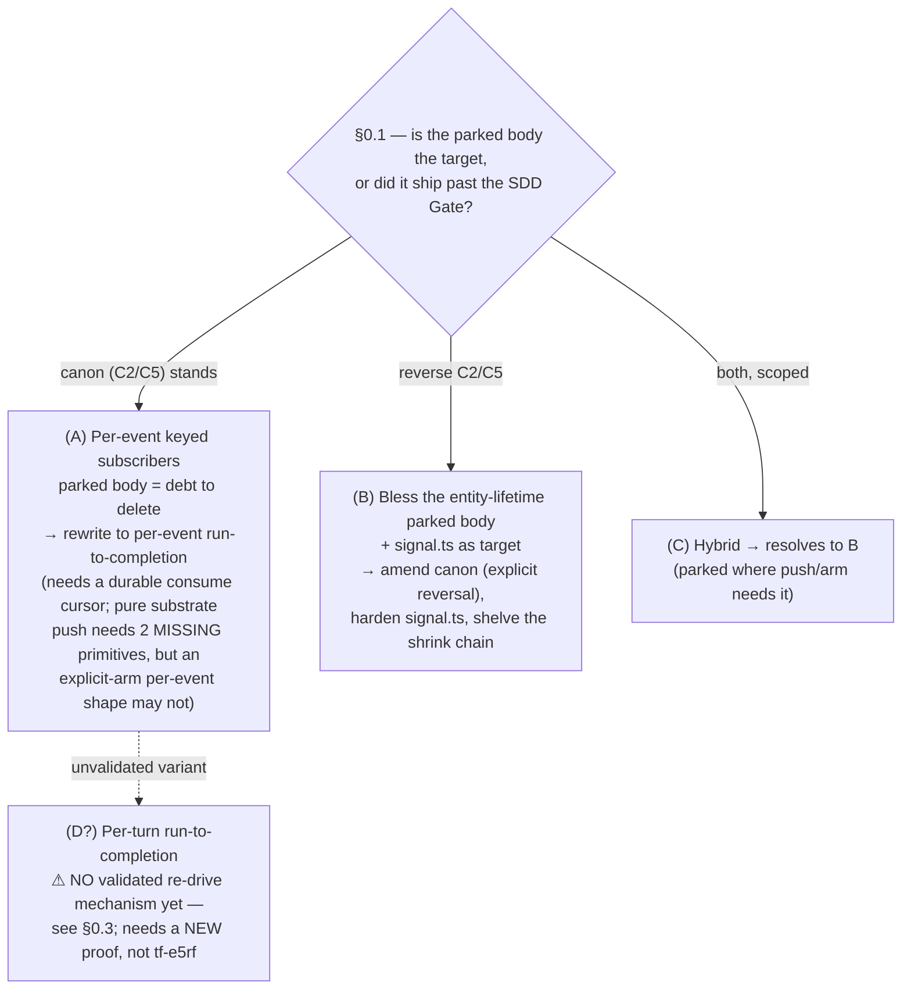
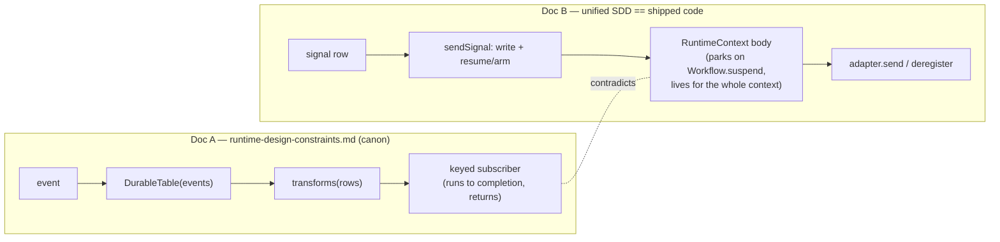
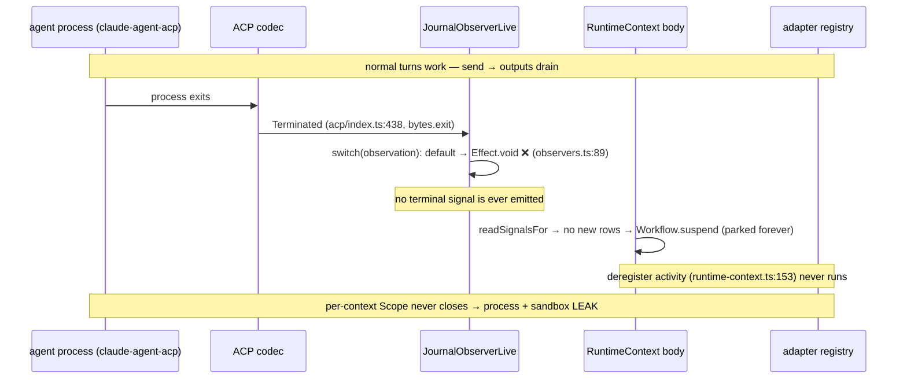
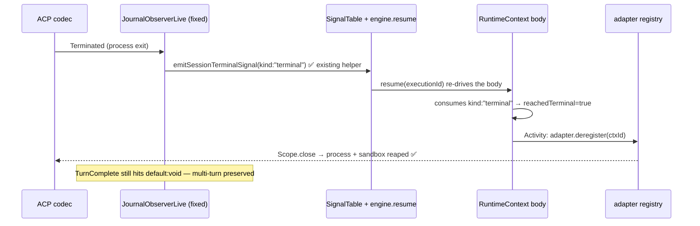
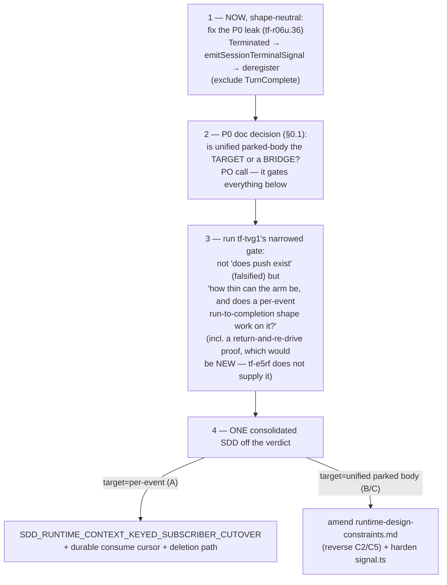

# Proposal — Reconcile the RuntimeContext body with the keyed-subscriber canon

- **Date:** 2026-06-02
- **Status:** proposal for review (decision is the PO's; this frames it)
- **Revision:** v5 — adds the **blast-radius / prior-art** finding (§9): a
  calibration challenge ("is the whole system on the wrong model?") was answered at
  source — **no**; the divergence is **one body** (`RuntimeContext`), the actor
  model is **already in production** (permission/tool handlers), and `signal.ts` is
  mostly model-neutral plumbing. Full write-up:
  `docs/analysis/2026-06-02-runtime-shape-blast-radius-and-prior-art.md`. This also
  reframes `tf-c71h` (per-event fresh-execution, *not* return-and-re-drive — the
  `PermissionRoundtrip` shape) and specifies the verifying sim.
- **Revision history:** v4 reconciled **three** peer reviews (all *amend*): **#842**
  (Agent0), the **Opus diversity-review** (`tf-1axl`), and the **"D pressure-test"**
  review — option D demoted (re-drive of a returned execution is source-falsified,
  `tf-e5rf` doesn't prove it); option set back to **A/B/C**, mechanism settled
  (explicit arm), shape open (per-event A vs parked B/C); §0.1 reframed to "unified
  shipped a parked entity body past the canon SDD Gate"; §2.2 snippet corrected. See §7.
- **Main:** `origin/main` post-§12 (`c24c87f60`+)
- **Surfaced by:** the `tf-0awo.34` alignment audit + a `bv --robot-insights`
  structural read (`tf-tvg1` / `tf-r06u.14` are betweenness keystones).

---

## §0 — The load-bearing decision (and the blocker that gates it)

There are **two** decisions here, and peer review established that they are
nested — the second cannot be answered until the first is.

### §0.1 — P0, gates everything: *a canon-forbidden shape shipped past the SDD Gate*

Post-§12 the architecture docs disagree — but **not as co-equal peers** (review 3,
§4, verified):

- `docs/cannon/architecture/runtime-design-constraints.md` is **`Doc-Class:
  dispatchable`** canon (`:3`). It bans *"a workflow body representing the lifetime
  of an entity and parking across many events"* — constraints **C2** ("Subscribers
  Are Per-Event Handlers, Not Long-Lived Bodies", `:258`) and **C5** ("The Runtime
  Does Not Park Entity Bodies Between Events", `:361`). It carries an **SDD Gate**
  (`:558`): *every new runtime SDD must include a Constraint Check* marking each of
  C1/C2/C5/C7 "complies / not applicable / bridge exception", and *"A bridge
  exception that fails any of these is not dispatchable"* (`:594`). It also has an
  explicit **"Priority Over The Workflow-Engine-Era Canon"** section (`:623`).
- `docs/sdds/SDD_FIREGRID_UNIFIED_PRODUCTION_WIRING.md` asserts the substrate is
  *"collapsed to three primitives (Workflow + DurableTable + Signal)"* (`:12`) and
  *"settled"* (`:14`), and ships a **parked entity body** — but carries **no
  Constraint Check section and files no bridge exception** (verified: grep finds
  none).

So the honest P0 is **not** "pick which of two equal docs wins." It is: **the
unified SDD shipped a shape canon forbids (C2/C5) without passing canon's own SDD
Gate.** That is the highest-order blocker — it changes the meaning of every
downstream RuntimeContext bead (`tf-tvg1`, `tf-r06u.36`, the shrink chain) — and
framing it this way removes the omission-bias of a false symmetry.

> This does not change the conclusion: blessing the parked body is still a **real
> architecture reversal** (it would have to *reverse* C2/C5 in dispatchable canon,
> not just file a late bridge exception), and that is a **PO call**, not a
> coordinator edit. The reframe only names the conflict accurately.

### §0.2 — The architecture choice (gated on §0.1)

The live decision is **A vs B/C**: the *mechanism* is settled (an explicit arm —
write + `engine.resume`, proven by `tf-e5rf`); the open question is the *shape* —
per-event run-to-completion (A) vs the entity-lifetime parked body (B/C).



### §0.3 — Why option D (per-turn run-to-completion) is **not** on the table yet

> **Review correction (review 3, §1) — verified, and it retracts the v3 elevation
> of D.** v3 floated a 4th option: a body that *drains the available batch,
> **returns** (sets `finalResult`), and is re-driven per input by `engine.resume`*.
> **Those two halves cannot both be true on the current substrate:**
> - `engine.resume` re-drives a **suspended** execution. `tf-e5rf` proves exactly
>   that and *only* that — Phase 1 asserts `suspended === true` **and**
>   `finalResult === undefined` *before* the resume
>   (`DurableStreamsWorkflowEngine.test.ts:60-61`). It does **not** prove re-drive
>   of a *returned* execution.
> - A **returned** body has `finalResult` set, and the arm path explicitly
>   **refuses** to re-drive a completed execution: `armSession` /recovery guard
>   `if (exec?.finalResult !== undefined) return` (`signal.ts:150`, `:288`).
>
> So D-as-described either (a) actually **parks** (then it *is* B and fails the
> no-park rule it was invented to satisfy), or (b) needs a **new execution
> identity per turn** — which is not what was described, is not covered by
> `tf-e5rf`, is not available under the current stable
> `idempotencyKey: ${contextId}:${attempt}`, and re-opens cursor durability *harder*
> than v3's §D3 admitted (a fresh per-turn execution resets the body-local
> `consumed` to 0 and re-fires every `unified.session.send/${cursor}` activity
> unless the cursor is made durable). **D has no validated re-drive mechanism
> today.** Opus's underlying logic ("no auto-push compels a thin *arm*, not a
> parked *shape*") is sound, but D is **not** a working existence proof of
> arm-without-park. It returns to the table only if `tf-tvg1` produces a *new*
> return-and-re-drive proof.

**This proposal does not pick A vs B/C, and does not pre-decide §0.1.** It (1)
names the P0 accurately (§0.1), (2) records the settled-vs-open split
(mechanism settled, shape open), (3) argues the cheap *order of operations*, and
(4) identifies **one fix to do now regardless of the choice** — corrected below
after review caught a real bug in the original fix.

---

## §1 — The contradiction, at source

> **Review corrections (#842 + review 3):** the original framing was "code
> violates the obviously-current canon; canon wins" — wrong; the code *matches*
> the unified SDD (#842). But the two docs are also **not co-equal** (review 3):
> canon is dispatchable with an SDD Gate the unified SDD did not pass (§0.1). So
> this is a *canon-forbidden shape that shipped*, shown at source below.

**Doc A — `docs/cannon/architecture/runtime-design-constraints.md` (allowlisted):**
> `events -> DurableTable(events) -> transforms(rows) -> keyed subscribers(rows)`
> … A keyed subscriber *"is invoked for events for its key, runs to completion,
> and returns. It does not park on a deferred, keep a fiber alive across
> events…"* (`:80`, `:83`). It is **not** anti-workflow — it explicitly permits
> `@effect/workflow` as execution machinery (`:88`); the banned shape is *"a
> workflow body representing the lifetime of an entity and parking across many
> events"* (`:92`). It names the active validation path as `tf-tvg1` (`:474`,
> `:479`) and labels controller-owned write+arm a *migration safety primitive*,
> *"not the target abstraction"* (`:488`, `:494`).

**Doc B — `docs/sdds/SDD_FIREGRID_UNIFIED_PRODUCTION_WIRING.md` (current SDD):**
> *"collapsed the substrate to three primitives (Workflow + DurableTable +
> Signal)"* (`:12`); *"The substrate is settled. This phase is surface work."*
> (`:14`). It defines the session lifecycle around a **workflow body whose
> terminal action calls `deregister`** (`:20`, `:34`).

**The shipped code matches Doc B** (`runtime-context.ts:113-145`):

```ts
// packages/runtime/src/unified/subscribers/runtime-context.ts
let consumed = 0
let reachedTerminal = false
while (!reachedTerminal) {
  const rows = yield* readSignalsFor(signals, executionId).pipe(Effect.orDie)
  if (consumed >= rows.length) {
    return yield* Workflow.suspend(instance)           // ← park the entity body
  }
  while (consumed < rows.length && !reachedTerminal) {
    const input = yield* decodeSessionInputPayloadJson(rows[consumed]!.payloadJson) // …
    if (input.kind === "terminal") { reachedTerminal = true; consumed += 1; break }
    yield* Activity.make({ /* unified.session.send */ execute: adapter.send(...) })
    consumed += 1
  }
}
// only reached after a terminal signal is consumed:
yield* Activity.make({ name: `unified.session.deregister/${ctxId}`,
                       execute: adapter.deregister(ctxId) })  // ← kills the process
```

This is exactly the shape Doc A bans: **one entity-lifetime body** that parks on
`Workflow.suspend` and drains a merged input loop. `signal.ts`'s `sendSignal` is
the **write+arm** mechanism Doc A names as a migration primitive.



> **Review correction (#842) — `signal.ts` is *write+arm*, not atomic.** The file
> comment says *"Atomically: records the signal row, performs the …"*
> (`signal.ts:25`), but the impl is **sequential**:
> ```ts
> const writeSignalRow = (options) => Effect.gen(function*() {
>   yield* insertSignalRow({ ... })   // signal.ts:168 — append the signal row
>   yield* options.write(options.value) // signal.ts:180 — then the domain row
> })
> // sendSignal then arms: workflow.resume(executionId)  (or a custom arm)
> ```
> It is a durable *write-then-arm composition*, **not** an all-or-nothing
> multi-row transaction. The comment over-claims; correct the wording wherever
> "atomic" is implied.

---

## §2 — The open P0 leak (`tf-r06u.36`/`tf-ll90.5`) — and the corrected fix

The parked body is also the root of the **terminal-completion process leak**.
This is independently shippable and **the one thing to do now regardless of
A/B/C** — but the *original* fix in v1 had a bug that review caught.

### §2.1 — The leak chain (source-verified)



The dispatcher today (`observers.ts:53-90`) handles only `PermissionRequest` and
`ToolUse`; **everything else — including `Terminated` — hits `default:
Effect.void`**:

```ts
// packages/runtime/src/unified/observers.ts:55
switch (observation._tag) {
  case "PermissionRequest": return Effect.fork(PermissionRoundtripWorkflow.execute({...}))
  case "ToolUse":           return Effect.fork(ToolDispatchWorkflow.execute({...}))
  default:                  return Effect.void   // ← Terminated falls here → no cleanup
}
```

### §2.2 — The corrected fix: `Terminated` ONLY, reusing the existing helper

> **Review correction (#842), decision-grade:** v1 said *"wire
> `Terminated`/`TurnComplete` → terminal signal → deregister."* Routing
> **`TurnComplete` is a bug.** The adapter registry is **cross-turn continuity** —
> *"The same `claude-agent-acp` process serves many inputs across attempts; the
> registry is the cross-attempt continuity"* (`codec-adapter.ts:7`), and
> `deregister` closes the per-context Scope, **killing the process**
> (`codec-adapter.ts:518`). `TurnComplete` fires after *every* prompt turn
> (`acp/index.ts:768`, derived from `stopReason`). Wiring it to cleanup would
> **deregister after the first turn and break multi-turn sessions.** Only
> `Terminated` (process exit, `acp/index.ts:438`, from `bytes.exit`) + the
> already-wired explicit cancel/close are terminal.

The fix is small because the producer already exists. Cancel/close already emit
the shared terminal signal via `signalSessionTerminal` →
`emitSessionTerminalSignal` (`channel-bindings.ts:287`, `:442`, `:485`), which
writes a `{ kind: "terminal" }` `SessionInputPayload`. The body already consumes
`kind: "terminal"` and runs `deregister` (`runtime-context.ts:131`, `:153`).
`Terminated` **is** a real variant of `RuntimeAgentOutputObservation`
(`schema.ts:324-329`) and the drain is **unfiltered** — `drainOutputsToJournal`
appends every event (`codec-adapter.ts:158`), so the observer's `switch` is the
*only* filter and a `Terminated` case is viable, not dead code. The **only**
missing leg is *natural process exit*.

> **Review corrections (review 3, §3 + minor) — the v3 snippet did not typecheck;
> corrected below.** (1) `triggerForObservation(captured)` has only the `captured`
> `Context` in scope — there were no `signals`/`engineTable`/`engine` bindings; the
> services must be **extracted from `captured`**. (2) `emitSessionTerminalSignal`
> needs `WorkflowEngineTable` (`signal.ts:141`), but the observer's
> `CapturedServices = WorkflowEngine | SignalTable | UnifiedTable`
> (`observers.ts:48`) does **not** capture it — so `CapturedServices` must be
> **widened to include `WorkflowEngineTable`**. (3) Use the **same idempotency
> namespace** cancel/close use (`session.{op}:${sessionId}`,
> `channel-bindings.ts:340`) so a cancel-then-natural-exit doesn't write two
> distinctly-named terminal signals. (Benign even if it did — the body
> short-circuits on the first `kind:"terminal"` and the second sits unconsumed
> since `finalResult` is then set — but matching the namespace is cleaner.)

```ts
// packages/runtime/src/unified/observers.ts — corrected dispatcher (illustrative)
// PREREQ: widen CapturedServices to include WorkflowEngineTable, e.g.
//   type CapturedServices =
//     WorkflowEngine.WorkflowEngine | SignalTable | UnifiedTable | WorkflowEngineTable
switch (observation._tag) {
  case "PermissionRequest": return Effect.fork(PermissionRoundtripWorkflow.execute({...}))
  case "ToolUse":           return Effect.fork(ToolDispatchWorkflow.execute({...}))

  case "Terminated": {      // NEW — natural process exit only
    // extract the service VALUES from the captured context
    const signals     = Context.get(captured, SignalTable)
    const engineTable = Context.get(captured, WorkflowEngineTable)
    const engine      = Context.get(captured, WorkflowEngine.WorkflowEngine)
    return Effect.fork(
      emitSessionTerminalSignal({
        signals, engineTable, engine,
        contextId: observation.contextId,
        idempotencyKey: `session.terminated:${observation.contextId}:${observation.activityAttempt}`,
        payloadJson: JSON.stringify({ reason: "process-exit" }),
      }).pipe(Effect.orDie),
    )
  }

  // NOTE: do NOT add `case "TurnComplete"` — it is per-turn; it would
  // deregister after the first turn and break multi-turn sessions.
  default:                  return Effect.void
}
```

*(The shape is sound and shape-neutral; the plumbing — widen `CapturedServices`,
extract the three services — is the real diff. The exact journal→observation
decode path should be confirmed once more in the fix PR, but the union + unfiltered
drain show `Terminated` surfaces.)*



**Why not a direct `observer → adapter.deregister`?** It would close the registry
but leave the workflow body *suspended without its final result* (the body's
`return {...}` never runs). Going through the terminal-signal path lets the body
complete its own lifecycle. (#842, §4a.)

This fix is **shape-neutral**: if the eventual decision is (A) per-event
subscribers, the same `Terminated → terminal contract` edge has to exist there
too. So it does not pre-commit A/B/C. **`tf-r06u.36` stays P0.**

---

## §3 — Why the broader rewrite isn't already settled (the real substrate facts)

`tf-vrz6` (the input-table cutover) **STOP'd** on source-verified substrate gaps.
Review (#842, §2) amended one of the two:

| Substrate question | Status | Evidence |
|---|---|---|
| Atomic multi-row append on `DurableTable`? | **NO** | `CollectionFacade` exposes only row-level `insert/insertOrGet/upsert/delete/get/query/subscribe` + `awaitTxId`; one State-Protocol event per write; `insertOrGet` is *"not a lock/claim/coordination primitive."* (`DurableTable.ts:117/146/155/368/426`) |
| **Automatic** table-write-driven wakeup (a bare row insert wakes a suspended body)? | **NO** | DurableTable writes don't intrinsically wake executions. |
| **Explicit** table-write + `engine.resume` wakeup (no `DurableDeferred` mailbox)? | **YES — proven** | test `tf-e5rf` (`DurableStreamsWorkflowEngine.test.ts:927`); `engine.resume` re-drives the body (`engine-runtime.ts:182/206/350`) |
| **Return-and-re-drive** (can a body that *returned* — `finalResult` set — be re-driven per turn)? | **NO — falsified** | `engine.resume` re-drives only *suspended* executions; the arm guards `if (finalResult !== undefined) return` (`signal.ts:150/288`); `tf-e5rf` asserts `finalResult === undefined` before resume (`:60-61`) |
| **Session-state + cursor continuity** across hypothetical per-turn *new* executions | **OPEN — moot until re-drive exists** | only relevant if a new per-turn execution identity is introduced (review 3, §1) |

> **Correction (review 3, §1) — supersedes v3's §D3.** v3 listed
> "session-state continuity" as option D's *one* open risk. Verified at source,
> the blocker is **more basic**: D has no validated re-drive mechanism at all
> (row above). `engine.resume` cannot re-drive a *returned* execution, and the arm
> path explicitly refuses one. So the cursor/session-continuity question is
> **downstream** of a missing primitive (return-and-re-drive, or a durable
> per-turn execution identity), not the gating question. Drain *ordering* across
> attempts is safe (per Opus, `tf-0awo.26`/#822 — `deregister`'s `Scope.close`
> awaits the drain), but that does not supply re-drive. **`tf-tvg1` would have to
> produce a *new* return-and-re-drive proof before option D is even evaluable.**

> **Review correction (#842), §2:** v1 said *"No F3 wakeup — a row write cannot
> wake a suspended subscriber … unproven."* That is **overstated**. Distinguish:
> - **automatic** push (row write *intrinsically* wakes a body) — **absent**;
> - **explicit** arm (row write **+ `engine.resume`**) — **already proven** by
>   `tf-e5rf`. No `DurableDeferred` mailbox, no polling — a single explicit
>   resume.

The `tf-e5rf` proof, in essence:

```ts
// packages/runtime/test/workflow-engine/DurableStreamsWorkflowEngine.test.ts:927
// "resumes a suspended workflow from a workflow-owned table write via
//  engine.resume, without a deferred mailbox"
const completed = await runWithLayer(engineLayer, workflowLayer, Effect.gen(function*() {
  const table = yield* WakeInputTable
  yield* table.inputs.insert({ key: "wake-1", value: "delivered-by-table-write" }) // write the row
  yield* WakeWorkflow.resume(executionId)                                          // explicit arm
  return yield* WakeWorkflow.execute({ id: "wake-1" })                             // body re-reads → completes
}))
expect(completed).toBe("delivered-by-table-write")
// …and no DurableDeferred row was ever created for this execution.
```

**This reframes the open question.** "Pure substrate-native push, no arm" is
*already source-falsified*. The live question `tf-tvg1` must answer is **not**
"does push exist" but **"how thin can the arm be, and does a per-event
run-to-completion shape work on top of it?"** — `signal.ts` is one existing answer
to the *mechanism* half. This does **not** pre-favor a verdict: it narrows the
mechanism (explicit arm) while leaving the **shape** (per-event A vs parked B/C)
genuinely open.

`Shape C / Shape D` (`docs/architecture/shape-c-vs-shape-d.md`, **not
allowlisted, self-labeled "transitional"**) is the documented *bridge*, not the
target.

---

## §4 — Documentation landscape (and the gap)

| Layer | Doc | Status |
|---|---|---|
| Target architecture | `cannon/architecture/runtime-design-constraints.md` (#6) + `runtime-pipeline-type-boundaries.md` (#7) | **canon** — but contradicts Doc B (§0.1) |
| Current production shape | `SDD_FIREGRID_UNIFIED_PRODUCTION_WIRING.md` | **current SDD** — says substrate "settled" on parked-body + signal |
| Write+arm principle | `cannon/architecture/kernel-owned-write-arm.md` | principle **binding**; mechanism refs **stale post-#765** (now `signal.ts`, not `KernelCommandTable`) (`:8`, `:31`) |
| Bridge model | `architecture/shape-c-vs-shape-d.md`, `unified-subscriber-kernel.md`, `runtime-shrink-loop.md` | working, **transitional** |
| Cutover slices | `SDD_RUNTIME_CONTEXT_WORKFLOW_INPUT_TABLE_CUTOVER`, `SDD_DURABLE_OUTPUT_CURSOR_PRIMITIVE` | fragments, **partly bridge/superseded** |

**The gap:** no single doc is *both* current *and* internally consistent with the
shipped code. The authority is a **canon-vs-canon contradiction** + an *unwritten*
`tf-tvg1` verdict + superseded fragments.

---

## §5 — Recommendation (the order of operations, not the verdict)



1. **NOW, decoupled & shape-neutral — fix the P0 leak** (§2.2). `Terminated`
   (+ existing cancel/close) → `emitSessionTerminalSignal` → body's existing
   `deregister`. **Exclude `TurnComplete`.** Mark the shape *current-unified*.
2. **Resolve the §0.1 doc-precedence P0 *before* dispatching more rewrite work.**
   It is the highest-order blocker. If unified is blessed as target, the decision
   must **explicitly reverse** the no-parked-entity-body constraint and update
   `runtime-design-constraints.md` + `unified-subscriber-kernel.md` +
   `kernel-owned-write-arm.md` in one pass.
3. **Run `tf-tvg1`'s narrowed gate** (§3): the cheap source/API facts already
   prune "pure push." The gate's job is now **(a)** how thin the explicit arm can
   be, and **(b)** whether a *per-event run-to-completion* shape (A) works on top
   of it — which requires a **new return-and-re-drive proof** (`tf-e5rf` proves
   only suspend→resume, not return→re-drive). Without (b), the only proven shape is
   the parked body, and the PO is choosing between "delete the parked body" (A,
   pending that proof) and "bless it" (B/C).
4. **Then write ONE consolidated SDD** off the verdict (per branch above). *Canon
   must not durably contradict shipped code either way.*

**Lean — corrected after the Opus review (I withdraw the B-lean as stated).**
v2 leaned **B/C** on the reasoning "no automatic push ⇒ keep the parked body."
**Opus (§D2) correctly calls that a non-sequitur, and I accept the correction.**
The argument conflates two separable things:

- **Mechanism** — *how* a suspended body is re-driven. The substrate fact (no
  automatic wakeup) genuinely compels an **explicit arm** (write + `engine.resume`,
  C-shaped, *proven* by `tf-e5rf`). This part of my lean stands.
- **Shape** — *whether* the body parks for the entity lifetime or returns per
  turn. The substrate fact says **nothing** about this. Option D is the existence
  proof that you can keep the explicit arm **and** satisfy canon's no-park ban.

So "substrate can't push ⇒ bless the entity-lifetime parked body (B)" borrows a
true substrate fact to justify a *shape the fact does not require* — exactly the
motivated-reasoning risk to guard against. **Corrected position (after review 3):**
the *mechanism* is settled (explicit arm); the *shape* is the open choice — but the
honest set is **A (per-event) vs B/C (parked)**, not a clean third way. v3 floated
option D (per-turn return-and-re-drive) as "plausibly the best of both"; **that line
is withdrawn** — D has no validated re-drive mechanism (§0.3): a *returned*
execution cannot be re-armed (`signal.ts:150`), and `tf-e5rf` proves only
suspend→resume. D is admissible only if `tf-tvg1` first produces a new
return-and-re-drive proof. Separately (#842, §4c) `signal.ts` is
workflow-execution-specific (`signal.ts:86/102/229/266/305`) — the current unified
write+arm *mechanism*, not proof of any *shape*; harden it under B, retire/split it
under A.

**Net lean:** I no longer carry a B/C lean. The mechanism is settled; the shape is
a genuine PO call between deleting the parked body (A — contingent on the
return-and-re-drive proof) and blessing it (B/C — contingent on reversing C2/C5).

---

## §6 — What this proposal explicitly does NOT decide (PO calls)
- **§0.1** — whether to ratify the parked body (reverse C2/C5) or treat it as a
  shape that shipped past the SDD Gate and must be unwound. The gating P0.
- **A vs B/C** (the direction) — downstream of §0.1. (Option D is *not* a live
  choice until `tf-tvg1` supplies a return-and-re-drive proof — §0.3.)
- Whether to invest in the substrate primitives — pure substrate push (A's
  strongest form) needs atomic multi-row append + automatic wakeup; an explicit-arm
  per-event A needs a durable consume cursor; B/C needs neither.
- Related PO-owned items already flagged: `tf-0awo.17` (daemon A/B), `tf-0awo.33`
  (afterSequence default), `tf-r06u.48` (spawn contract), `tf-0awo.36` cap-6
  (port-vs-remove `execute`).

---

## §7 — Peer-review reconciliation

**Agent0 (#842, verdict *amend*) — all four corrections source-verified by the
coordinator and folded above:**

| # | Correction | Folded into | Verified at |
|---|---|---|---|
| 1 | **`TurnComplete` must be excluded** from terminal cleanup (registry is cross-turn; would break multi-turn). | §2.2 | `codec-adapter.ts:7/518`, `acp/index.ts:438/768` |
| 2 | It's **canon-vs-canon**, not canon-vs-code; amending canon = real reversal. | §0.1, §1 | SDD:12/14 vs constraints:80/83/92 |
| 3 | **F3 is partial** — explicit `resume` proven (`tf-e5rf`); only *automatic* push absent. | §3 | `DurableStreamsWorkflowEngine.test.ts:927`; `engine-runtime.ts:182/206/350` |
| 4 | `signal.ts` is **write+arm, not atomic** (comment over-claims). | §1 | `signal.ts:25/168/180` |
| 5 | `signal.ts` is **workflow-specific**, not a generic arm → temper the B lean. | §5 | `signal.ts:86/102/229/266/305` |

**Opus diversity-review (`tf-1axl`, verdict *amend* on the proposal, *agree+amend*
on #842) — landed and folded.** Coordinator independently spot-verified its load-
bearing new claim (`startOrAttach` no-op at `codec-adapter.ts:408`). It confirmed
all of #842's corrections at source, then added genuine divergence (the diversity
payoff):

| # | Divergence / addition | Folded into | Verified |
|---|---|---|---|
| D1 | **False trichotomy** — proposed a 4th canon-compliant option (per-turn run-to-completion). | **partially accepted, then SUPERSEDED by review 3 §1** — D's re-drive is unproven, so it is not yet a live option (§0.3). The *logic* (arm ≠ shape) stands. | `codec-adapter.ts:408` ✅ (process continuity holds; re-drive does not) |
| D2 | The B/C lean is a **mechanism-vs-shape non-sequitur** — "no auto push" compels a thin *arm*, not a parked *shape*. | §5 lean (withdrawn) | argument, accepted |
| D3 | Session-state/cursor continuity across per-turn executions. | §3 — **reframed by review 3**: moot until a re-drive mechanism exists (the more basic gap). | flagged OPEN |
| D4 | The `tf-tvg1` gate must test more than {auto/explicit/poll}. | §5 step 3 — recast as "does per-event run-to-completion work on the arm", needing a new proof. | accepted |

**Third deep review (the "D pressure-test", verdict *amend*) — landed and folded;
every load-bearing finding source-verified by the coordinator.** It corrected v3's
over-elevation of option D and tightened two more points:

| # | Finding | Folded into | Verified at |
|---|---|---|---|
| 1 | **Option D's re-drive is contradictory; `tf-e5rf` does not prove it.** A *returned* execution can't be re-armed; `engine.resume` only re-drives *suspended* ones. → D demoted; option set back to A vs B/C. | §0.2, §0.3, §3, §5, §6 | `signal.ts:150/288`; `…test.ts:60-61`; idempotencyKey `…:${attempt}` |
| 2 | **Leak-fix precondition** — does `Terminated` reach the observer, or is the stream pre-filtered? | §2.2 (verified it surfaces) | `schema.ts:324-329` (union has `Terminated`); `codec-adapter.ts:158` (unfiltered drain) |
| 3 | **The fix snippet won't typecheck** — `CapturedServices` lacks `WorkflowEngineTable`; services must be extracted from `captured`. | §2.2 (snippet corrected) | `observers.ts:48`; `signal.ts:141` |
| 4 | **§0.1 overstates symmetry** — canon is dispatchable with an SDD Gate (C2/C5); the unified SDD shipped past it with no Constraint Check / bridge exception. Stronger, less omission-biased framing. | §0.1 (reframed) | `runtime-design-constraints.md:3/258/361/558/594/623` |

**Convergence across all three reviews:** the `TurnComplete`-exclusion bug, the
canon-forbidden-parked-body P0, F3-partial, `signal.ts` non-atomic +
workflow-specific, and the route-through-terminal-signal fix. **Net divergence
arc:** Opus widened the option set to include D; review 3 then *closed* it by
source-falsifying D's mechanism — leaving **mechanism settled (explicit arm),
shape open (A vs B/C)**, and no coordinator lean.

## §8 — Sources
`docs/cannon/architecture/runtime-design-constraints.md` (#6, `:3/80/83/88/92/258/361/474/488/558/594/623`) ·
`packages/protocol/src/session-facade/schema.ts:324-329` (observation union incl. `Terminated`) ·
`packages/runtime/src/unified/codec-adapter.ts:146-168` (unfiltered drain) ·
`runtime-pipeline-type-boundaries.md` (#7) · `kernel-owned-write-arm.md` (`:8/31`) ·
`docs/sdds/SDD_FIREGRID_UNIFIED_PRODUCTION_WIRING.md` (`:12/14/20/34`) ·
`packages/runtime/src/unified/subscribers/runtime-context.ts:105-160` ·
`packages/runtime/src/unified/observers.ts:53-90` ·
`packages/runtime/src/unified/signal.ts:25/86/102/168/180/193/229/266/305` ·
`packages/runtime/src/unified/channel-bindings.ts:287/442/485` ·
`packages/runtime/src/unified/codec-adapter.ts:7/23/408/518/529` ·
`packages/runtime/src/sources/codecs/acp/index.ts:438/768` ·
`packages/effect-durable-operators/src/DurableTable.ts:117/146/155/368/426` ·
`packages/runtime/test/workflow-engine/DurableStreamsWorkflowEngine.test.ts:927` ·
beads `tf-tvg1` (+ `tf-4fy3/.u8w2/.28b8/.1r0o`), `tf-vrz6` (STOP notes),
`tf-w6qj`, `tf-jpcg`, `tf-9rpy`, `tf-r06u.36`/`tf-ll90.5`, `tf-1axl` ·
peer reviews `docs/reviews/2026-06-02-runtime-context-reconcile-proposal-review.md` (#842, Agent0) +
`docs/reviews/2026-06-02-runtime-context-reconcile-review-opus.md` (`tf-1axl`, Opus) ·
`docs/analysis/2026-06-02-architecture-health-check.md` ·
`docs/analysis/2026-06-02-runtime-shape-blast-radius-and-prior-art.md` (§9).

---

## §9 — Blast radius & prior-art finding (added v5)

A calibration challenge asked whether the system's integrity is compromised — i.e.
whether `signal.ts` quietly put the *whole system* on the Temporal model instead of
the actor/virtual-object model canon and the RFCs align with. **Answered at source
— it does not.** Full write-up + the verifying sim spec:
`docs/analysis/2026-06-02-runtime-shape-blast-radius-and-prior-art.md`. Summary:

- **The actor model is what canon specifies** (C1 keyed durable entity + C2
  `(state,event)->(newState,actions)` run-to-completion + C4 await-once) — that's
  the Restate-Virtual-Object / Orleans-grain / actor family, just unnamed in canon.
- **The actor model already runs in production** — `PermissionRoundtripWorkflow`
  and `ToolDispatchWorkflow` are per-event fresh executions that await once and
  return (canon-compliant, C4). [verified]
- **Exactly one body diverges** — `RuntimeContext`'s `while(!reachedTerminal)`
  parked loop is the single C2/C5 violation. It is load-bearing but *localized*,
  and the canon **already documents it** as a known compatibility bridge (C2:282).
- **`signal.ts` is mostly model-neutral plumbing** (durable event table + deliver/
  arm/recover) that *both* models need; only the RuntimeContext loop's *use* of it
  is the banned shape. Under A you keep the table+arm, delete the parked loop.
- **This dissolves the v4 "return-and-re-drive" puzzle:** the actor target spawns a
  **fresh execution per event** (the `PermissionRoundtrip` shape), reading a durable
  cursor from state — it never re-drives a returned execution (which review 3
  correctly proved impossible). **`tf-c71h` is reframed accordingly**, and the
  verifying tiny-firegrid workbench sim is specified in the analysis doc §4.

> Net: the §0.1 decision is **migrate one documented holdout body to the shape the
> rest of the system already uses**, or formally ratify the parked body (reverse
> C2/C5). Far smaller than "re-architect the system." The v4 flat "Shipped=Temporal
> vs Canon=actor" framing **overstated** the spread; corrected here.
