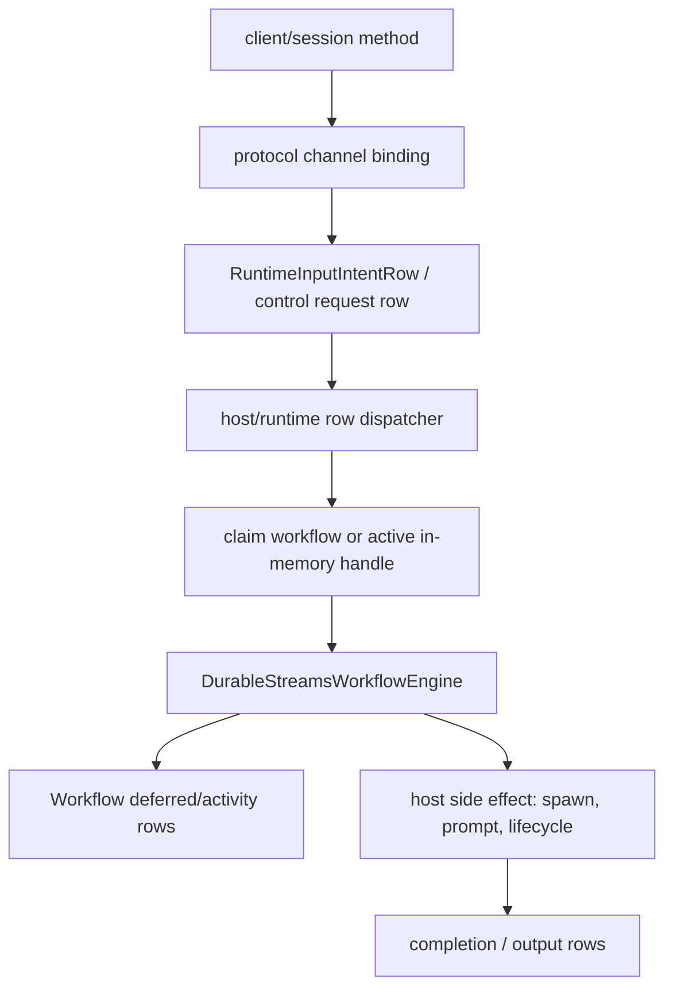
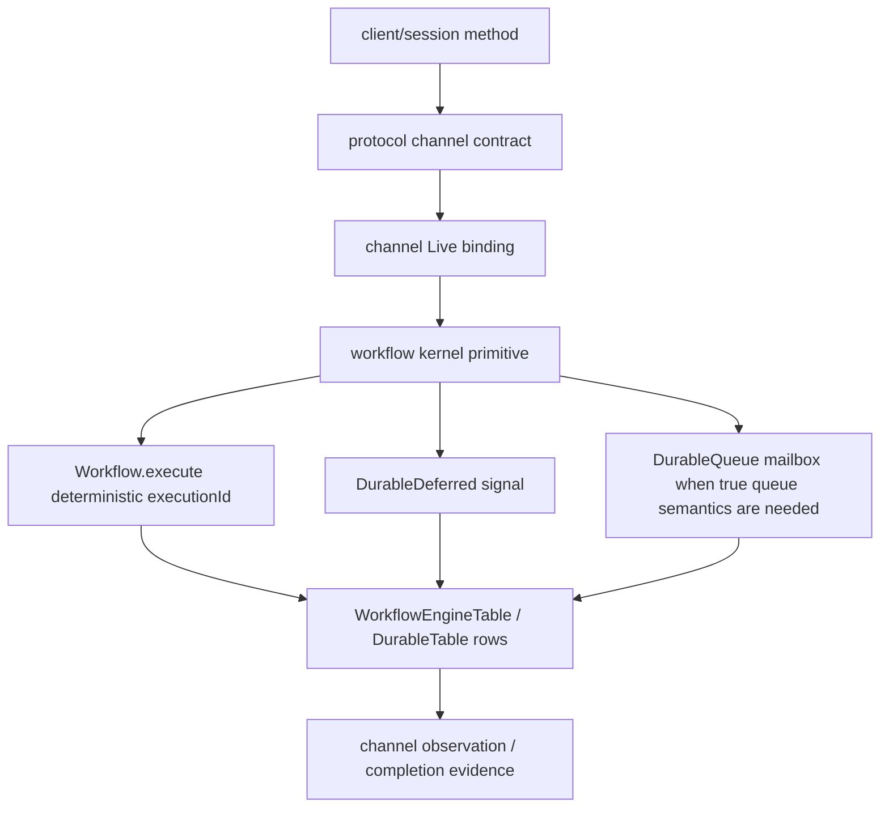

# tf-5n1z.2: Workflow Kernel + Channel Primitive Options

Verdict: **prototype the workflow-native path, not new Firegrid coordination Tags**.

The cheap prototypes should lean on upstream `@effect/workflow` primitives where
they already express the semantics: workflow execution idempotency for
exclusive ownership, `DurableDeferred` for one-shot external signals, and
`DurableQueue` only where the target is a true queued worker mailbox. Keep
Firegrid Channels as semantic contracts over the substrate; do not expose
Effect `Queue`, `Mailbox`, `Stream`, or `Channel` as public channel interfaces.

## Sources Read

- `packages/host-sdk/src/host/commands.ts`
- `packages/host-sdk/src/host/runtime-context-workflow-runtime.ts`
- `packages/runtime/src/control-plane/control-request-dispatcher.ts`
- `packages/runtime/src/workflow-engine/runtime-input-deferred.ts`
- `packages/runtime/src/workflow-engine/workflows/runtime-context.ts`
- `packages/runtime/src/workflow-engine/internal/engine-runtime.ts`
- `repos/effect/packages/workflow/README.md`
- `repos/effect/packages/workflow/src/Workflow.ts`
- `repos/effect/packages/workflow/src/WorkflowEngine.ts`
- `repos/effect/packages/workflow/src/DurableDeferred.ts`
- `repos/effect/packages/workflow/src/DurableQueue.ts`
- `repos/effect/packages/workflow/src/DurableClock.ts`
- `repos/effect/packages/effect/src/Queue.ts`
- `repos/effect/packages/effect/src/Mailbox.ts`
- `docs/sdds/SDD_FIREGRID_ONE_SUBSTRATE_PRIMITIVE.md`
- `docs/sdds/SDD_FIREGRID_DURABLE_CHANNELS_SYNC_ASYNC.md`
- `docs/research/workflow-body-single-suspension-rule.md`

## Current Imperative Components

| Component | Actual purpose today | Target owner |
| --- | --- | --- |
| `commands.ts` `startRuntime` | Host-facing command gate. It resolves host-owned context, then delegates to `RuntimeContextWorkflowRuntime.run`; duplicate protection comes indirectly through deterministic workflow execution id and active handle state. See `packages/host-sdk/src/host/commands.ts:85` and `packages/host-sdk/src/host/commands.ts:158`. | Host binding method only; kernel owns execution. |
| `commands.ts` `appendRuntimeIngress` | Writes a `RuntimeInputIntentRow` via `insertOrGet` and returns a pending ingress shape before the active workflow sees it. See `packages/host-sdk/src/host/commands.ts:115` and `packages/host-sdk/src/host/commands.ts:227`. | Channel binding should write a semantic input signal; runtime kernel owns durable signal resolution. |
| `RuntimeContextWorkflowRuntimeLive` | Host-scoped workflow-engine composition, in-memory active execution map, support-layer registration, startup reconciliation, and intent dispatch into workflow deferreds. See `packages/host-sdk/src/host/runtime-context-workflow-runtime.ts:183`, `:260`, `:309`, and `:339`. | Kernel/service below host-sdk. Host-sdk should compose only. |
| `RuntimeInputIntentDispatcherLive` | Long-running host-side row follower that watches all input intent rows and tries to dispatch them to an active context execution. See `packages/host-sdk/src/host/runtime-context-workflow-runtime.ts:413`. | Delete after channel-to-deferred or mailbox lowering. |
| `control-request-dispatcher.ts` | Runtime-internal callable-channel request-row consumer. It now starts workflows per request id, but still has stream daemons and side-effect phases around workflow outcomes. See `packages/runtime/src/control-plane/control-request-dispatcher.ts:328`, `:471`, `:518`, and `:720`. | Kernel control workflow plus channel Live binding. |
| `runtime-input-deferred.ts` | Bridge from input intent rows to `DurableDeferred.done`, including sequence assignment by scanning prior deferred rows. See `packages/runtime/src/workflow-engine/runtime-input-deferred.ts:75` and `:94`. | Keep the deferred semantics, but make channel ingress lower directly into this kernel path instead of a host row dispatcher. |

## Current Shape

This already uses workflow primitives, but the control path is split: channel
contracts create DurableTable rows, separate row followers rediscover them, and
workflow execution is used as a downstream claim/result mechanism.

## Target Shape

The boundary split:

- **Kernel ownership:** workflow definitions, execution ids, deferred names,
  activity claims, queue workers, and durable row mutation.
- **Channel contracts:** protocol-owned request/response/observation schemas
  and target names.
- **Channel Live bindings:** projection-specific lowering from channel verb to
  kernel primitive.
- **Edge transports:** client, host-sdk, CLI, MCP, and future HTTP/gRPC
  surfaces.

## Upstream Effect Facts

`Workflow.make` derives a deterministic execution id from workflow name plus
the declared idempotency key before calling `engine.execute`; see
`repos/effect/packages/workflow/src/Workflow.ts:263` and
`repos/effect/packages/workflow/src/Workflow.ts:301`. This is the upstream
primitive for duplicate execution suppression.

`DurableDeferred.await` checks `engine.deferredResult`; if unresolved, it calls
`Workflow.suspend`, creating a durable one-shot suspension point. See
`repos/effect/packages/workflow/src/DurableDeferred.ts:102`. Tokens are
deterministically encoded from workflow name, execution id, and deferred name,
then resolved through `engine.deferredDone`; see
`repos/effect/packages/workflow/src/DurableDeferred.ts:264`,
`repos/effect/packages/workflow/src/DurableDeferred.ts:324`, and
`repos/effect/packages/workflow/src/DurableDeferred.ts:389`.

`DurableQueue.process` writes to a persisted queue with an idempotency key, then
waits on a `DurableDeferred`; `DurableQueue.worker` drains the persisted queue
and completes that deferred. See
`repos/effect/packages/workflow/src/DurableQueue.ts:160` and
`repos/effect/packages/workflow/src/DurableQueue.ts:228`.

`DurableClock.sleep` is safe as a single workflow suspension point for long
durations; see `repos/effect/packages/workflow/src/DurableClock.ts:61`.

Effect `Queue` and `Mailbox` are useful semantics but not the public Firegrid
surface. `Mailbox` is explicitly a queue that can be ended or failed and can
convert to `Stream`/`Channel`; see `repos/effect/packages/effect/src/Mailbox.ts:61`.
The channel SDD says Firegrid Channels must not extend Effect `Channel`,
`Queue`, or `Mailbox`; they are named, schema-bearing durable contracts. See
`docs/sdds/SDD_FIREGRID_DURABLE_CHANNELS_SYNC_ASYNC.md:107`.

## Load-Bearing Limitation

Firegrid's durable-streams workflow adapter is single-fiber sequential. New
workflow bodies must avoid `Stream.runForEach`, `Stream.merge`, `Effect.race`,
`DurableDeferred.raceAll`, and similar body-level concurrency unless an engine
primitive owns the coordination. The rule is documented in
`docs/research/workflow-body-single-suspension-rule.md:11`; the known failure
class for `DurableDeferred.raceAll` is documented at
`docs/research/workflow-body-single-suspension-rule.md:115`.

This does **not** ban streams or races inside an `Activity`; it bans making
workflow body progress depend on multiple independently suspended body fibers.
The current production runtime-context body follows the safe peek-then-await
shape: non-blocking deferred/output checks first, then exactly one blocking
input await. See `packages/runtime/src/workflow-engine/workflows/runtime-context.ts:749`
and `packages/runtime/src/workflow-engine/workflows/runtime-context.ts:815`.

## Claim Mechanism Options

| Rank | Option | Crash/restart | Cross-host ownership | Duplicate start | Interruption | Child lifecycle | Observability | Verdict |
| --- | --- | --- | --- | --- | --- | --- | --- | --- |
| 1 | Workflow execution id / idempotency | Replays from `WorkflowEngineTable`; completed executions short-circuit. | Strong when execution id includes host-neutral context/request identity and engine stream namespace is shared correctly. | Strong for workflow body; side effects must be inside Activities or guarded by activity claims. | Uses `Workflow.interrupt`; current adapter supports interrupted row + fiber interrupt. | Natural if child context workflow id is deterministic. | Workflow spans and execution rows already exist. | **Prototype first.** |
| 2 | Parent `HostKernelWorkflow` owns child `RuntimeContextWorkflow` executions | Parent can replay orchestration and re-execute child starts idempotently. | Strong if parent workflow stream is host/namespace scoped and child context host check remains authoritative. | Strong for parent/child dispatch, provided child execution id is deterministic. | Better central point for close/interrupt. | Best option for explicit context lifecycle. | One root execution links all child events. | **Prototype second, likely target shape.** |
| 3 | `DurableQueue.worker` ownership | Queue persists work and worker completes deferred; restart depends on persisted queue factory semantics. | Good for worker pools; not naturally a singleton context owner. | Good per queue idempotency key. | Queue item cancellation/abandon policy must be defined. | Weak for long-lived child workflow lifecycle by itself. | Queue spans plus deferred result, but less domain-specific. | **Prototype only for async mailbox work, not context ownership.** |
| 4 | Current request-row claim/completion tables | Rows survive restart, but daemons must rediscover and reconcile. | Current implementation does host filtering plus workflow claim outcome. | Partially strong; duplicate suppression is split between request rows, workflow ids, and side-effect terminal checks. | Lifecycle side effects remain manually sequenced. | Split across dispatcher and side-effect service. | Good row audit, too many spans/paths. | **Bridge only. Do not expand.** |
| 5 | Raw `DurableTable` claim rows | Can be made crash-safe with `insertOrGet` and leases, but reimplements workflow activity claims. | Requires bespoke lease/owner/abandon semantics. | Possible but manual. | Manual. | Manual. | Manual. | **Dead end unless extracted as a substrate primitive, and Effect already covers most of it.** |

## Mailbox / Signal Lowering Options

| Rank | Option | Boundary | Transport hiding | Endpoint swapping | Package ownership | Verdict |
| --- | --- | --- | --- | --- | --- | --- |
| 1 | Channel -> `DurableDeferred` signal | Channel binding constructs deterministic deferred name/token from channel payload identity. | Durable stream/table details stay in runtime workflow engine. | Any client/host edge can call the same channel binding; workflow sees only deferred completion. | Protocol owns channel schema; runtime owns deferred naming/resolution; host-sdk/client compose. | **Prototype first for runtime input and one-shot request responses.** |
| 2 | Channel -> `DurableQueue` mailbox | Channel `send` offers persisted queue item; worker layer processes and resolves item deferred. | Queue implementation is runtime-internal. | Senders and workers swap independently behind the channel. | Protocol owns payload; runtime owns queue; host-sdk installs worker binding if edge-owned side effect is needed. | **Prototype for true async work queues / work stealing.** |
| 3 | Channel -> future `engine.signal` | Ideal ergonomic API if it is a thin engine method over deterministic deferred resolution. | Best hiding if engine owns naming and resume. | Strong. | Runtime workflow engine. | **Do not block on it. Prototype can name the future seam but implement with `DurableDeferred`.** |
| 4 | Channel -> engine-native `streamWait` / `streamWaitAny` | Channel observation compiles to engine-owned wait intent. | Strong if the engine persists wait intents and child subscriptions. | Strong for `wait_for` and `wait_for_any`. | Runtime workflow engine + observation source registry. | **Needed for multi-source waits; separate from input mailbox.** |
| 5 | Current inputIntent row -> dispatcher -> deferred completion | Channel writes intent row; host row follower resolves deferred if active. | Leaks DurableTable dispatch machinery into host runtime composition. | Requires active execution map and startup reconciliation. | Split between protocol row schema, host-sdk dispatcher, runtime deferred. | **Bridge only. Delete after option 1 lands.** |

## Ranked Prototype Recommendations

### 1. `tf-5n1z.3` — Runtime input channel -> DurableDeferred signal

Build a tiny-firegrid prototype where a prompt/input channel send lowers
directly to deterministic `DurableDeferred.done` for
`RuntimeContextWorkflowNative`, without `RuntimeInputIntentDispatcherLive`.

Acceptance:
- A context workflow suspended on `runtimeInputDeferredFor(contextId, sequence)`
  resumes after the channel send.
- Replaying/restarting the host before and after the send does not duplicate
  the input sequence.
- The durable row evidence is the workflow deferred row plus normal runtime
  input/output facts; no host-sdk input-intent dispatcher span is required.
- Public surface remains channel-shaped; no Effect `Queue`/`Mailbox` leaks.

### 2. `tf-5n1z.4` — HostKernelWorkflow owns runtime context child execution

Prototype a parent kernel workflow for context start/lifecycle that owns child
`RuntimeContextWorkflowNative` execution by deterministic context id. The
parent should replace the row-daemon claim path for one start/lifecycle slice.

Acceptance:
- Two competing hosts/processes try to start the same context; only one child
  runtime side effect occurs.
- Crash after parent execution row write but before child completion replays
  without duplicate child spawn.
- Close/interrupt routes through the parent and records terminal evidence once.
- Observability shows one parent execution id linked to the child context
  workflow execution id.

### 3. `tf-5n1z.5` — DurableQueue-backed async channel mailbox

Prototype a neutral async work channel where `send` writes to a
`DurableQueue`, and N worker fibers drain with concurrency while completing
per-item deferreds. This is for work-stealing/bounded queue semantics, not
context singleton ownership.

Acceptance:
- N workers race over M messages; each message is processed once.
- Worker crash before completion leaves the item recoverable according to the
  queue's persisted semantics or produces an explicit unsupported finding.
- Channel payload schema stays protocol-owned; queue names and worker layers
  stay runtime-owned.
- Backpressure/ack/lease semantics are documented as channel-binding metadata,
  not as a public `Queue` API.

## Explicit Dead Ends

- Do not add a Firegrid `ClaimTag` abstraction over raw `DurableTable` rows for
  workflow/context ownership. `Workflow.execute`, Activity claims, and
  `DurableQueue` already cover the primitive space.
- Do not keep expanding request-row daemon dispatch as the kernel. It remains a
  migration bridge and should shrink as channel-to-workflow lowering lands.
- Do not put `Stream.runForEach` over channel streams inside workflow bodies.
  If the operation is long-lived observation, it must be an Activity or an
  engine-native wait primitive.
- Do not expose Effect `Mailbox`/`Queue` as Firegrid Channel contracts. Borrow
  the semantics and vocabulary only.

## Final Ranking

1. **Workflow execution id/idempotency + Activities for exclusive ownership.**
   This is the base kernel primitive for context/request ownership.
2. **DurableDeferred for one-shot channel-to-workflow signals.** This is the
   lowest-risk replacement for input-intent dispatcher rows.
3. **Parent HostKernelWorkflow for lifecycle composition.** This gives a root
   execution that owns child context workflow lifecycle.
4. **DurableQueue for true async mailboxes.** Valuable, but only where queue
   semantics matter.
5. **Future `engine.signal` / `streamWaitAny`.** Good engine API shape; should
   wrap the same durable rows, not block the first prototypes.
6. **Current dispatcher/request-row claim tables.** Keep only as compatibility
   bridges.
7. **Raw DurableTable claim rows.** Avoid.

