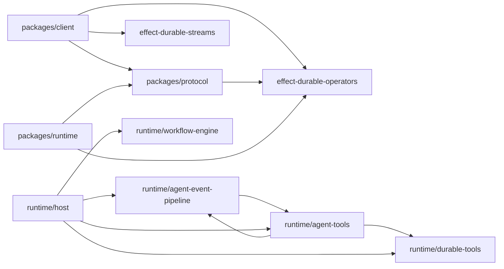
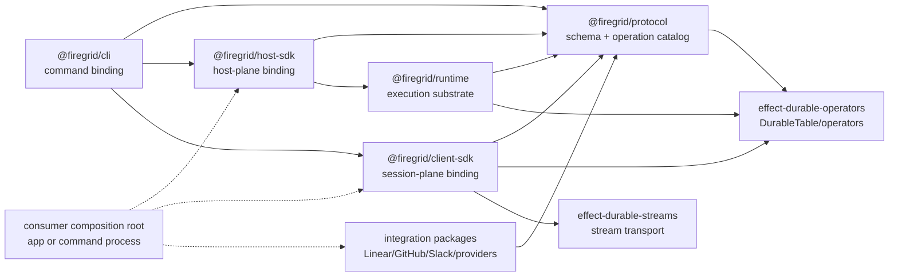

# SDD: Firegrid SDK Planes

Status: draft design contract

Related specs:

- `firegrid-host-sdk`
- `firegrid-runtime-host-modularity`
- `firegrid-runtime-process`
- `firegrid-workflow-driven-runtime`
- `firegrid-schema-projection-contract`

Prior art:

- Restate TypeScript services: <https://docs.restate.dev/develop/ts/services>
- Restate service configuration:
  <https://docs.restate.dev/services/configuration>

## Purpose

Firegrid needs two app-facing SDK packages plus one command binding package:

- `@firegrid/client-sdk` owns the **session plane**;
- `@firegrid/host-sdk` owns the **host plane**;
- `@firegrid/cli` owns the **command-line binding**.

The goal is not to add a second event pipeline. The goal is to make the public
platform boundary match the architecture we already built: runtime internals
stay in `@firegrid/runtime`, protocol schemas stay in `@firegrid/protocol`,
session operations are imported from the client SDK, and host composition is
imported from the host SDK. The CLI is another binding of the same protocol
catalog and host/session substrate, not a separate vocabulary.

Today, the working pieces exist, but the composition story is split:

- `src/run.ts` proves a CLI-owned path for `run` and `start`;
- `src/host.ts` proves an env-driven passive host/MCP launcher;
- `@firegrid/runtime/runtime-host` exports the runtime host Layers and
  commands, but that is still too implementation-facing for product apps;
- `@firegrid/client/firegrid` exposes the current session facade for
  create/load, prompt, start, snapshot, typed waits, and permission response;
- `apps/factory/src/host.ts` hand-composes all of the above with app-owned
  facts and projections.

That is enough to smoke-test plumbing. It is not enough for production app
authors. Product apps should not reverse-engineer the root CLI, copy
`apps/factory/src/host.ts`, or import runtime internals to launch Firegrid
hosts and operate sessions.

The SDK split is the public composition contract that closes that gap.

## Projection Mechanism

This SDD is the package-level counterpart to
`SDD_FIREGRID_SCHEMA_PROJECTION_CONTRACT.md`.

The source of truth is the protocol operation catalog: Effect Schema values
with built-in annotations plus one small Firegrid operation annotation. SDK
packages do not define their own operation contracts. They project the protocol
catalog into their target environment.

```txt
@firegrid/protocol operation catalog
  -> @firegrid/host-sdk bindings
       host Layer composition
       Effect AI Tool / Toolkit
       route-scoped MCP exposure
       provider / webhook / agent adapter installation
  -> @firegrid/client-sdk bindings
       browser/app-safe TypeScript session API
       snapshot and typed wait helpers
       permission response helpers
  -> @firegrid/cli bindings
       @effect/cli commands, flags, help, examples
       Node-only process entrypoints
  -> execution substrate
       runtime host commands
       agent-event-pipeline
       workflow engine
       durable operators
```

Projection has four steps:

1. **Catalog**: protocol exports schema values for operation input/output and
   attaches metadata through Effect Schema annotations.
2. **Binding**: each SDK reads the schema and metadata and creates a
   target-specific surface: Effect AI tools, TypeScript session methods, or CLI
   commands.
3. **Validation**: each binding decodes user input through the same protocol
   schema and encodes output through the same protocol schema.
4. **Execution**: validated input is passed to an explicit Effect service over
   runtime, host, durable, or integration capabilities. Execution code does not
   import binding modules to discover operations.

The schema-level metadata looks like this:

```ts
export const SessionCreateInputSchema = Schema.Struct({
  // fields
}).annotations({
  identifier: "firegrid.operation.session.create.input",
  title: "Create session input",
  description: "Create a RuntimeContext-backed session.",
  examples: [
    // examples
  ],
  [FiregridOperationAnnotationId]: {
    operation: "session.create",
    toolName: "session_new",
    clientName: "sessions.create",
    cliName: "sessions create",
  },
})
```

The bindings are small projectors over those schema values:

```txt
host-sdk binding
  Schema + operation annotation
    -> Tool.make(...)
    -> Toolkit.make(...)
    -> MCP exposure
    -> host operation executor service

client-sdk binding
  Schema + operation annotation
    -> sessions.create(...)
    -> session.prompt(...)
    -> session.wait.forAgentOutput(...)
    -> session.permissions.respond(...)

cli binding
  Schema + operation annotation
    -> Command.make(...)
    -> flags/options/help/examples
    -> Node command execution
```

This is deliberately not a Firegrid `OperationEntry` registry, not a graph DSL,
and not a second event pipeline. The projection mechanism is Effect Schema
metadata plus ordinary Effect services.

The package names make the environment boundary obvious:

- host bindings may depend on Effect Layers, MCP, provider adapters, runtime
  host composition, and Node/platform services;
- client bindings must stay app/browser safe and must not import runtime,
  MCP, provider adapters, or Node/platform services;
- CLI bindings may depend on `@effect/cli`, process env, local developer
  defaults, and Node-only launch helpers;
- execution substrate performs effects against runtime and durable storage but
  must not import client, host, or CLI binding modules.

This is why `agent-tools`, `packages/client/src/firegrid.ts`, and `src/run.ts`
are the same architectural problem in three surfaces. They currently mix
projection/binding with execution. The target package split makes those roles
auditable.

## Plane Split

The package split is semantic, not just browser versus Node.

| Package | Plane | Owns | Must not own |
| --- | --- | --- | --- |
| `@firegrid/client-sdk` | Session plane | Agent-session launch intent, session handles, attach, prompt, snapshots, typed runtime waits, permission response inputs, and session-safe observation helpers. | Host identity, provider implementations, local process env policy, MCP listener installation, runtime table authority wiring. |
| `@firegrid/host-sdk` | Host plane | Host composition, provider implementations, local process env policy, MCP installation, host session identity, host-side execution authority wiring, integration layer installation. | Product workflow policy, app facts, provider credentials hidden in runtime, session API definitions. |
| `@firegrid/cli` | Command binding | `@effect/cli` command definitions, help text, flags, examples, local developer defaults, process exit behavior, and Node-only command execution wiring. | New operation contracts, browser/session SDK behavior, product workflow policy, hidden host composition not available through host-sdk. |
| `@firegrid/runtime` | Runtime implementation | `agent-event-pipeline`, workflow-engine adapter, runtime authorities, durable-tools, codecs, host internals. | Normal product-app import path. |
| `@firegrid/protocol` | Schema/operation catalog | Shared operation schemas, row schemas, runtime ingress/launch/session vocabulary. | Runtime execution or host composition. |

Product apps should compose these SDKs. They should not create a parallel
Firegrid event system.

## Boundary Contracts

These contracts are the review bar for every SDK extraction PR:

| Boundary | Contract |
| --- | --- |
| Protocol | Owns operation schemas, row schemas, and projection metadata. It does not import runtime, host-sdk, client-sdk, cli, Node, MCP, or provider adapters. |
| Runtime | Owns execution substrate: agent event-pipeline, runtime authorities, workflow-engine adapter, codecs, and runtime-private host plumbing. It must not import host-sdk, client-sdk, or cli. |
| Client SDK | Owns browser/app-safe session-plane bindings. It must not import runtime, host-sdk, cli, Node, MCP, platform-node, or Effect AI. |
| Host SDK | Owns host-plane bindings and composition. It may import runtime and protocol. It must not import client-sdk. It returns protocol-shaped results where it needs to hand data to client-sdk. |
| CLI | Owns command binding and process behavior. It may import host-sdk and client-sdk. No package may import cli. |
| Integration packages | Own provider/webhook/agent adapter vocabulary. They may depend on protocol schemas and expose Effect services/Layers. Runtime core and host-sdk core must not own Linear, GitHub, Slack, provider, or webhook product semantics. |
| Product apps | Own prompts, product workflow policy, app facts, app projections, provider configuration, and UI read models. |

Host-sdk and client-sdk are sibling projections over protocol. Product apps and
cli compose both when both planes are needed.
Integration packages are sibling adapters, not hidden host-sdk dependencies.
The app or CLI composition root installs host-sdk, client-sdk, and integration
Layers together. Host-sdk defines the host extension points; it does not import
every provider package that might satisfy them.

## Package Graph Review

This dependency analysis intentionally excludes `apps/`. The apps were built
against the wrong public layers because Firegrid had not yet established those
layers. They are consumers and validation targets later; they should not define
the package graph.

The package-only current graph is regenerated at
`docs/dependency-graph-sdk-current.mmd`. The most important signal is:



The client package graph is close to the target already: it does not import
runtime. The problem is mostly file organization inside
`packages/client/src/firegrid.ts`, which mixes schema projection, pure
projection helpers, table/session transport, service tags, and Layer wiring.
That can become `@firegrid/client-sdk` without a runtime dependency if it is
split along binding/execution lines inside the package.

The runtime graph is where the SDK split can fail. Today
`agent-event-pipeline` imports `agent-tools`, and `agent-tools` imports
`agent-event-pipeline`, `durable-tools`, protocol launch authority, and
Effect AI/MCP/workflow services. If `agent-tools` is moved wholesale into
`@firegrid/host-sdk`, runtime would gain a forbidden dependency on host-sdk.
If `@firegrid/host-sdk` simply re-exports runtime `agent-tools`, the graph
keeps the wrong ownership and downstream code builds against a false
foundation.

The package boundary must therefore be created by changing edges, not by
adding package names.

There is no separate "binding layer" package in the target graph. The binding
packages are the external surfaces themselves:

- `@firegrid/host-sdk` binds protocol operations and runtime substrate into a
  host-process API;
- `@firegrid/client-sdk` binds protocol operations into browser/app-safe
  session methods;
- `@firegrid/cli` binds protocol operations into commands;
- integration packages bind provider-specific APIs into explicit Effect
  services/Layers that a host composition root can install.

Shared contracts live in `@firegrid/protocol`. Runtime remains the execution
substrate. Adding a fourth generic binding package would collapse the
environment-specific constraints this split is meant to make reviewable.

The target graph is captured at `docs/dependency-graph-sdk-target.mmd`:



Expected graph changes:

| Current edge | Target change | Why |
| --- | --- | --- |
| `runtime/agent-event-pipeline -> runtime/agent-tools` | Replace with `runtime/agent-event-pipeline -> ToolUseExecutor` capability defined in runtime or protocol, provided by host-sdk. | Runtime owns committed `ToolUse` observation, not host/tool execution policy. |
| `runtime/agent-tools/tools.ts -> tool-use-to-effect` | Split binding from execution. Effect AI `Tool`/`Toolkit` construction moves to host-sdk and calls an executor service. | Binding packages must not hide runtime substrate imports. |
| `runtime/agent-tools/mcp-host.ts -> platform-node/RPC/MCP` | Move to host-sdk. | MCP listener installation is host-plane exposure. |
| `runtime/host -> runtime/agent-tools` | Move the host implementation and agent-tool host capability into host-sdk, or keep only runtime-private substrate helpers in runtime. | Host composition is host-sdk public surface. |
| `runtime/agent-adapters -> runtime/agent-event-pipeline` | Move adapters to host-sdk or integration packages after confirming no reverse runtime edge. | Adapters lower provider/session APIs into runtime byte/session sources. |
| `runtime/index.ts -> verified-webhook-ingest` | Remove from runtime public surface; move or retire. | Webhook verification is integration evidence, not runtime substrate. |
| `src/run.ts -> runtime + agent-tools` | Split into `@firegrid/cli -> host-sdk/client-sdk`; host launch substrate moves out of root CLI. | CLI should be a projection of protocol operations, not a production host API. |

Dependency issues to expect:

- Moving `tool-use-to-effect` before introducing a `ToolUseExecutor` capability
  will create a runtime-to-host-sdk dependency. Do the inversion first.
- Moving `AgentToolHost` without moving host composition will leave runtime
  host files importing host-sdk. Move the public host surface as one slice.
- Creating `packages/client-sdk` as a re-export of `@firegrid/client/firegrid`
  would not break the graph, but it would also not establish the binding shape.
  Split `firegrid.ts` before publishing the package boundary.
- Creating `packages/cli` as a wrapper around `src/run.ts` would preserve the
  current mixed command/launch file. Split command parsing from launch
  substrate first.
- Moving `agent-adapters` is lower risk because the generated graph shows the
  edge is adapter-to-pipeline, not pipeline-to-adapter. The main cleanup is
  package export ownership.

The right shape is acyclic around the SDKs:

```txt
protocol
  <- runtime
  <- client-sdk
  <- host-sdk
  <- cli

runtime <- host-sdk <- cli
client-sdk <- cli
```

No edge should point from runtime to host-sdk, client-sdk, or cli.
No edge should point between host-sdk and client-sdk in either direction. They
are sibling projections over the same protocol catalog. Product apps compose
both packages, and Effect requirements connect them through shared protocol
services rather than package imports.
No edge should point from host-sdk core to concrete provider integrations.
Host-sdk may define extension points and helper constructors, but concrete
Linear/GitHub/Slack/provider packages remain independently importable adapters
installed by the composition root.

## Runtime Ownership Audit

The regenerated dependency graphs make the next ownership pass concrete. The
question is not "what currently imports what?" but "is this folder runtime
execution substrate, or is it a host-plane/binding concern that lowers into the
runtime?"

| Current runtime folder | Current graph signal | Target owner |
| --- | --- | --- |
| `agent-event-pipeline/` | Core pipeline imports protocol rows, runtime errors, agent tools for tool routing, and owns runtime output/ingress authorities. | Stays in `@firegrid/runtime`. It is the runtime execution substrate. |
| `authorities/` | Control-plane context/run authority, imported by host and durable-tools. | Stays in `@firegrid/runtime`. It owns runtime control-plane durability. |
| `workflow-engine/` | Adapter from `@effect/workflow` to DurableTable. | Likely stays in `@firegrid/runtime` until proven generic enough for `effect-durable-operators`. |
| `durable-tools/` | Mixed: table/wait/deferred mechanics use `effect-durable-operators` and `@effect/workflow`, but typed `RuntimeWaitStreams` imports runtime output and control-plane streams. | Split candidate. Generic wait mechanics may move to `effect-durable-operators`; runtime typed wait-source wiring remains `@firegrid/runtime` or `@firegrid/host-sdk`. Do not move wholesale while it imports runtime streams. |
| `host/` | Composes runtime authorities, workflow engine, sandbox providers, start/ingress commands, and host session identity. | Move public composition surface to `@firegrid/host-sdk`; keep implementation internals in runtime only where tightly coupled to authorities. |
| `agent-adapters/` | Adapts Effect AI/ACP language-model/provider surfaces into runtime byte/session concepts. Imports `agent-event-pipeline` sources/codecs. | Candidate for `@firegrid/host-sdk` or integration package. It is a host-plane adapter that lowers provider/session surfaces into runtime, not core runtime substrate. |
| `agent-tools/` | Mixed binding/execution: Effect AI `Tool`/MCP projection, host-scoped MCP exposure, host capability service, `schedule_me` workflow, and `tool-use-to-effect` lowering into durable tools/workflow/host operations. | Split. Protocol owns the schemas/catalog; host-sdk owns agent-facing bindings, MCP exposure, host capability services, and operation execution wiring; runtime keeps only the committed `ToolUse` row subscriber edge that invokes a narrow executor capability. |
| `verified-webhook-ingest/` | Tracer-era DurableTable-backed verifier that turns already-routed webhook bytes into neutral fact rows. Its feature still mentions `SourceCollections`, which is now stale after typed wait-source cutover. | Do not keep as runtime core. Either move to a host-sdk/integration package as a reusable webhook verification adapter, or retire it if no product uses it. It is input-adapter/receipt evidence, not runtime execution substrate. |

This table should drive code movement. The SDK package split is useful because
it gives non-runtime code somewhere honest to live:

```txt
@firegrid/runtime
  runtime execution substrate
  agent-event-pipeline/
  authorities/
  workflow-engine/
  runtime-owned durable wait wiring

@firegrid/host-sdk
  host plane composition
  runtime host layers
  launch substrate
  local process env policy
  MCP installation
  host-plane adapters and bindings

@firegrid/client-sdk
  session plane
  session handles
  prompt/start/snapshot/wait/permission response
  session-safe observations

@firegrid/cli
  command binding
  command definitions
  help/defaults
  Node-only process entrypoints
```

The `agent-adapters/` example is the clearest ownership smell: adapting ACP or
Effect AI provider/session APIs into runtime byte/session concepts is
"lowering into runtime." That belongs with host-plane composition or a provider
adapter package, not in the runtime core package once `@firegrid/host-sdk`
exists.

`agent-tools/` has the same shape, but it is more mixed today. It is not one
runtime boundary. The current folder contains four different roles:

| Current file | Role | Target owner |
| --- | --- | --- |
| `@firegrid/protocol/agent-tools` schemas and operation metadata | Agent-visible operation contract: tool names, input/output schemas, descriptions, and typed operation vocabulary. | `@firegrid/protocol`. This is the source catalog projected into SDKs and bindings. |
| `agent-tools/tools.ts` | Binding from the protocol catalog to Effect AI `Tool` and `Toolkit` values, plus handler layer construction. | `@firegrid/host-sdk` agent-tool binding. It is how a host chooses to expose Firegrid operations to an agent runtime. |
| `agent-tools/mcp-host.ts` | Route-scoped localhost MCP server over the toolkit, including platform-node HTTP/RPC composition and runtime-context route authority. | `@firegrid/host-sdk` host-plane exposure. It installs a transport in the host process; it is not runtime substrate. |
| `agent-tools/tool-host.ts` | Host capability service for operations that need host authority: child sessions, prompt append, lifecycle, sandbox/session capability execution, and scheduled prompt append. | `@firegrid/host-sdk`. The consuming app/host owns these capabilities and their provider/integration policy. |
| `agent-tools/tool-use-to-effect.ts` and `scheduled-input-workflow.ts` | Validated operation input to Effect execution over workflow, durable wait, host operations, and runtime ingress. | Split. The operation executor belongs with host-sdk wiring; the runtime event pipeline keeps only the subscriber that consumes committed `ToolUse` observations and asks an executor capability for a `ToolResult`. |

This is why `agent-tools/` is not a client-sdk concern. The client SDK exposes
session-plane methods for app code: agent-session launch, attach, prompt,
snapshot, typed waits, and permission responses. It may share the same protocol
operation schemas, but it must not import Effect AI `Tool`, MCP server
transport, workflow-engine services, host session authority, or runtime
durable-tool execution.

It is also why `agent-tools/` should not remain a runtime package as-is. Runtime
owns durable observations and the agent event-pipeline subscriber that sees a
committed `ToolUse` event. Runtime should not own the agent-facing toolkit
catalog projection, the MCP listener, or host policy for spawning sessions and
executing provider capabilities. Those are host-plane bindings that lower into
runtime capabilities through explicit Effect services.

The same projection rule applies to the other current mixed surfaces:

- `packages/client/src/firegrid.ts` is the client-sdk binding plus client
  execution against durable/session protocol tables. It should expose the
  browser-safe session plane while keeping projection helpers and table access
  separated inside the package.
- `src/run.ts` is the CLI binding plus Node-only host launch execution. It
  should become a thin command package over host-sdk launch substrate and
  client/session operations, not the place where the production host API is
  discovered.

`verified-webhook-ingest/` is similar but even more obviously not runtime core.
Its history is tracer-first: the only live test is
`scenarios/firegrid/test/tracer-020-verified-webhook-ingest.test.ts`, and its
README calls it a narrow tracer surface. The useful generic pieces are:

- raw-body HMAC verification before JSON parsing;
- deterministic source plus external-event idempotency key;
- payload hash conflict detection;
- selected non-secret header capture;
- durable `insertOrGet` evidence write.

Those are host/integration concerns. They can become a reusable webhook adapter
package if products need them, but the row table should be app-owned or
adapter-package-owned, not a runtime-owned fact table. The old reason to keep
it in runtime was wait integration through generic SourceCollections; typed
runtime waits removed that path. A product that wants to wait on webhook facts
should use app-owned projection waits over its own DurableTable rows.

## Restate Lessons

Restate's TypeScript SDK exposes explicit declarations:

- a service/object/workflow has a name and handlers;
- the app serves an explicit list of services;
- configuration is attached at service or handler boundaries;
- retries, retention, timeout, privacy, and state-access settings are named
  configuration, not incidental code hidden inside handlers.

Firegrid should borrow the shape, not the substrate:

- app authors declare a host and its installed capabilities explicitly;
- configuration is a typed object or env-backed Layer;
- installed runtime, session, integration, and MCP surfaces are visible in code
  review;
- reusable integration adapters can be installed explicitly as Layers or
  capability declarations;
- no dynamic module discovery or hidden default graph;
- no product-specific workflow policy in runtime core.

Firegrid remains Effect-native. The Host SDK returns ordinary `Layer` values
and exposes ordinary `Context.Tag` services. The Client SDK exposes ordinary
services and handles. Neither package is a graph DSL.

## Current Mixed Surfaces

The current code already proves the behavior, but each surface mixes binding
with execution:

| Current surface | Proven behavior | Target |
| --- | --- | --- |
| `packages/client/src/firegrid.ts` | Session create/load, prompt, start, snapshot, typed waits, permission responses. | Split into client-sdk agent-session launch/handle bindings plus client transport/session execution modules. |
| `packages/runtime/src/host` | Host-scoped runtime composition, start/ingress commands, env policy, local-process host wiring. | Move public host-plane composition to host-sdk; keep runtime-private authority plumbing in runtime. |
| `packages/runtime/src/agent-tools` | Effect AI tools, MCP exposure, host tool capability, scheduled prompt workflow, ToolUse execution. | Split into protocol catalog, host-sdk bindings/executor, and runtime ToolUse subscriber seam. |
| `src/run.ts` | CLI parsing, local dev defaults, launch substrate, MCP injection, RuntimeContext insertion, startRuntime, process exit behavior. | Move command binding to cli and launch substrate to host-sdk. |

Scenario tests for `pnpm firegrid -- run` and `pnpm firegrid -- start` remain
the compatibility proof while these surfaces split.

## Target User Experience

The desired public vocabulary is **agent session**, not runtime. Runtime remains
the implementation substrate. A user should be able to describe an agent,
launch an agent session, and interact with the returned session handle.

Client/session entrypoint sketch:

```ts
import { Effect } from "effect"
import {
  Agent,
  FiregridClientLive,
  FiregridSessions,
} from "@firegrid/client-sdk"
import { envBinding } from "@firegrid/protocol/launch"

const claude = Agent.localProcess({
  command: ["npx", "-y", "@agentclientprotocol/claude-agent-acp"],
  protocol: "acp",
  cwd: workspaceDir,
  env: [
    envBinding("ANTHROPIC_API_KEY"),
  ],
})

const ClientLive = FiregridClientLive({
  durableStreamsBaseUrl,
  namespace,
})

const program = Effect.gen(function* () {
  const sessions = yield* FiregridSessions
  const session = yield* sessions.launch({
    agent: claude,
    prompt: "Plan the implementation for LIN-123.",
  })

  yield* session.prompt("Now produce the first concrete implementation step.")
  return yield* session.wait.forAgentOutput({ timeoutMs: 120_000 })
})
```

`Agent.localProcess(...)` is a user-facing projection over the protocol launch
schemas in `@firegrid/protocol/launch`. It lowers to the same durable shape as
`PublicLaunchRuntimeIntent` / `RuntimeConfig`:

```ts
{
  provider: "local-process",
  config: {
    argv: ["npx", "-y", "@agentclientprotocol/claude-agent-acp"],
    agent: "claude-acp",
    agentProtocol: "acp",
    cwd: workspaceDir,
    envBindings: [envBinding("ANTHROPIC_API_KEY")],
  },
}
```

The optional idempotency path is separate from the happy path. A product uses it
when it wants webhook retries, button double-clicks, or repeated job dispatches
to converge on one durable agent session:

```ts
const session = yield* sessions.launch({
  idempotencyKey: "linear.issue:LIN-123:planner",
  agent: claude,
  prompt: "Plan the implementation for LIN-123.",
})
```

Firegrid can generate a fresh session id when `idempotencyKey` is absent. It
cannot privately infer that two product events represent the same logical work
item; that identity belongs to the caller.

Host entrypoint sketch:

```ts
import { NodeRuntime } from "@effect/platform-node"
import { Effect, Layer } from "effect"
import {
  FiregridHostLive,
  LocalProcessProviderLive,
} from "@firegrid/host-sdk"

const HostLive = FiregridHostLive({
  name: "product-host",
  durableStreams: {
    baseUrl: process.env.DURABLE_STREAMS_BASE_URL!,
    namespace: process.env.FIREGRID_RUNTIME_NAMESPACE!,
  },
  providers: {
    localProcess: LocalProcessProviderLive({
      environment: {
        source: process.env,
        expose: {
          ANTHROPIC_API_KEY: "ANTHROPIC_API_KEY",
        },
      },
    }),
  },
  mcp: { enabled: true },
})

NodeRuntime.runMain(Layer.launch(HostLive))
```

The host does not predeclare `claude`. It installs provider implementations and
policies that can satisfy durable agent-session intents. For `local-process`,
the host owns process spawning and environment resolution. The session request
contains only env refs such as `env:ANTHROPIC_API_KEY`; the host decides whether
those refs are authorized and resolves the values at spawn time. Secret values
do not enter durable rows.

Product apps may run `HostLive` and `ClientLive` in one process, but the
packages remain independent. Browser clients can launch sessions by appending
the same durable agent-session intent when the product permits it; they still do
not receive `process.env`, live process handles, provider SDK clients, or host
environment exposure policy.

## Host Declaration

The Host SDK should expose a host declaration value:

```ts
export interface FiregridHostOptions {
  readonly name: string
  readonly durableStreams: FiregridDurableStreamsOptions
  readonly providers: FiregridHostProviderOptions
  readonly mcp?: FiregridHostMcpOptions
}

export class FiregridHost extends Context.Tag(
  "@firegrid/host-sdk/FiregridHost",
)<FiregridHost, FiregridHostService>() {}

export interface FiregridHostService {
  readonly health: Effect.Effect<FiregridHostHealth, FiregridHostError>
}

export const FiregridHostLive = (
  options: FiregridHostOptions,
): Layer.Layer<FiregridHost, FiregridHostError>
```

The host layer installs long-lived host-plane programs and capabilities. It
does not expose the normal app launch API; agent-session launch lives in
`@firegrid/client-sdk` and is expressed as durable intent. The host observes and
executes those intents when its installed providers and policies can satisfy
them.

```txt
client-sdk agent-session launch intent
  -> durable control-plane row
  -> host-sdk provider implementation claims/executes
  -> runtime substrate records runs/output/ingress
  -> client-sdk session handle observes snapshots/waits/permissions
```

Host SDK services may still expose operational controls for host lifecycle,
diagnostics, and provider health. They must not become product trigger APIs and
must not return client-sdk-owned handles.

## Configuration

The Host SDK should provide two constructors:

```ts
export const FiregridHostLive = (options: FiregridHostOptions) => Layer...

export const FiregridHostFromConfig = (
  options?: FiregridHostFromConfigOptions,
) => Layer...
```

`FiregridHostLive` is for explicit app code. `FiregridHostFromConfig` is for
process entrypoints that want Effect Config/env-driven topology.

Current required topology:

```ts
interface FiregridDurableStreamsOptions {
  readonly baseUrl: string
  readonly namespace: string
  readonly headers?: DurableTableHeaders
  readonly hostId?: HostId
  readonly hostSessionId?: HostSessionId
}
```

Agent child processes do not receive the ambient host environment. Provider
implementations expose explicit environment binding policy:

```ts
interface FiregridHostEnvironmentOptions {
  readonly source: Record<string, string | undefined>
  readonly expose: Record<string, string>
}
```

`source` is the host-side environment map, commonly `process.env`.
`expose` maps host variable names to child runtime variable names. For example,
`{ ANTHROPIC_API_KEY: "ANTHROPIC_API_KEY" }` means the host may read
`source.ANTHROPIC_API_KEY` and expose it to the launched local-process agent
as `ANTHROPIC_API_KEY`.

Current env-backed fields:

```txt
DURABLE_STREAMS_BASE_URL
FIREGRID_RUNTIME_NAMESPACE
FIREGRID_RUNTIME_INPUT_ENABLED
FIREGRID_DURABLE_STREAMS_TOKEN
```

`src/run.ts` also has local-development fallback to embedded
`DurableStreamTestServer`. That should be an explicit local-dev option:

```ts
localDevelopment: {
  embeddedDurableStreams: true
}
```

Production examples should not use it. Production app acceptance should use an
explicit durable endpoint.

### Service/Handler Options

Restate names retry, timeout, retention, privacy, and state-access options at
service/handler boundaries. Firegrid should not copy those knobs until the
substrate owns equivalent behavior.

Allowed current options:

- runtime input enabled/disabled;
- env binding authorization;
- MCP listener topology;
- default Firegrid MCP injection policy;
- local process env allowlist source;
- durable endpoint/namespace/headers.

Deferred options:

- retry policy;
- invocation retention;
- journal retention;
- workflow retention;
- inactivity/abort timeout;
- private/public service ingress.

Those can be added later when backed by Firegrid runtime/workflow semantics.

## Shared Launch Substrate

The following code in `src/run.ts` should move behind the Host SDK or an
internal SDK support module:

- `rawRunConfigFromCli` normalization after CLI parsing;
- env binding policy construction;
- durable endpoint acquisition;
- RuntimeContext insertion;
- Firegrid MCP declaration injection;
- initial prompt ingress;
- `startRuntime`.

`src/run.ts` should keep:

- `@effect/cli` command declarations;
- help text;
- process exit-code handling;
- local command wiring;
- printing ready records for CLI users.

Target:

```txt
src/run.ts
  CLI binding only

@firegrid/host-sdk
  host-plane SDK
  launch substrate
  host composition

@firegrid/client-sdk
  session-plane SDK
  agent-session launch/attach/prompt/snapshot/wait/permission response

product app
  provider intake
  app-owned facts/projections
  FiregridHostLive usage
```

## Consumer Fit

Consumer-specific reverse engineering belongs outside this Host SDK SDD. This
document defines the generic SDK package graph and public substrate. Product
apps supply their own intake rows, run records, provider policy, projection
vocabulary, prompts, and UI read models.

Factory-specific findings live in
`docs/sdds/SDD_FIREGRID_FACTORY_PLATFORM_FIT.md`. That document is expected to
shrink over time. Every time `@firegrid/client-sdk`, `@firegrid/host-sdk`,
`@firegrid/cli`, `effect-durable-operators`, or reusable integration packages
expose the right underlying substrate, factory should delete bespoke glue and
the factory-specific SDD should lose corresponding requirements.

## Consumer Import Contract

Product apps import SDK packages, not runtime implementation subpaths.
`@firegrid/host-sdk` and `@firegrid/client-sdk` are sibling projections: neither
imports the other. The CLI and product apps may import both. `@firegrid/client-sdk`
must not import `@firegrid/runtime`.

Allowed imports in app code:

```ts
import { FiregridSessions, type FiregridSessionHandle } from "@firegrid/client-sdk"
import { FiregridHostLive, FiregridHost } from "@firegrid/host-sdk"
```

Forbidden app imports:

```ts
import ... from "@firegrid/runtime/src/host/..."
import ... from "@firegrid/runtime/authorities"
import ... from "@firegrid/runtime/events" // for product status parsing
import ... from "@firegrid/runtime/durable-tools" // unless writing runtime workflow internals
```

## Non-Goals

- No Firegrid-owned product workflow SDK.
- No dynamic host registry.
- No service discovery or deployment controller.
- No Restate-compatible protocol.
- No implicit provider credential registry; apps configure integration Layers
  explicitly.
- No SourceCollections replacement.
- No automatic provider/subscriber defaults.
- No product-specific HTTP route framework in runtime core.
- No browser-originated runtime authority.
- No package-boundary skeletons that only re-export old mixed implementation
  files.

## Implementation Plan

### PR 1: SDK Plane SDD/spec

Land this SDD and `firegrid-host-sdk.feature.yaml`.

### PR 2: Package Graph Guardrails

Add static package-boundary rules before code movement:

- runtime must not import `@firegrid/client-sdk`, `@firegrid/host-sdk`, or
  `@firegrid/cli`;
- client-sdk/browser-safe files must not import runtime, host-sdk, cli, Node,
  Effect AI, MCP, or platform-node;
- host-sdk may import runtime and protocol, but must not import client-sdk or
  return client-sdk-owned handles;
- cli may import host-sdk and client-sdk, but no package may import cli;
- binding modules must not import execution/substrate modules;
- execution/substrate modules must not import binding modules.

This PR may add tests, dependency-cruiser rules, and package graph docs. It
must not create SDK packages that simply forward to existing mixed files.

### PR 3: In-Place Binding/Execution Split

Split the current mixed files while keeping public package names stable:

- split `packages/client/src/firegrid.ts` into browser-safe binding/projection
  modules and transport/session execution modules;
- split `packages/runtime/src/agent-tools` into protocol-derived bindings,
  host capability interfaces, operation execution, and the runtime
  `ToolUseExecutor` seam;
- split `src/run.ts` into CLI command binding and reusable launch substrate
  functions.

Acceptance is graph shape, not package names: the mixed files stop being the
foundation that later packages would re-export.

### PR 4: Real Package Boundary Creation

Create `packages/client-sdk`, `packages/host-sdk`, and `packages/cli` by moving
the already-separated binding code into the correct package. Do not create
compatibility forwarding packages around old mixed files.

Package acceptance:

- `client-sdk` imports protocol/effect-durable packages only, never runtime;
- `host-sdk` imports runtime/protocol and owns host bindings, never client-sdk;
- `cli` imports host-sdk/client-sdk/protocol and owns command binding;
- runtime no longer exports host-sdk or client-sdk concerns as public product
  surfaces.

### PR 5: Launch Substrate And CLI Cutover

Move reusable launch/start functions out of the root CLI into `@firegrid/host-sdk`
and move command parsing into `@firegrid/cli`. Existing tracer-019 and
tracer-022 tests must remain green.

### PR 6: Public Host Plane Layer

Add explicit `FiregridHostLive` and `FiregridHost` services in
`@firegrid/host-sdk`. Prove type-level product app examples without importing
runtime internals.

### PR 7: Consumer Cutover

Move product consumers to `@firegrid/client-sdk`, `@firegrid/host-sdk`, and
`@firegrid/cli` only after the package graph is correct. Product-specific
facts, projections, provider policy, and prompts remain consumer-owned.

### PR 8: Production Intake And Smoke

Build provider-shaped intake and a production smoke over hosted durable rows.

## Acceptance

The SDK split is acceptable when:

- product apps can compose session-plane and host-plane behavior using public
  SDK packages only;
- `src/run.ts` becomes a CLI binding over shared launch substrate;
- existing `pnpm firegrid -- run` and `pnpm firegrid -- start` tests stay
  green;
- product apps no longer need to duplicate runtime launch substrate logic;
- app-owned provider/product semantics remain outside Firegrid packages;
- no arbitrary wait source registry or SourceCollections-like abstraction is
  introduced.
