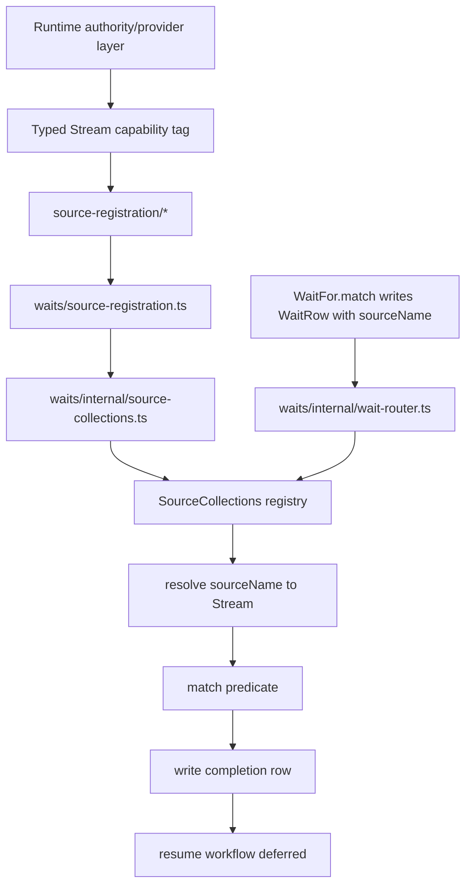
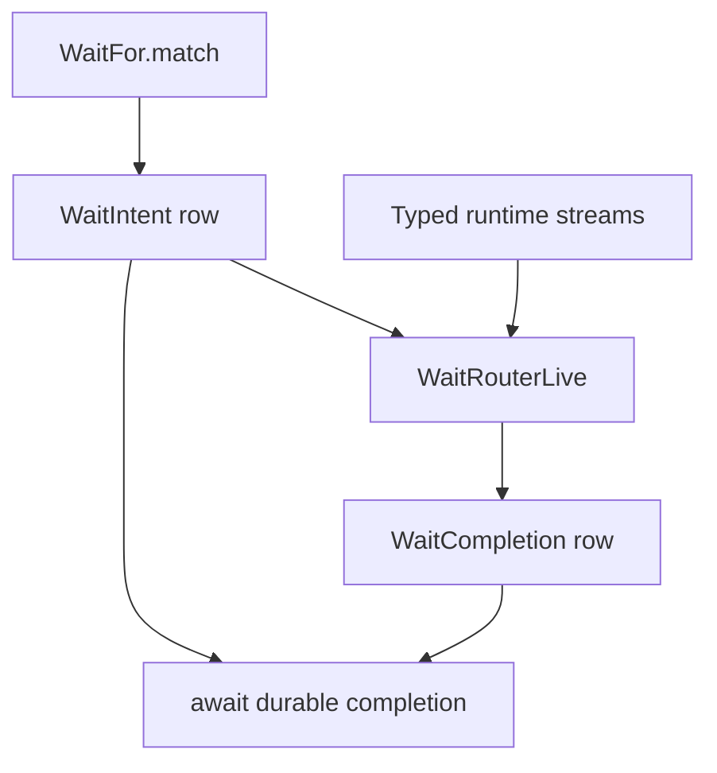

# SDD: Firegrid Typed Wait Source Redesign

Status: draft corrective design
Created: 2026-05-16
Owner: Firegrid Runtime

Related specs:

- `firegrid-typed-wait-source-redesign`
- `firegrid-runtime-boundary-reconciliation`
- `firegrid-durable-wait-extraction`
- `firegrid-runtime-agent-event-pipeline`
- `firegrid-schema-projection-contract`

## Purpose

This SDD captures a corrective design decision: the current runtime
`SourceCollections` model should not be treated as architecture. It exists
because `wait_for` needed a way to turn a persisted source name into an
observation stream, but that implementation grew into a stringly global source
registry and ended up inside `packages/runtime/src/waits/`.

That placement is not the only problem. Moving the same registry to a neutral
folder would make the dependency graph cleaner but would preserve the wrong
abstraction. Runtime waiting should be expressed with typed durable observation
streams, durable wait rows, `DurableClock`, and workflow deferred resume. A
source-name registry is not the runtime model.

This document intentionally starts from a clean sheet and treats
`SourceCollections` as a rejected design for production runtime paths.

## Context

The current runtime has the pieces needed for an Effect-native wait design:

- `packages/effect-durable-operators/src/DurableTable.ts` provides durable row
  storage and retained/live row observation streams;
- `repos/effect/packages/workflow/src/DurableClock.ts` provides durable timeout
  semantics through Effect Workflow;
- `packages/runtime/src/workflow-engine/**` bridges runtime workflows and
  deferred completion;
- `packages/runtime/src/agent-event-pipeline/**` exposes runtime observations as
  typed `Stream` capability tags behind `Context.Tag`/`Layer` providers;
- `packages/runtime/src/waits/**` currently stores wait rows and completion rows
  and drives workflow resume.

The `waits/` folder name is also misleading. The table namespace is
`firegrid.durableTools`, the public layer is `DurableToolsWaitForLive`, and the
existing README describes the area as a place for durable tools to share one
stream URL, preload, and materialized view. `wait_for` is the first durable
tool instance, not the bounded-context name. The target folder is therefore
`durable-tools/`, with wait-specific code inside it.

The good shape already exists elsewhere in the runtime. Static runtime
subscribers consume typed `Stream` capability tags through the Effect
requirement channel. Runtime authorities own durable writes and observations.
Waits should compose those same surfaces instead of introducing another
registry vocabulary.

## Current Problem

`packages/runtime/src/waits/internal/source-collections.ts` is a
`sourceName -> stream` rendezvous registry. It is mechanically simple, but its
ownership and semantics are wrong for the post-reconciliation architecture.

The rejected current flow is:

> Do not preserve this shape. It is included only to show the dependency and
> vocabulary mistake being removed.



The bad edge is:

```txt
source-registration/* -> waits/source-registration.ts -> waits/internal/source-collections.ts
```

That makes provider/source-registration code depend on the misnamed wait
bounded context for a primitive with no durable-tool semantics. It also keeps
runtime waiting centered on arbitrary strings instead of typed observations.
This violates the architecture we converged on for authorities and subscribers:
stock Effect capabilities behind typed tags, with durability carried by the
provider layer.

The research note
`docs/research/dynamic-wait-source-registration-boundary.md` correctly
identifies the smell. Its relocation recommendation is useful as a fallback but
is not the target design. `firegrid-typed-wait-source-redesign.REJECTION.4`
requires more than moving the registry.

## Design Principle

Runtime wait sources are not runtime-global strings. They are typed wait-source
discriminators over known durable observations.

The runtime should persist wait intent as data, but that data should name a
supported wait source by discriminated variant, not by a registry key that any
module can register.

Illustrative shape:

```ts
import { Schema } from "effect"

export const RuntimeWaitSource = Schema.Union(
  Schema.Struct({
    _tag: Schema.Literal("AgentOutput"),
  }),
  Schema.Struct({
    _tag: Schema.Literal("RuntimeRun"),
  }),
)

export type RuntimeWaitSource = Schema.Schema.Type<typeof RuntimeWaitSource>
```

The exact variants belong in the implementation PR, but the direction is not
negotiable: schema-backed source discriminators, existing
`FieldEqualsTrigger` predicates, and no arbitrary source registry in production
runtime paths.

## Durable Tools Boundary

The target bounded context is durable tools. It owns durable tool rows,
completion rows, wait operator implementation, wait router, and reconciliation.
It does not own runtime observation streams and it does not expose a global
source registry.

This matters for future tools. `schedule_me`, `spawn`, or `execute` can share
the durable tools table namespace without pretending they are waits. Conversely,
agent event-pipeline subscribers stay in `agent-event-pipeline/subscribers/`
because their semantic vocabulary is runtime events, not durable tool intents.

## Target Runtime Shape

The target is not a new top-level registry lane. It is a durable-tools bounded
context that consumes the already-typed runtime streams.

```txt
packages/runtime/src/
  agent-event-pipeline/
    authorities/
      runtime-output-journal.ts       # RuntimeAgentOutputEvents stream tag
    ...

  authorities/
    runtime-control-plane-recorder.ts # RuntimeRuns stream tag
    ...

  durable-tools/
    WaitFor.ts                        # public operator facade
    index.ts                          # durable-tools barrel; no SourceCollections export
    internal/
      table.ts                        # WaitIntent / WaitCompletion rows
      durable-wait-store.ts           # row-level wait/completion capabilities
      wait-for.ts                     # WaitFor.match implementation
      wait-router.ts                  # existing WaitRouterLive, typed source selection
      reconcile.ts                    # completion -> workflow deferred reconcile
      types.ts                        # typed wait-source schemas and predicates

  agent-tools/
    tool-use-to-effect.ts             # wait_for -> typed runtime wait source

  host/
    host-owned-durable-tools.ts       # provides WaitFor + WaitRouterLive
    runtime-substrate.ts              # no RuntimeSourceRegistrationsLive

  source-registration/                # deleted if only SourceCollections remains
```

Deleted production surfaces:

- `waits/source-registration.ts`;
- `waits/internal/source-collections.ts`;
- `source-registration/runtime-output.ts`;
- `source-registration/runtime-ingress.ts`;
- `source-registration/runtime-control-plane.ts`;
- `source-registration/app-source-registration.ts`;
- runtime exports for `SourceCollections`, `sourceCollectionStreamHandle`,
  `registerRuntimeHostAppSource`, and `RuntimeHostAppSourceRegistrationsLive`.

The transactional implementation also renames `packages/runtime/src/waits/` to
`packages/runtime/src/durable-tools/`. Keeping the old folder would make the
typed-source cutover look like a wait-only fix and would leave the next durable
tool without a natural home.

## Target Activity



`WaitRouterLive` already exists and already has the right scoped-subscriber
shape. It is not an agent event-pipeline subscriber: its output is durable wait
completion rows plus workflow deferred resume, not pipeline events. Its semantic
owner is the wait operator because it consumes wait rows and resumes workflow
deferreds. The redesign changes how the router resolves a wait source; it does
not introduce a new router abstraction. Its dependencies are explicit:

```ts
export const WaitRouterLive: Layer.Layer<
  never,
  RuntimeWaitError,
  | DurableWaitIntentStream
  | DurableWaitCompletionUpsert
  | RuntimeWaitStreams
  | WorkflowEngine.WorkflowEngine
> = Layer.scopedDiscard(startRouter)
```

`RuntimeWaitStreams` is a private router input built from concrete stream tags:

```ts
export class RuntimeWaitStreams extends Context.Tag(
  "@firegrid/runtime/RuntimeWaitStreams",
)<RuntimeWaitStreams, {
  readonly agentOutput: Stream.Stream<RuntimeAgentOutputObservation, DurableTableError>
  readonly runtimeRun: Stream.Stream<RuntimeRunRow, DurableTableError>
}>() {}

export const RuntimeWaitStreamsLive = Layer.effect(
  RuntimeWaitStreams,
  Effect.gen(function*() {
    const agentOutput = yield* RuntimeAgentOutputEvents
    const runtimeRun = yield* RuntimeRuns
    return { agentOutput, runtimeRun }
  }),
)
```

The dependency proof remains Effect-native: `RuntimeWaitStreamsLive` names the
typed stream tags it consumes, and `WaitRouterLive` names the router-local
stream bundle it needs. There is no string registry side channel. The source
selection becomes an ordinary pattern match:

```ts
const streamForSource = (source: RuntimeWaitSource) =>
  Effect.flatMap(RuntimeWaitStreams, streams =>
    Match.value(source).pipe(
      Match.tag("AgentOutput", () => Effect.succeed(streams.agentOutput)),
      Match.tag("RuntimeRun", () => Effect.succeed(streams.runtimeRun)),
      Match.exhaustive,
    ))
```

Adding a typed source is intentionally localized: add one
`RuntimeWaitSource` variant, one field on `RuntimeWaitStreams` provided by
`RuntimeWaitStreamsLive`, and one `Match.tag` arm in `streamForSource`.

The supported runtime sources are listed explicitly:

| Wait source variant | Stream capability |
| --- | --- |
| `AgentOutput` | `RuntimeAgentOutputEvents` |
| `RuntimeRun` | `RuntimeRuns` |

`RuntimeContext` is not part of the first typed wait-source set. The current
repo only proves it through source-registration tests, not a product flow. Add
it later only with a product-facing context-state wait use case.

Timeout remains owned by `WaitFor.match` for the first cutover. The router is
responsible for matched completions from typed streams; `WaitFor.match` remains
responsible for timeout completion until a separate behavior-change PR moves
that ownership.

Removed, for reference only: the old stringly equivalent is:

```ts
export const WaitRouterLive: Layer.Layer<
  never,
  never,
  | DurableWaitIntentStream
  | DurableWaitCompletionUpsert
  | RuntimeAgentOutputEvents
  | RuntimeRuns
  | WorkflowEngine.WorkflowEngine
> = Layer.scopedDiscard(/* sourceName -> SourceCollections.awaitHandle */)
```

That is the shape being removed, not renamed.

## Lessons From Effect Workflow

`repos/effect/packages/workflow/src/DurableQueue.ts` is useful as a naming and
shape reference, not as a reason to introduce a new matcher. The runtime already
has the corresponding two halves:

```txt
WaitFor.match   ~= DurableQueue.process
WaitRouterLive  ~= DurableQueue.worker
WaitIntent row  ~= persisted queue item
WaitCompletion row ~= durable completion evidence / audit row
```

The first typed-source cutover does not migrate the resume surface. `WaitRow`
keeps `workflowName`, `executionId`, and `deferredName`; the router and
reconciler keep using the existing `WorkflowEngine.deferredDone` path. A later
PR may adopt an upstream `DurableDeferred.Token` on the wait row if that reduces
workflow-engine coupling, but that is independent from deleting
`SourceCollections`.

`DurableDeferred.raceAll` also supports the timeout decision in this SDD. It
is already the Effect-native way to race a match branch against
`DurableClock.sleep` while persisting the winning result in a race deferred.
Therefore the first cutover keeps timeout ownership in `WaitFor.match`; the
router only completes matched observations.

`repos/effect/packages/workflow/test/WorkflowEngine.test.ts` reinforces the
test shape we should copy: prove durable clock wakeups with `TestClock` or
engine reconstruction, prove deferred completion/reconciliation, and prove
suspension does not leak as ordinary failure.

This is also close to Restate's Durable Promises model: a workflow waits on a
logical durable promise, and another handler resolves it. Firegrid's typed wait
source adds one runtime-specific piece: the resolver is not an arbitrary
handler or a string source registry, but `WaitRouterLive` observing
typed runtime streams. If Firegrid later needs external callback IDs, that is
closer to Restate's awakeable/task-token pattern and should not be modeled by
reviving `SourceCollections`.

## Why Not Workflow Plus Activity?

Short waits can be ordinary workflow code. `ScheduledInputWorkflow` is the good
example: sleep with `DurableClock`, then append one scheduled prompt. It does
not need a router because the workflow itself owns the whole operation.

`wait_for` is different. It can wait for minutes or days, its resolver is the
next matching row written by some other runtime authority, and every wait shares
the same timeout, replay, reconciliation, and deferred-resume mechanics. A
workflow body that runs `Stream.runHead` directly would hold an awaiting fiber
for the lifetime of the wait and would force each source-specific workflow to
repeat the timeout race and recovery logic. `WaitFor.match` plus
`WaitRouterLive` keeps the workflow suspended as durable state while a scoped
worker observes typed streams and resolves completions.

That is the reason for the worker split. It is not because `wait_for` needs a
new registry or because the router is an agent event-pipeline subscriber; it is
because long-lived observation-driven waits need a durable awaiter/resolver
split.

## Surrounding Primitive Examples

These examples are intentionally small. They show the intended shape of the
surrounding primitives, not final file names.

### Durable Table Row Observation

`DurableTable` already supplies retained/live row observation. A runtime
authority layer turns that row stream into a typed Effect capability.

```ts
export class RuntimeRuns extends Context.Tag(
  "@firegrid/runtime/RuntimeRuns",
)<RuntimeRuns, Stream.Stream<RuntimeRunRow, DurableTableError>>() {}

export const RuntimeControlPlaneRecorderLive: Layer.Layer<
  RuntimeRuns | RuntimeRunAppendAndGet,
  never,
  RuntimeControlPlaneTable
> = Layer.effect(
  RuntimeRuns,
  Effect.map(RuntimeControlPlaneTable, table => table.runs.rows()),
).pipe(
  Layer.merge(/* RuntimeRunAppendAndGet */),
)
```

The wait router consumes `RuntimeRuns`; it does not know the table, collection
facade, or registration helper.

### Typed Wait Intent Data

The wait row should persist a schema-backed source discriminator. Row matching
stays in the existing `FieldEqualsTrigger` value on the wait row.

```ts
export const RuntimeRunWaitSource = Schema.Struct({
  _tag: Schema.Literal("RuntimeRun"),
})

export const AgentOutputWaitSource = Schema.Struct({
  _tag: Schema.Literal("AgentOutput"),
})

export const RuntimeWaitSource = Schema.Union(
  RuntimeRunWaitSource,
  AgentOutputWaitSource,
)
```

This is the replacement for `sourceName`. It is still durable and replayable,
but the supported sources are explicit. `trigger` remains the data that decides
which rows on the selected stream match.

### Operator API

`WaitFor.match` remains the workflow-facing operator. It writes a wait intent
and awaits durable completion; it does not resolve a source registry.

```ts
const matchDeferred = DurableDeferred.make("wait-for/run-exited", {
  success: Schema.Unknown,
})

const outcome = yield* WaitFor.match({
  name: "run-exited",
  source: {
    _tag: "RuntimeRun",
  },
  trigger: [
    { path: ["contextId"], equals: contextId },
    { path: ["status"], equals: "exited" },
  ],
  resultSchema: RuntimeRunRow,
  timeout: Duration.minutes(10),
})
```

The call site is still ergonomic, but it can only ask for supported wait-source
variants.

The first cutover preserves the current wait-row resume fields. It does not add
or require a `DurableDeferred.Token` column.

### Wait Router

The existing router is a scoped Layer over real Effect requirements. It
pattern-matches the persisted wait-source variant and attaches to the
corresponding typed stream.

```ts
const streamForSource = (
  source: RuntimeWaitSource,
): Effect.Effect<Stream.Stream<unknown, DurableTableError>, never, RuntimeWaitStreams> =>
  Effect.flatMap(RuntimeWaitStreams, streams =>
    Match.value(source).pipe(
      Match.tag("AgentOutput", () => Effect.succeed(streams.agentOutput)),
      Match.tag("RuntimeRun", () => Effect.succeed(streams.runtimeRun)),
      Match.exhaustive,
    ))

export const WaitRouterLive: Layer.Layer<
  never,
  RuntimeWaitError,
  | DurableWaitIntentStream
  | DurableWaitCompletionUpsert
  | RuntimeWaitStreams
  | WorkflowEngine.WorkflowEngine
> = Layer.scopedDiscard(
  Effect.gen(function*() {
    const waits = yield* DurableWaitIntentStream

    yield* waits.pipe(
      Stream.runForEach(wait =>
        Effect.forkScoped(runOneWait(wait)),
      ),
    )
  }),
)
```

The sketch uses `Stream.runHead` only to show direction. This SDD does not
respecify wait completion semantics; the implementation must preserve existing
idempotency, timeout, replay, and completion reconciliation behavior.

### Agent Tool Binding

The tool binding projects schema-validated tool input into the same typed source
data. It does not forward arbitrary `source` strings into runtime internals.

```ts
const waitForRunExit = (input: {
  readonly contextId: ContextId
  readonly timeoutMs?: number
}) =>
  WaitFor.match({
    name: `runtime-run:${input.contextId}:exited`,
    source: {
      _tag: "RuntimeRun",
    },
    trigger: [
      { path: ["contextId"], equals: input.contextId },
      { path: ["status"], equals: "exited" },
    ],
    resultSchema: RuntimeRunRow,
    timeout: Option.fromNullable(input.timeoutMs).pipe(
      Option.map(Duration.millis),
    ),
  })
```

If a product needs app fact waiting, it gets product-owned projection waits. It
does not get a runtime source string escape hatch.

### Client Ergonomics

The client should expose named wait helpers for supported runtime observations.
Those helpers project to typed wait-source data at the protocol boundary.

```ts
const run = await session.wait.forRun({
  status: "exited",
  timeoutMs: 60_000,
})

const permission = await session.wait.forPermissionRequest({
  timeoutMs: 60_000,
})
```

The browser/client surface remains ergonomic, but the protocol payload is a
schema-backed typed wait-source expression rather than `{ source, whereFields }`.

### Generic Durable Operator Shape

If this becomes a package-level generic primitive, it should accept explicit
streams or DurableTable row streams. It should not import Firegrid source names
or expose a runtime registry. That package shape belongs in a later
`effect-durable-operators` design once a non-runtime consumer proves the API;
it is not the runtime fix for `SourceCollections`.

## Runtime-Owned Wait Sources

Runtime-owned waits are limited to observations the runtime already owns as
typed capabilities. Existing string source names are migration evidence, not a
contract to preserve.

| Current source | Target classification |
| --- | --- |
| `firegrid.runtime.agent-output-events` | Runtime typed wait over `RuntimeAgentOutputEvents`. |
| `firegrid.runtime.runs` | Runtime typed wait over `RuntimeRuns`. |
| `firegrid.runtime.contexts` | Do not include in the first typed source set. Add later only with a product-facing context-state wait use case. |
| `firegrid.runtime.output.events` | Do not preserve as a public wait source. Use derived `AgentOutput` variants or add an explicit typed runtime-event wait variant with tests. |
| `firegrid.runtime.output.logs` | Do not preserve as a default wait source. Treat as diagnostic/client projection until a typed wait variant is justified. |
| `firegrid.runtime.ingress.inputs` | Do not preserve as public wait source. Internal runtime pipeline observation. |
| `firegrid.runtime.ingress.deliveries` | Do not preserve as public wait source. Internal runtime pipeline observation. |
| `firegrid.runtime.durable-tools.waits` | Remove from runtime observation names. |
| `firegrid.runtime.durable-tools.completions` | Remove from runtime observation names. |
| test-only strings such as `test-source` | Replace with typed test fixtures or move to a generic package test if a generic registry is ever extracted. |
| app-owned names such as `darkFactory.facts` | App-owned fact/projection wait, not runtime source-registration internals. |

The expected result is fewer public wait sources, not a one-for-one translation
of old names.

## App-Owned Facts

Factory and other apps may need to wait on app-owned facts, approvals, provider
evidence, or run-process projections. Those are not runtime authority streams.

The immediate target for app facts is app-local projection waits over app-owned
tables. Factory owns its helper names and exact API. The runtime requirement is
only that those helpers use ordinary `DurableTable` row streams, Effect
`Stream` filters, and app schemas without registering `darkFactory.facts` with
runtime.

Future EventPlane, RunWait, or generic durable wait APIs may replace those
helpers once the repeated app pattern is proven. They are not a prerequisite for
removing runtime `SourceCollections`.

They must not be smuggled into runtime by registering arbitrary names with
`SourceCollections`.

## Relationship To `effect-durable-operators`

This redesign does not move code into `packages/effect-durable-operators`
unless that move is part of the transactional implementation. It does require
that any generic future wait surface be modeled as ordinary
Effect/DurableTable composition, not as a Firegrid runtime registry.

A generic durable wait package would take explicit streams or durable table
collections as inputs. It would not depend on Firegrid runtime source names. A
named source resolver is out of scope until a concrete non-runtime consumer
proves the need.

## Transactional Cutover Plan

The implementation should land as one coherent cutover. Splitting the work into
documentation, typed source variants, tool/client changes, and registry removal
as separate production states would recreate the compatibility residue this SDD
is rejecting.

The cutover may use review checkpoints, but the branch should not merge until
all of the following are true.

### 1. Replace Source Names With Typed Wait Sources

Add schema-backed runtime wait-source variants for the runtime-owned sources
that survive the inventory:

- agent output observations;
- runtime run observations.

Do not create typed variants for internal ingress delivery, raw output logs,
wait rows, completion rows, or runtime contexts unless a concrete
product-facing wait use exists.

### 2. Replace Registry Lookup With Effect Requirements

Replace `SourceCollections.awaitHandle(sourceName)` inside `WaitRouterLive`
with typed source selection over `RuntimeWaitStreams`:

```ts
export const WaitRouterLive: Layer.Layer<
  never,
  RuntimeWaitError,
  | DurableWaitIntentStream
  | DurableWaitCompletionUpsert
  | RuntimeWaitStreams
  | WorkflowEngine.WorkflowEngine
>
```

This is the same pattern used by runtime subscribers and authority providers:
capabilities in the requirement channel, no global registry.

### 3. Cut Tool And Client Bindings To Typed Sources

Update agent-tool `wait_for` lowering and client/session wait APIs so runtime
waits are expressed through typed source variants. App-owned facts are handled
through app-local projection wait helpers. Generic EventPlane, RunWait, or
durable wait operators can replace those helpers later, but the runtime
`SourceCollections` removal does not wait for them.

There is no production compatibility path that accepts arbitrary legacy source
strings and routes them through hidden runtime registration.

The merge constraint is hard: the committed tree may not contain production
or test code that exercises both `SourceCollections` and typed runtime wait
sources in parallel. Temporary differential tests are acceptable only as
uncommitted branch-local scaffolding during implementation.

### 4. Delete Registry Production Surface

Delete production `SourceCollections`, `sourceCollectionStreamHandle`, and
source-registration layers that only support the old registry model. Remove old
runtime observation names that only existed for generic string lookup. Add
static rules preventing reintroduction.

Acceptance for the transactional cutover:

- no production runtime module imports `SourceCollections`;
- the old `packages/runtime/src/waits/**` folder no longer exists;
- no source-registration module imports `durable-tools/**`;
- no production API accepts arbitrary wait source strings;
- unsupported old runtime source names are removed rather than aliased;
- dependency-cruiser or semgrep blocks new production usage;
- tests prove retained replay, live observation, timeout, and restart
  reconciliation for typed wait sources.

## Lockstep Cutover Surface

The transactional branch must update these surfaces in the same merge:

| Surface | Required change |
| --- | --- |
| Protocol agent-tool schema | Replace `EventQuerySchema { stream, whereFields }` for runtime waits with typed runtime wait-source input. |
| Runtime `tool-use-to-effect` | Lower `wait_for` only to typed runtime wait sources. Remove source-string trigger lowering. |
| Runtime wait rows | Persist schema-backed typed wait-source data instead of `sourceName`; preserve the existing `workflowName` / `executionId` / `deferredName` resume fields and replay/restart semantics. |
| Runtime wait router | Replace `SourceCollections.awaitHandle(sourceName)` with typed source selection over `RuntimeWaitStreams`. |
| Runtime source-registration | Delete registry layers and app-source registration helpers that only feed `SourceCollections`. |
| Runtime folder boundary | Rename `packages/runtime/src/waits/` to `packages/runtime/src/durable-tools/`; keep `wait_for` as one durable tool inside that boundary. |
| Client session wait APIs | Keep named runtime waits such as `forAgentOutput` and `forPermissionRequest`; remove lower-level arbitrary source-string waits. |
| Factory | Remove `registerRuntimeHostAppSource` / `darkFactory.facts` runtime registration; use app-local projection waits for factory facts. |
| Tests | Rewrite arbitrary `test-source` / `tagged-source` registry tests to typed router source-selection tests or app-local projection tests. |
| Static enforcement | Add dependency-cruiser or semgrep rules blocking production `SourceCollections` and source-registration-to-durable-tools imports. |

Within this repository, the only production consumer outside `packages/runtime`
that currently registers a source name is `apps/factory` via
`registerRuntimeHostAppSource`. The runtime package does publicly export
`SourceCollections`, so the cutover remains breaking for any external consumer
of that unstable surface; that is intentional for this redesign.

## Non-Goals

- Do not move `SourceCollections` to a new folder as the main fix.
- Do not keep arbitrary runtime `sourceName` lookup as the default wait model.
- Do not merge an intermediate production state where both typed wait sources
  and arbitrary `SourceCollections` runtime lookup coexist.
- Do not fold the wait router into agent event-pipeline subscribers solely
  because it is subscriber-shaped.
- Do not move app-owned fact waiting into runtime authority modules.
- Do not extract generic durable waits to `effect-durable-operators` until a
  separate package-boundary design proves the generic API.

## Follow-Up Questions

- Should a future runtime-output-event wait variant be added if real consumers
  cannot express their waits through `AgentOutput`?
- What common shape should app-local projection waits graduate into after
  factory proves the pattern: EventPlane, RunWait, or a generic durable wait
  package?
- Should a later resume-token migration replace `workflowName`, `executionId`,
  and `deferredName` in `WaitRow`?
